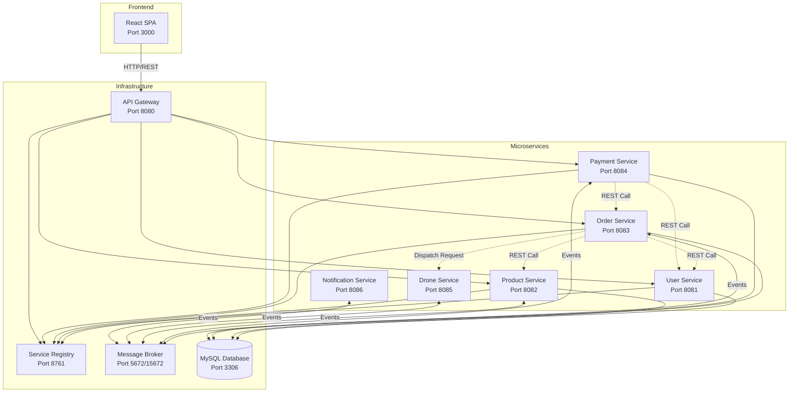
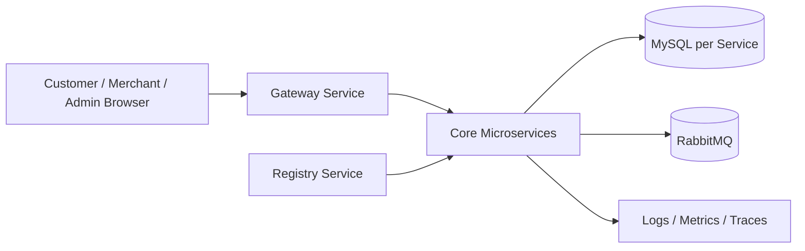
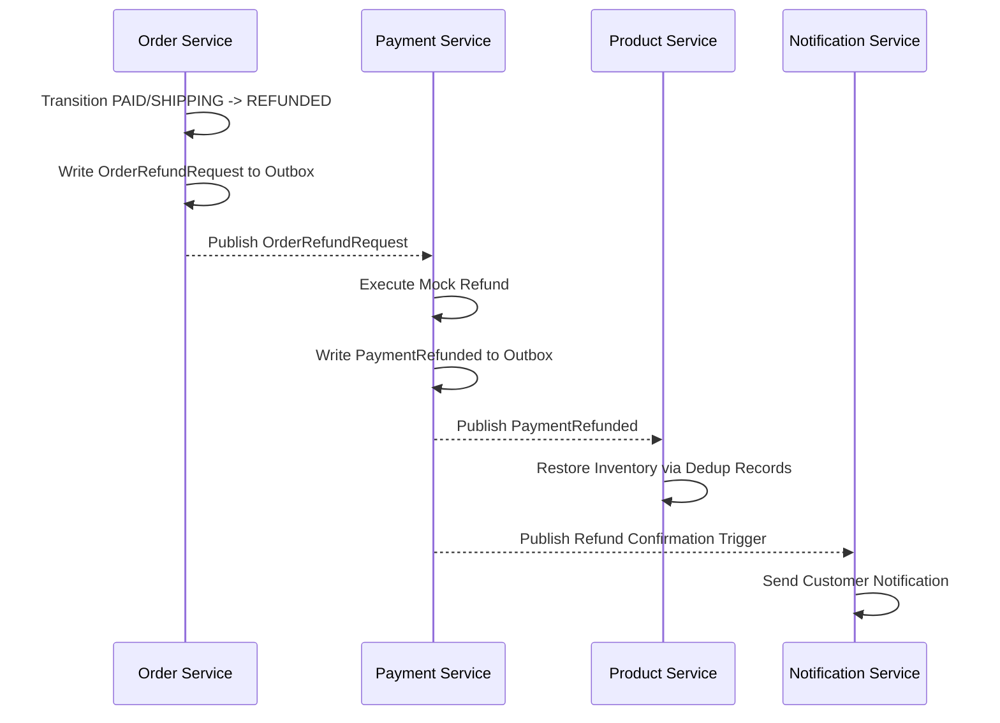

# ARCHITECTURE.md - FastFood Delivery Microservice Monorepo

> This document describes the system architecture, inter-service relationships, data flow patterns, and development conventions for the FastFood Delivery platform.
> For the functional requirements, user journeys, and Gherkin acceptance criteria under the Business Analyst perspective, see the [BA Unified Swimlane Specification](./docs/BA_UNIFIED_SWIMLANE_SPEC.md).

---

## 🏗️ ARCHITECTURAL OVERVIEW

The system is built as an **Event-Driven Microservices Monorepo** composed of 6 Java Spring Boot microservices, 1 React frontend SPA, and shared infrastructure services.

### System Architecture Diagram

### High-Level Runtime Topology

This logical topology emphasizes the runtime responsibilities of ingress, service discovery, per-service persistence, asynchronous messaging, and observability.

---

## 📦 MICROSERVICES REGISTRY

### 1. Core Services

| Service Name | Folder Path | Port | Database | Primary Purpose | API Context |
| :--- | :--- | :--- | :--- | :--- | :--- |
| **registry-service** | `services/registry-service` | `8761` | *None* | Eureka Service Discovery Server | *None* |
| **gateway-service** | `services/gateway-service` | `8080` | *None* | Centralized entrance, routing, JWT auth verification | `/api/v1/*` |
| **user-microservice** | `services/user-microservice` | `8081` | `userservice` | Identity management, role-based auth (Customer, Merchant, Admin) | `/api/v1/users`, `/api/v1/auth` |
| **product-microservice**| `services/product-microservice`| `8082` | `productmicroservice` | Product catalog, category and inventory/stock management | `/api/v1/products`, `/api/v1/categories` |
| **order-microservice** | `services/order-microservice` | `8083` | `orderservice` | Order lifecycle, validation, outbox event scheduling | `/api/v1/orders` |
| **payment-microservice**| `services/payment-microservice`| `8084` | `paymentservice` | Credit/Debit processing, mock refund, payment outbox events | `/api/v1/payments` |
| **drone-microservice** | `services/drone-microservice` | `8085` | `droneservice` | Automated drone routing and delivery logistics tracking | `/api/v1/drones` |
| **notification-microservice**| `services/notification-microservice`| `8086`| `notifications` | Async email/SMS notifications based on order/payment events | `/api/v1/notifications` |

### 2. Frontend Application

| Component | Folder Path | Development Port | Technologies | Production Build |
| :--- | :--- | :--- | :--- | :--- |
| **React SPA** | `frontend` | `3000` | React 19, Vite 7, Tailwind 4, Axios, React Router 6 | `npm run build` -> Nginx |

---

## 🔄 DATA PATTERNS & ASYNC FLOWS

To ensure database isolation and high resilience, the monorepo adheres to the **Database-per-Service** pattern, exchanging messages via **RabbitMQ**.

### 1. Order Creation & Deduct Stock Flow (Happy Path)
1. **Client** requests order creation via **API Gateway** -> **Order Service**.
2. **Order Service** saves order in `orders` (status: `PENDING`) and saves an `OrderCreated` event to `outbox_events_order` in a single ACID transaction (**Outbox Pattern**).
3. Outbox scheduler publishes `OrderCreated` to RabbitMQ exchange.
4. **Payment Service** consumes `OrderCreated`, creates a pending payment record, and processes the credit transaction.
5. Upon successful transaction, **Payment Service** writes `PAYMENT_SUCCESS` and `OrderPaid` events to its outbox, then publishes them to RabbitMQ.
6. **Order Service** consumes `PAYMENT_SUCCESS` and updates order status to `PAID`.
7. **Product Service** consumes `OrderPaid` and decrements product inventory.
8. **Notification Service** consumes payment success events and sends confirmation messages.
9. **Merchant Dashboard** surfaces the newly paid order for operational preparation.

### 2. Failure Paths & Compensation

#### Payment Timeout / Cancel Path
1. If `PAYMENT_SUCCESS` is not received within the order TTL window, the **Order Service** marks the order `CANCELLED`.
2. The Order Service publishes `OrderCancelled` through the outbox.
3. Downstream consumers release client or stock-related temporary state where applicable.

#### Refund & Stock Restore Path
1. If a paid order is rejected by the merchant, cannot be assigned to a drone within the retry window, or fails during shipping, the **Order Service** transitions the order to `REFUNDED`.
2. The Order Service publishes `OrderRefundRequest` through the outbox.
3. **Payment Service** consumes the event, executes the mock refund, and publishes `PaymentRefunded`.
4. **Product Service** consumes `PaymentRefunded` and restores stock using event deduplication records.
5. **Notification Service** informs the customer about the refund outcome.

### 3. Event Contract Baseline

| Field | Purpose |
| :--- | :--- |
| `event_id` | Unique event identity for deduplication and replay safety |
| `aggregate_id` / `order_id` | Primary business entity reference |
| `event_type` | Canonical event name such as `OrderCreated`, `OrderPaid`, `PaymentRefunded` |
| `version` | Schema version for backward-compatible evolution |
| `timestamp` | Creation time for ordering and auditing |
| `correlation_id` | Request/flow trace across services |
| `producer` | Service that emitted the event |
| `payload` | Domain-specific data required by consumers |

### 4. Idempotency & Resiliency
- **Idempotency Keys:** Enforced at the controller/service level (e.g. `stock_deduction_records` table) to prevent duplicate event processing.
- **Circuit Breakers:** Resilience4j is configured on synchronous REST communications (e.g. `OrderService` -> `ProductService` catalog validation).
- **Retry & Reprocessing:** Consumers should treat all RabbitMQ deliveries as at-least-once and rely on local deduplication records before applying mutations.
- **Flyway Migrations:** All schema changes must be placed in `src/main/resources/db/migration/` using standard SQL files named `V[Timestamp]__[Description].sql`.

### 5. Observability Guidelines
- **Logs:** Include `order_id`, `event_id`, and `correlation_id` in structured logs for every async transition.
- **Metrics:** Track payment processing time, queue lag, drone assignment latency, refund rate, and notification delay.
- **Tracing:** Link synchronous validation calls and async outbox events with a shared `correlation_id` where possible.
- **Alerts:** Escalate prolonged queue lag, repeated refund spikes, registry disconnects, and payment timeout anomalies to the Admin monitoring surface.

---

## 🎨 FRONTEND CONVENTIONS

The frontend dashboard (`frontend/`) contains specific sections for three actor roles: **Customers, Merchants, and Admins**.
- **State Management:** Enforced via React Context API (Auth Context).
- **Tailwind CSS 4:** CSS-first design configuration. Avoid utility overload. Keep layout pristine.
- **Dynamic UX:** Responsive sidebar layouts, card grids, clean glassmorphic alerts, and real-time dashboard analytics charts.
- **UI Constraints Reference:** Product-facing palette and styling rules belong in BA/UI guidance docs; architecture should only reference them when they affect component boundaries or runtime behavior.
