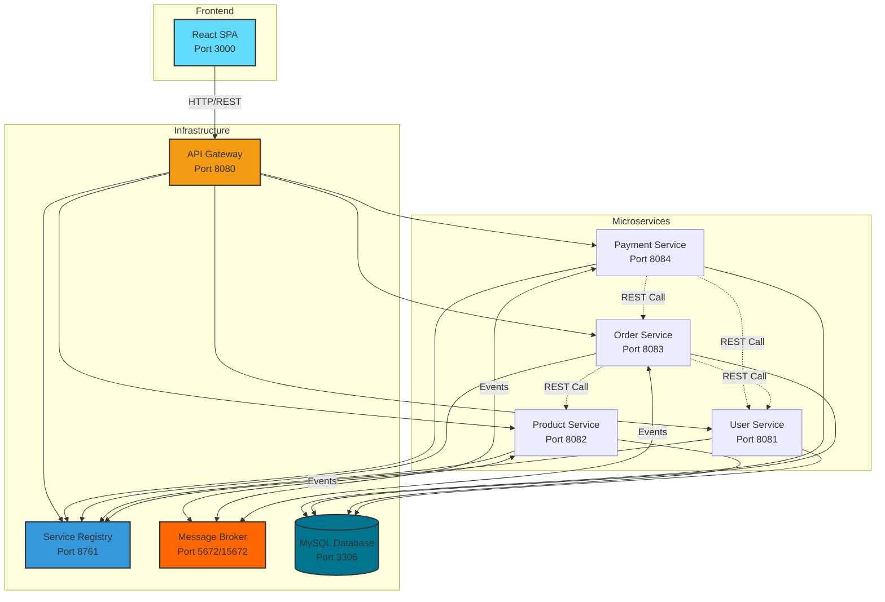

# FastFood Delivery - Microservice System

**Version:** 1.0  
**Last Updated:** November 2025

## 📋 Tổng Quan Hệ Thống

**FastFood Delivery** là nền tảng đặt món ăn trực tuyến được xây dựng theo kiến trúc microservices, kết nối khách hàng với các nhà hàng (merchants) để đặt món và thanh toán trực tuyến một cách thuận tiện và an toàn.

### 👥 Người Dùng

Hệ thống hỗ trợ 3 nhóm người dùng:
- **👤 Khách hàng (Customer)**: Đặt món ăn, thanh toán, theo dõi đơn hàng
- **🏪 Nhà hàng (Merchant)**: Quản lý menu, nhận đơn hàng, theo dõi doanh thu
- **⚙️ Quản trị viên (Admin)**: Quản lý toàn bộ hệ thống, duyệt merchant, hỗ trợ users

## 🏗️ Kiến Trúc Hệ Thống

### Tổng Quan Kiến Trúc



### 🔧 Technology Stack

#### Backend
- **Framework**: Spring Boot 3.x
- **Service Discovery**: Netflix Eureka
- **API Gateway**: Spring Cloud Gateway
- **Message Broker**: RabbitMQ
- **Database**: MySQL 8.0
- **Connection Pool**: HikariCP
- **Authentication**: JWT (JSON Web Tokens)
- **Circuit Breaker**: Resilience4j
- **Communication**: REST APIs + Event-Driven Messaging

#### Frontend
- **Framework**: React 19.x
- **Build Tool**: Vite 7.x
- **Styling**: Tailwind CSS 4.x
- **Routing**: React Router DOM 6.x
- **HTTP Client**: Axios
- **UI Icons**: Lucide React

#### Infrastructure
- **Containerization**: Docker & Docker Compose
- **Database Migration**: Flyway (for schema changes)
- **ORM**: Hibernate/JPA

## 📦 Microservices

### 1. Registry Service (Eureka Server)
- **Port**: 8761
- **Purpose**: Service registration and discovery
- **Tech**: Spring Cloud Netflix Eureka Server
- **URL**: http://localhost:8761

### 2. API Gateway
- **Port**: 8080
- **Purpose**: Single entry point for all client requests, routing, authentication
- **Tech**: Spring Cloud Gateway
- **Features**:
  - JWT authentication & authorization
  - Request routing to appropriate microservices
  - Cross-cutting concerns (logging, rate limiting)

### 3. User Service
- **Port**: 8081
- **Database**: `userservice`
- **Purpose**: User authentication, authorization, profile management
- **Key Features**:
  - User registration (Customer, Merchant, Admin)
  - Login/Logout with JWT tokens
  - Merchant approval workflow
  - Role-based access control
- **APIs**: `/api/v1/users`, `/api/v1/auth`

### 4. Product Service
- **Port**: 8082
- **Database**: `productmicroservice`
- **Purpose**: Product catalog management
- **Key Features**:
  - CRUD operations for products
  - Category management
  - Merchant-specific product management
  - Stock/inventory management
  - Product validation for orders
- **APIs**: `/api/v1/products`, `/api/v1/categories`

### 5. Order Service
- **Port**: 8083
- **Database**: `orderservice`
- **Purpose**: Order lifecycle management
- **Key Features**:
  - Order creation with idempotency
  - Order status management
  - Cross-service validation (user, products)
  - Event publishing for order lifecycle
  - User and merchant order history
- **APIs**: `/api/v1/orders`
- **Events Published**: `OrderCreated`, `OrderStatusChanged`, `OrderRefundRequest`

### 6. Payment Service
- **Port**: 8084
- **Database**: `paymentservice`
- **Purpose**: Payment processing and refunds
- **Key Features**:
  - Payment processing (integrated with payment gateway simulation)
  - Refund processing
  - Payment status tracking
  - Event-driven order updates
- **APIs**: `/api/v1/payments`
- **Events Published**: `PAYMENT_SUCCESS`, `PAYMENT_FAILED`, `OrderPaid`, `PaymentRefunded`
- **Events Consumed**: `OrderCreated`, `OrderRefundRequest`

## 🔄 Event-Driven Architecture

The system uses **RabbitMQ** for asynchronous communication between services:

### Key Event Flows

1. **Order Creation Flow**
   ```
   OrderService → OrderCreated → PaymentService
   (Creates pending payment record)
   ```

2. **Payment Success Flow**
   ```
   PaymentService → OrderPaid → ProductService
   (Deducts product stock)
   
   PaymentService → PAYMENT_SUCCESS → OrderService
   (Updates order status to PAID)
   ```

3. **Refund Flow**
   ```
   OrderService → OrderRefundRequest → PaymentService
   (Processes refund)
   
   PaymentService → PaymentRefunded → ProductService
   (Restores product stock)
   ```

### Event Patterns
- **Outbox Pattern**: Events stored in outbox tables before publishing
- **Idempotency**: Services track processed events to avoid duplicate processing
- **Circuit Breaker**: Resilience4j protects inter-service calls

## 💾 Database Schema

### Database Structure
Each microservice has its own database following the **Database per Service** pattern:

- **userservice**: Users, roles, authentication
- **productmicroservice**: Products, categories, stock
- **orderservice**: Orders, order items, idempotency keys, outbox events
- **paymentservice**: Payments, refunds, outbox events

### Key Tables

#### User Service
- `users`: User accounts (id, username, email, password, role, approved)

#### Product Service
- `products`: Product catalog (id, name, description, price, stock, category, merchant_id, active)
- `stock_deduction_records`: Idempotency tracking for stock operations

#### Order Service
- `orders`: Order master (id, order_code, user_id, merchant_id, status, totals, delivery info)
- `order_items`: Order line items (id, order_id, product_id, quantity, price)
- `idempotency_keys`: Request deduplication
- `outbox_events_order`: Event outbox

#### Payment Service
- `payments`: Payment records (id, order_id, user_id, amount, status, refund info)
- `outbox_events_payment`: Event outbox

## 🌐 Frontend Architecture

### Structure
```
frontend/
├── src/
│   ├── components/
│   │   ├── admin/           # Admin dashboard components
│   │   ├── merchant/        # Merchant dashboard components
│   │   └── common/          # Shared components
│   ├── pages/
│   │   ├── admin/           # Admin pages
│   │   ├── merchant/        # Merchant pages
│   │   └── auth/            # Login/Register pages
│   ├── context/             # React Context (Authentication)
│   ├── services/            # API service layer
│   └── App.jsx              # Main app component
```

### Key Features
- **Role-based Routing**: Protected routes for Admin and Merchant
- **Real-time Analytics**: KPI dashboards with charts
- **Order Management**: Real-time order tracking
- **Product Catalog**: Merchant product management
- **Payment Monitoring**: Payment history and analytics

### Dashboard Capabilities

#### Admin Dashboard
- System-wide KPIs (total revenue, orders, users, merchants)
- Order monitoring and management
- Payment tracking
- Merchant analytics
- User management
- Alert center

#### Merchant Dashboard
- Merchant-specific KPIs (today's sales, orders)
- Revenue charts and analytics
- Order fulfillment management
- Product catalog management
- Payment history

## 🚀 Getting Started

### Prerequisites
- **Docker** and **Docker Compose**
- **Java 17+** (for local development)
- **Node.js 18+** (for frontend development)
- **Maven 3.8+** (for building Java services)

### Quick Start with Docker

1. **Clone the repository**
   ```bash
   git clone <repository-url>
   cd FastfoodDelivery-microservice-monorepo
   ```

2. **Start all services**
   ```bash
   docker-compose up -d
   ```

3. **Verify services are running**
   ```bash
   docker-compose ps
   ```

4. **Access the application**
   - **Frontend**: http://localhost:3000
   - **API Gateway**: http://localhost:8080
   - **Eureka Dashboard**: http://localhost:8761
   - **RabbitMQ Management**: http://localhost:15672 (guest/guest)

### Service Health Check
- User Service: http://localhost:8081/actuator/health
- Product Service: http://localhost:8082/actuator/health
- Order Service: http://localhost:8083/actuator/health
- Payment Service: http://localhost:8084/actuator/health

## 🛠️ Development

### Running Services Locally (without Docker)

1. **Start MySQL**
   ```bash
   docker run -d -p 3306:3306 \
     -e MYSQL_ROOT_PASSWORD=1234 \
     -e MYSQL_DATABASE=userservice \
     --name mysql mysql:8.0
   ```

2. **Start RabbitMQ**
   ```bash
   docker run -d -p 5672:5672 -p 15672:15672 \
     --name rabbitmq rabbitmq:3.13-management
   ```

3. **Start Eureka (Registry Service)**
   ```bash
   cd services/registry-service
   mvn spring-boot:run
   ```

4. **Start API Gateway**
   ```bash
   cd services/gateway-service
   mvn spring-boot:run
   ```

5. **Start Microservices** (in any order)
   ```bash
   cd services/user-microservice && mvn spring-boot:run &
   cd services/product-microservice && mvn spring-boot:run &
   cd services/order-microservice && mvn spring-boot:run &
   cd services/payment-microservice && mvn spring-boot:run &
   ```

6. **Start Frontend**
   ```bash
   cd frontend
   npm install
   npm run dev
   ```

### Building Services

```bash
# Build all services
cd services/user-microservice && mvn clean package
cd services/product-microservice && mvn clean package
cd services/order-microservice && mvn clean package
cd services/payment-microservice && mvn clean package
cd services/gateway-service && mvn clean package
cd services/registry-service && mvn clean package
```

## 📖 Documentation

- **[PRD.md](docs/PRD.md)**: Comprehensive Product Requirements Document with use cases, sequence diagrams, and API documentation
- **[product-service-merchant.md](docs/product-service-merchant.md)**: Product Service merchant-specific documentation

## 🔐 Security

### Authentication & Authorization
- **JWT-based authentication** with access and refresh tokens
- **Role-based access control** (CUSTOMER, MERCHANT, ADMIN)
- **Merchant approval workflow**: New merchants require admin approval before activation
- **API Gateway**: Centralized authentication and authorization

### JWT Configuration
- **Secret Key**: Configured via environment variable `APP_JWT_SECRETKEY`
- **Access Token**: 25 hours expiration
- **Refresh Token**: 30 days expiration

## 🔄 CI/CD & Deployment

### Docker Deployment
All services are containerized and orchestrated using Docker Compose:
- **Network**: `microservice-net` (custom bridge network)
- **Volumes**: Persistent MySQL data storage
- **Health Checks**: MySQL has health check configuration
- **Dependencies**: Services start in correct order based on dependencies

### Environment Variables
All services support environment-based configuration:
- Database URLs, credentials
- Eureka server URLs
- RabbitMQ connection details
- JWT secret keys

## 📊 Monitoring & Observability

### Actuator Endpoints
All services expose Spring Boot Actuator endpoints:
- `/actuator/health`: Service health status
- `/actuator/info`: Service information
- `/actuator/metrics`: Service metrics (Order & Payment services)
- `/actuator/circuitbreakers`: Circuit breaker status (Order & Payment services)

### Service Discovery
- **Eureka Dashboard**: Visual monitoring of all registered services
- **Health Check URLs**: Registered with Eureka
- **Lease Renewal**: 30-second intervals

### Circuit Breaker Metrics
Order and Payment services have Resilience4j circuit breakers:
- **Failure Rate Threshold**: 50%
- **Wait Duration in Open State**: 5-10s
- **Sliding Window Size**: 10 calls
- **Auto-transition**: Half-open state enabled

## 🧪 Testing

### API Testing
Use the following base URLs:
- **Development**: http://localhost:8080/api/v1
- **Services Direct Access**: http://localhost:808{1-4}/api/v1

### Sample API Calls

#### Register User
```bash
POST http://localhost:8080/api/v1/auth/register
Content-Type: application/json

{
  "username": "customer1",
  "email": "customer1@example.com",
  "password": "password123",
  "role": "CUSTOMER"
}
```

#### Login
```bash
POST http://localhost:8080/api/v1/auth/login
Content-Type: application/json

{
  "username": "customer1",
  "password": "password123"
}
```

#### Create Product (Merchant)
```bash
POST http://localhost:8080/api/v1/products
Authorization: Bearer <jwt-token>
Content-Type: application/json

{
  "name": "Burger Deluxe",
  "description": "Premium burger with cheese",
  "price": 59.99,
  "stock": 100,
  "category": "BURGERS",
  "active": true
}
```

#### Create Order (Customer)
```bash
POST http://localhost:8080/api/v1/orders
Authorization: Bearer <jwt-token>
Content-Type: application/json

{
  "items": [
    {
      "productId": 1,
      "quantity": 2
    }
  ],
  "receiverName": "John Doe",
  "receiverPhone": "0123456789",
  "addressLine1": "123 Main St",
  "ward": "Ward 1",
  "district": "District 1",
  "city": "Ho Chi Minh City"
}
```

## 🤝 Contributing

### Branch Strategy
- `main`: Production-ready code
- `develop`: Integration branch
- `feature/*`: Feature branches
- `bugfix/*`: Bug fix branches

### Code Style
- Follow Spring Boot best practices
- Use Clean Architecture principles
- Write meaningful commit messages
- Add JavaDoc for public APIs

## 📝 License

[Add your license information here]

## 📞 Support

For questions or support, please contact:
- **Email**: [Add support email]
- **Documentation**: [docs/](docs/)
- **Issues**: [GitHub Issues or similar]

---

**Built with ❤️ using Spring Boot, React, and Microservices Architecture**
