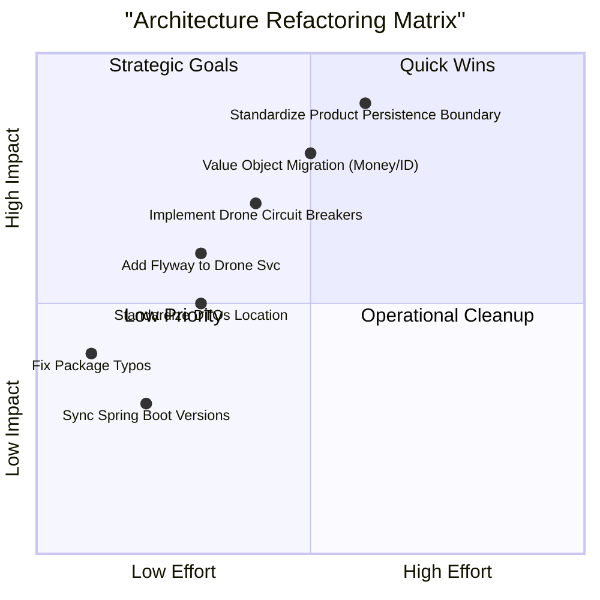

# 📊 Đánh Giá Kiến Trúc 5 Main Services

## Evaluation Context

| Field | Value |
| :--- | :--- |
| **Snapshot Date** | 2026-05-24 |
| **Scope** | `user-microservice`, `product-microservice`, `order-microservice`, `payment-microservice`, `drone-microservice` |
| **Out of Scope** | `gateway-service`, `registry-service`, `notification-microservice`, frontend UI implementation |
| **Evaluation Lens** | Clean Architecture, DDD modeling, event-driven reliability, resilience, schema management |
| **Related Docs** | [`ARCHITECTURE.md`](../ARCHITECTURE.md), [`BA_UNIFIED_SWIMLANE_SPEC.md`](BA_UNIFIED_SWIMLANE_SPEC.md) |

## Scoring Rubric

| Score | Meaning | Architecture Signal |
| :--- | :--- | :--- |
| 5 | Excellent | Domain model independent from frameworks; ports/adapters clear; events and persistence reliable. |
| 4 | Good | Clean layering mostly respected; minor consistency or migration gaps remain. |
| 3 | Mixed | Layering exists but framework/persistence concerns leak into domain or naming is inconsistent. |
| 2 | Weak | Business logic, persistence, and transport concerns are tightly coupled. |
| 1 | Critical | Hard to test, hard to evolve, and unsafe for event-driven workflows. |

## Tổng Quan

Dự án sử dụng **Clean Architecture** với các layer rõ ràng: Domain, Application, Infrastructure, và Interfaces. Dưới đây là đánh giá chi tiết cho từng service. Một số nhận định cũ đã được điều chỉnh theo snapshot hiện tại: ví dụ User Service hiện đã có `infrastructure/persistence/entity/*JpaEntity.java`, nên vấn đề không còn là “JPA nằm trực tiếp trong domain” mà là cần kiểm soát nhất quán giữa domain model, persistence entity, mapper và repository adapter.

---

## 1. 🧑‍💼 User Service (Port 8081)

### ✅ Điểm Mạnh

1. **Clean Architecture Compliance**
   - ✅ Tách biệt rõ ràng các layer: `domain`, `application`, `infrastructure`, `interfaces`
   - ✅ Domain layer không phụ thuộc vào framework (JPA annotations trong domain model là điểm yếu)
   - ✅ Use cases được tổ chức tốt trong `application/usecase`

2. **Domain Modeling**
   - ✅ Entity `User` có business logic methods (`changePassword`)
   - ✅ Domain exceptions được định nghĩa rõ ràng
   - ✅ Repository interfaces trong domain layer

3. **Security**
   - ✅ JWT authentication được implement đầy đủ
   - ✅ OAuth2 Resource Server integration
   - ✅ Role-based access control (ADMIN, USER, MERCHANT)

4. **External Integration**
   - ✅ WebClient cho geocoding service
   - ✅ RabbitMQ event publishing
   - ✅ Eureka service discovery

### ⚠️ Điểm Cần Cải Thiện

1. **Domain Model Annotations**
   ```java
   // ❌ Vấn đề: JPA annotations trong domain model
   @Entity
   @Table(name = "users")
   public class User { ... }
   ```
   - **Khuyến nghị**: Tách domain entity và JPA entity (như Order Service đã làm)

2. **Repository Implementation**
   - Repository implementation nên ở infrastructure layer, không phải domain

3. **Use Case Configuration**
   - Manual bean configuration trong `UserUseCaseConfig` - có thể dùng `@Service` annotation

---

## 2. 📦 Product Service (Port 8082)

### ✅ Điểm Mạnh

1. **Clean Architecture Structure**
   - ✅ Cấu trúc layer rõ ràng
   - ✅ Use cases được tổ chức tốt
   - ✅ Event listeners cho async communication

2. **Business Logic**
   - ✅ Stock management logic (deduct/restore)
   - ✅ Product validation use case
   - ✅ Category management

3. **Event-Driven Architecture**
   - ✅ RabbitMQ listeners cho merchant events
   - ✅ Order events handling

### ⚠️ Điểm Cần Cải Thiện

1. **Typo trong Package Name**
   ```java
   // ❌ Vấn đề: "infracstructor" thay vì "infrastructure"
   package com.example.demo.infracstructor.config;
   ```
   - **Khuyến nghị**: Đổi tên package thành `infrastructure`

2. **Domain Model với JPA**
   - Giống User Service, Product entity có JPA annotations trực tiếp
   - Nên tách domain entity và persistence entity

3. **Missing Value Objects**
   - Price, Stock có thể là value objects thay vì primitive types

4. **File Upload**
   - File upload logic nên tách ra infrastructure layer

---

## 3. 🛒 Order Service (Port 8083)

### ⭐ Điểm Mạnh Nổi Bật

1. **Clean Architecture Xuất Sắc**
   ```java
   // ✅ Domain entity KHÔNG có JPA annotations
   public class Order {
       private Long id;
       private OrderCode orderCode;  // Value Object
       private Money subtotal;       // Value Object
       // ... business logic methods
   }
   ```
   - ✅ Domain layer hoàn toàn độc lập với persistence
   - ✅ Tách biệt rõ ràng: `domain/entities` vs `infrastructure/persistence/entity`

2. **Value Objects**
   - ✅ `OrderCode`, `Money`, `DeliveryAddress`, `OrderStatus` là value objects
   - ✅ Encapsulation tốt, business rules trong value objects

3. **Repository Pattern**
   - ✅ Domain repository interfaces
   - ✅ Infrastructure adapters (`OrderRepositoryImpl`)
   - ✅ Mappers để convert giữa domain và JPA entities

4. **Advanced Features**
   - ✅ **Idempotency** - chống duplicate requests
   - ✅ **Outbox Pattern** - đảm bảo event delivery
   - ✅ **Port/Adapter Pattern** cho external services
   - ✅ Flyway migrations

5. **Resilience**
   - ✅ Resilience4j circuit breaker
   - ✅ WebClient với retry logic

### ⚠️ Điểm Cần Cải Thiện

1. **Spring Boot Version**
   - Dùng Spring Boot 3.5.6 (mới hơn các service khác 3.4.6)
   - Nên đồng bộ version

2. **Complexity**
   - Service này phức tạp nhất - cần documentation tốt hơn

---

## 4. 💳 Payment Service (Port 8084)

### ✅ Điểm Mạnh

1. **Clean Architecture**
   - ✅ Cấu trúc layer tốt
   - ✅ Port/Adapter pattern cho external services
   - ✅ Outbox pattern cho event publishing

2. **Business Logic**
   - ✅ Payment processing logic rõ ràng
   - ✅ Refund handling
   - ✅ Idempotency support

3. **Integration**
   - ✅ WebClient cho Order Service và User Service
   - ✅ Circuit breaker với Resilience4j
   - ✅ Event-driven với RabbitMQ

### ⚠️ Điểm Cần Cải Thiện

1. **Domain Model với JPA**
   ```java
   // ❌ JPA annotations trong domain model
   @Entity
   @Table(name = "payments")
   public class Payment { ... }
   ```
   - Nên tách như Order Service

2. **Typo trong Package**
   ```java
   // ❌ "lisener" thay vì "listener"
   package com.example.payment.infrastructure.lisener;
   ```

3. **Flyway Disabled**
   - Flyway dependencies bị comment out
   - Nên enable để quản lý schema versioning

---

## 5. 🚁 Drone Service (Port 8085)

### ✅ Điểm Mạnh

1. **Clean Architecture Tốt**
   - ✅ Domain entities không có JPA annotations
   - ✅ Value objects: `BatteryLevel`, `Coordinates`, `State`, `Status`, `WeightCapacity`
   - ✅ Repository pattern với adapters

2. **Domain Modeling Xuất Sắc**
   ```java
   // ✅ Business logic trong domain entity
   public boolean canAcceptMission(double weightKg, double totalDistanceKm) {
       if (!state.isIdle()) return false;
       if (!weightCapacity.canCarry(weightKg)) return false;
       return batteryLevel.canSupport(totalDistanceKm, 10.0);
   }
   ```

3. **Value Objects**
   - ✅ `BatteryLevel` với business rules
   - ✅ `Coordinates` với distance calculation
   - ✅ `State` với state transition validation
   - ✅ `WeightCapacity` với validation logic

4. **Infrastructure**
   - ✅ Mappers cho domain/JPA conversion
   - ✅ Scheduler cho drone simulation
   - ✅ Event publishing

### ⚠️ Điểm Cần Cải Thiện

1. **Package Naming**
   - `usecases` (số nhiều) vs `usecase` (số ít) ở các service khác
   - Nên đồng bộ naming convention

2. **DTOs Location**
   - DTOs trong `application/DTOs` - nên đặt trong `interfaces/rest/dto`

3. **Missing Features**
   - Chưa có Flyway migrations (dùng SQL script thủ công)
   - Chưa có circuit breaker

---

## 📊 So Sánh Tổng Quan

| Service | Clean Arch | Domain Model | Value Objects | Repository Pattern | Event-Driven | Resilience |
|---------|-----------|--------------|---------------|-------------------|--------------|------------|
| **User** | ⭐⭐⭐⭐ | ✅ JPA isolated in infrastructure | ⚠️ Partial | ✅ | ✅ | ⚠️ |
| **Product** | ⭐⭐⭐ | ⚠️ Needs boundary verification | ❌ | ⚠️ | ✅ | ⚠️ |
| **Order** | ⭐⭐⭐⭐⭐ | ✅ Pure domain | ✅ Excellent | ✅ Perfect | ✅ | ✅ |
| **Payment** | ⭐⭐⭐⭐ | ✅ JPA isolated in infrastructure | ⚠️ | ✅ | ✅ | ✅ |
| **Drone** | ⭐⭐⭐⭐⭐ | ✅ Pure domain | ✅ Excellent | ✅ | ✅ | ⚠️ |

---

## 🎯 Roadmap & Refactoring Prioritization

### Priority Matrix (Impact vs Effort)



### Sequenced Implementation Path

| Phase | Focus | Key Action | Success Metric | Priority |
| :--- | :--- | :--- | :--- | :--- |
| **Phase 1: Hygiene** | Operational cleanup | Sửa typo (`infracstructor`, `lisener`), đồng bộ version Spring Boot | 0 build errors, 0 naming warnings | P0 |
| **Phase 2: Integrity** | Persistence boundaries | Verify and standardize Domain Entity $\leftrightarrow$ JPA Entity separation in Product Service, and keep Payment/User aligned with the same mapper/repository pattern | Domain layer 0% framework dependencies | P0 |
| **Phase 3: Reliability** | Resilience & Migration | Thêm Circuit Breakers cho Drone Svc, Setup Flyway cho Drone Svc | 100% services using Flyway | P1 |
| **Phase 4: Sophistication**| DDD refinement | Migrate primitive types $\rightarrow$ Value Objects (Price, Email, Coordinates) | Reduced bug rate in domain logic | P2 |

## 🔎 Evidence Register

| Finding | Current Evidence | Interpretation |
| :--- | :--- | :--- |
| User persistence is separated from domain | `services/user-microservice/src/main/java/com/example/userservice/infrastructure/persistence/entity/UserJpaEntity.java:14` | JPA concern is in infrastructure; earlier “JPA in domain” warning should be treated as resolved/needs regression guard. |
| Payment persistence is separated from domain | `services/payment-microservice/src/main/java/com/example/paymentservice/infrastructure/persistence/entity/PaymentJpaEntity.java:17` | Payment has infrastructure JPA entity and mapper path; domain boundary is healthier than older notes suggest. |
| Order domain is persistence-free | `services/order-microservice/src/main/java/com/example/order_service/domain/entities/Order.java:21` | Reference implementation for other services. |
| Drone uses persistence adapters and JPA entities outside domain | `services/drone-microservice/src/main/java/com/example/droneservice/infrastructure/persistence/entity/DroneJpaEntity.java:17` | Confirms Clean Architecture separation in Drone Service. |
| Use case package naming inconsistency exists | `services/drone-microservice/src/main/java/com/example/droneservice/application/usecases/mission/GetAllMissionsUseCase.java:1` | Naming consistency remains a cleanup target. |
| Drone assignment is event-driven (listener exists) | `services/drone-microservice/src/main/java/com/example/droneservice/infrastructure/listener/OrderReadyListener.java:20` | Add explicit failure policy (retry/timeout/compensation) for assignment workflows. |

## 🏆 Best Practices Được Áp Dụng

1. ✅ **Clean Architecture** - Separation of concerns
2. ✅ **Domain-Driven Design** - Rich domain models
3. ✅ **Event-Driven Architecture** - RabbitMQ integration
4. ✅ **Outbox Pattern** - Order và Payment services
5. ✅ **Idempotency** - Order và Payment services
6. ✅ **Port/Adapter Pattern** - External service integration
7. ✅ **Repository Pattern** - Data access abstraction
8. ✅ **Value Objects** - Type safety và business rules

---

## 📝 Kết Luận

**Order Service** và **Drone Service** là những ví dụ tốt nhất về Clean Architecture trong dự án này. Các service khác nên refactor để follow cùng pattern:

1. **Priority High**: Chuẩn hoá boundary Domain ↔ Infrastructure trong Product Service (vì hiện trạng cần verify rõ ràng, tránh leak JPA/persistence concern).
2. **Priority Medium**: Đồng bộ naming conventions (`usecase`/`usecases`, typo packages) và package structure để giảm cognitive load và tăng consistency.
3. **Priority Low**: Migrate value objects có ý nghĩa nghiệp vụ cao (Money/Price/Coordinates) và bổ sung docs/ADRs khi đã ổn định boundary.

**Điểm số tổng thể**: ⭐⭐⭐⭐ (4/5)

Dự án có nền tảng kiến trúc tốt, chỉ cần refactoring để đạt consistency cao hơn.
