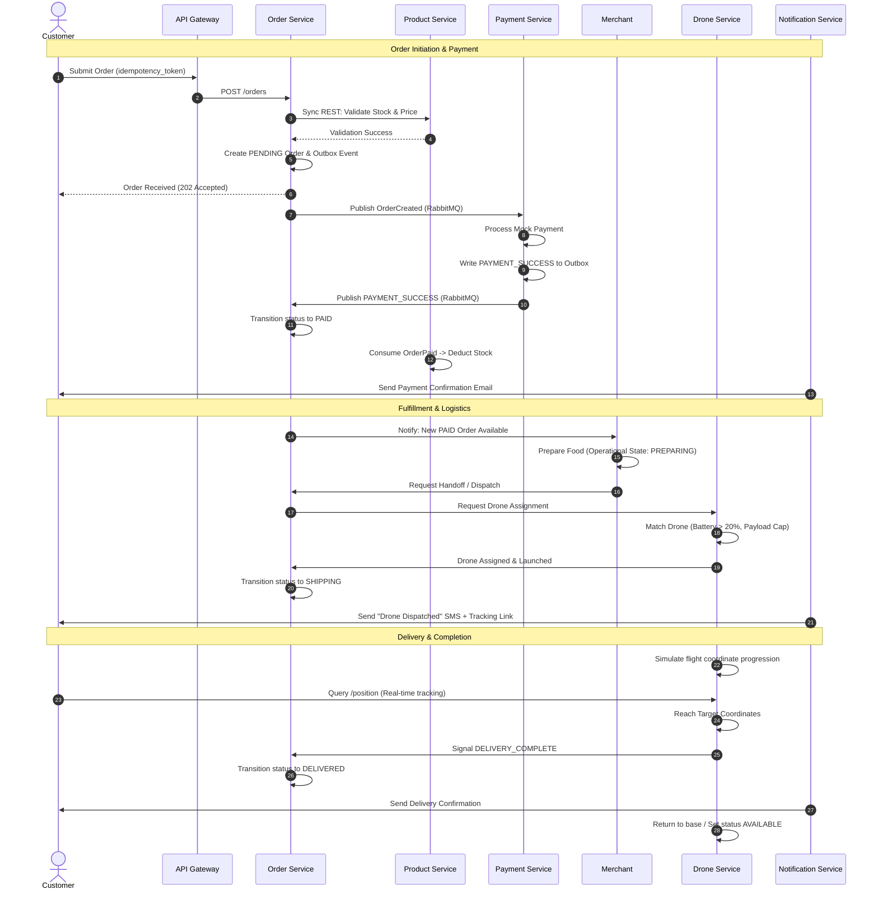
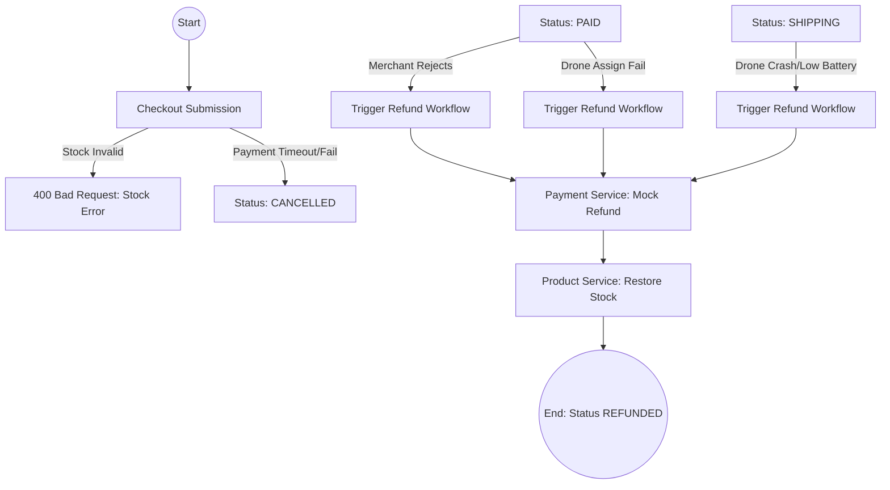

# BA Unified Swimlane Specification - FastFood Delivery Platform

This document defines the functional specifications, business rules, actor journeys, and system swimlane flows for the FastFood Delivery microservices platform.

---

## 📖 1. INTRODUCTION & SCOPE

**Version:** 1.1  
**Status:** Draft / In-Review  
**Last Updated:** 2026-05-24  
**Scope:** End-to-end business processes for Order, Payment, Inventory, and Drone Logistics.  
**Related Docs:** [Architecture Blueprint](../ARCHITECTURE.md), [Architecture Evaluation](ARCHITECTURE_EVALUATION.md)

This specification bridges the gap between the technical microservices architecture and business operations. It defines how different actors (Customer, Merchant, Admin) interact with the automated backend systems (Payment, Order, Drone/Logistics, Notification) to fulfill the lifecycle of a fast-food order.

---

## 🗺️ 2. UNIFIED SYSTEM SWIMLANES

This section describes the end-to-end flow of the system. The activities are divided into lanes representing different actors or system services.

### 2.1 Happy Path: End-to-End Order Lifecycle

### 2.2 Exception Paths & Compensation

---

## ⚡ 3. CORE BUSINESS RULES (SPECIAL FOCUS)

### 3.1 Order State Machine
The system handles order state transitions through a strict state machine. Order status represents the *system state*, which is triggered by *operational actions* performed by actors or backend microservices.

#### System Order Statuses
*   `PENDING`: Order has been submitted by the Customer but is awaiting payment validation.
*   `PAID`: Payment has been successfully captured and processed by the Payment Service.
*   `SHIPPING`: The order has been accepted by the Merchant and has been assigned/dispatched via a Drone.
*   `DELIVERED`: The Drone has arrived at the Customer's coordinates and successfully delivered the package.
*   `CANCELLED`: The order was aborted before payment (due to checkout validation failure, customer cancellation, payment timeout, or merchant rejection).
*   `REFUNDED`: The order was aborted after payment (due to merchant cancellation post-payment, drone assignment failure, or in-flight logistics failure).

#### State Transition Matrix
| Source Status | Target Status | Triggering Operational Action / Event | Actor/System | Description |
| :--- | :--- | :--- | :--- | :--- |
| *None* | `PENDING` | Submit Order | Customer | Order created, idempotency token locked. |
| `PENDING` | `PAID` | Capture Payment Success (`PAYMENT_SUCCESS`) | Payment Service | Payment simulated successfully, outbox event published. |
| `PENDING` | `CANCELLED` | Payment Timeout / Customer Cancel / Merchant Reject | Order Service / Merchant | Payment window expires (15m), or order rejected before payment. |
| `PAID` | `SHIPPING` | Merchant Accept + Dispatch Request | Merchant / Drone Service | Merchant preparation finished, Drone assigned and launched. |
| `PAID` | `REFUNDED` | Merchant Reject Post-Paid / Drone Assign Fail | Merchant / Drone Service | Store cancels order after paid, or no available drones. |
| `SHIPPING` | `DELIVERED` | Delivery Complete (`DELIVERY_COMPLETE`) | Drone Service | Drone reaches coordinates, drops payload, returns home. |
| `SHIPPING` | `REFUNDED` | Delivery Crash / Flight Emergency | Drone Service | Drone battery emergency, payload lost, or flight crash. |

#### Operational Action $\leftrightarrow$ System Status Mapping
| Actor | Operational Action | Current Status | Target Status | System Event | Note |
| :--- | :--- | :--- | :--- | :--- | :--- |
| Customer | `Place Order` | *None* | `PENDING` | `OrderCreated` | Validates stock sync, locks idempotency. |
| Payment Svc | `Payment Success` | `PENDING` | `PAID` | `PAYMENT_SUCCESS` | Triggered by mock gateway. |
| Merchant | `Accept Order` | `PAID` | `PAID` | *None* | Internal state `PREPARING`. |
| Merchant | `Handoff/Dispatch` | `PAID` | `SHIPPING` | `DISPATCHED` | Triggers Drone assignment. |
| Drone Svc | `Assign Drone` | `PAID` | `SHIPPING` | `DRONE_ASSIGNED` | Based on payload/battery/range. |
| Drone Svc | `Arrive Target` | `SHIPPING` | `DELIVERED` | `DELIVERY_COMPLETE` | Triggered by GPS coordinate match. |
| System | `Payment Timeout` | `PENDING` | `CANCELLED` | `OrderCancelled` | 15m TTL exceeded. |
| Merchant | `Reject Order` | `PAID` | `REFUNDED` | `OrderRefundRequest` | Triggers compensating refund flow. |
| Drone Svc | `Flight Emergency` | `SHIPPING` | `REFUNDED` | `DELIVERY_FAILED` | Low battery (<10%) or crash. |

> [!WARNING]
> Operational actions (e.g., `accept order`, `assign drone`, `dispatch start`) are **not** system statuses. They represent events and API calls that transition the system order status.

---

### 3.2 Payment Idempotency & Timeouts
Reliability in payment processing prevents double-billing and ensures clean order termination.

#### Payment Idempotency
1.  **Idempotency Keys:** Every payment request must include a unique transaction identifier (e.g., `idempotency_key` or `order_id`).
2.  **Duplicate Check:** Upon receiving a payment request, the Payment Service queries the payment transactions ledger.
    *   *If transaction exists:* Return the existing transaction outcome immediately without re-calling the gateway.
    *   *If transaction does not exist:* Create a ledger entry in `PENDING` status, process mock credit card billing, update status to `SUCCESS` or `FAILED`, and publish the event.

#### Payment Timeouts
1.  **Time-to-Live (TTL):** A `PENDING` order is allotted a payment window of **15 minutes**.
2.  **Expiration Job:** A background cron job in the Order Service periodically scans for `PENDING` orders.
3.  **Cancellation:** Any order exceeding the TTL without a matching `PAYMENT_SUCCESS` event is automatically cancelled. The system:
    *   Transitions order status to `CANCELLED`.
    *   Releases the locked checkout idempotency token.
    *   Publishes `OrderCancelled` to RabbitMQ.

---

### 3.3 Refund Triggers & Workflows
Refunds are processed asynchronously using the Outbox pattern to ensure guaranteed delivery of compensation events.

#### Refund Triggers
1.  **Merchant Post-Paid Rejection:** Merchant rejects an order that is already in `PAID` status (due to sudden store outage or ingredient shortage).
2.  **Logistics Assignment Timeout:** Order is `PAID` but the Drone Service fails to assign a drone within the logistics window (e.g. all drones are low battery or out of service).
3.  **In-Flight Delivery Failure:** Drone encounters an emergency crash or battery drop below safety threshold, aborting the shipment.

#### Asynchronous Refund Workflow

```mermaid
sequenceDiagram
    participant OS as Order Service
    participant PS as Payment Service
    participant PDS as Product Service
    
    Note over OS: Refund Triggered
    OS->>OS: Update Status to REFUNDED
    OS->>OS: Write OrderRefundRequest to Outbox
    OS-->>PS: Publish OrderRefundRequest (RabbitMQ)
    
    Note over PS: Consume Event
    PS->>PS: Match Transaction ID
    PS->>PS: Execute Mock Card Refund
    PS->>PS: Write PaymentRefunded to Outbox
    PS-->>PDS: Publish PaymentRefunded (RabbitMQ)
    
    Note over PDS: Consume Event
    PDS->>PDS: Match Order ID
    PDS->>PDS: Restore Stock Catalog
    PDS->>PDS: Write StockRestored to Outbox
```

---

### 3.4 Inventory Deduct & Restore (Event Deduplication)
To avoid race conditions and event duplication, stock modifications use a strict event deduplication pattern.

#### Stock Deduction
*   **Trigger:** Product Service consumes the `OrderPaid` (or `PAYMENT_SUCCESS`) event from RabbitMQ.
*   **Action:** Decrements stock for each item in the order.

#### Stock Restoration
*   **Trigger:** Product Service consumes the `PaymentRefunded` or `OrderCancelled` event.
*   **Action:** Restores the exact item quantities to the active catalog.

#### Event Deduplication Protocol
To ensure idempotency in the Product Service:
1.  The Product Service maintains a database table `stock_deduction_records` (`event_id` PRIMARY KEY, `order_id`, `status`, `timestamp`).
2.  Upon consuming a stock event:
    *   **Step 1:** In a local transaction, check if `event_id` is present in `stock_deduction_records`.
    *   **Step 2 (Duplicate):** If present, acknowledge the RabbitMQ message and log a duplicate event warning. **Do not modify stock.**
    *   **Step 3 (New):** If not present:
        1. Insert `event_id` into `stock_deduction_records`.
        2. Adjust stock levels in the `products` table.
        3. Commit transaction and acknowledge the message.
        4. If database transaction fails, RabbitMQ message is NACKed/re-queued automatically.

---

## 👥 4. ACTOR JOURNEYS & SWIMLANE FLOWS

Detailed descriptions of individual journeys, focusing on operational actions vs. system states.

### 4.1 Customer Journey & Flows
The Customer is the initiator of the food delivery lifecycle. Their journey encompasses account registration, menu discovery, cart checkout, payment execution, and tracking.

#### Customer Swimlane Sequence
| Customer (Actor) | API Gateway / Order Service | Product Service | Payment Service | Notification Service |
| :--- | :--- | :--- | :--- | :--- |
| **1.** Browse Menu | Router: Forward query | Return active products & stock | - | - |
| **2.** Submit Checkout (Locks `idempotency_token`) | **3.** Create `PENDING` Order; Execute REST validation | **4.** Validate product catalog & price (Sync REST) | - | - |
| - | **5.** Write `OrderCreated` to transaction outbox | - | **6.** Consume event, lock payment idempotency | - |
| - | - | - | **7.** Process mock card charge; Write `PAYMENT_SUCCESS` | - |
| **10.** Receive "Paid" alert | **8.** Consume event, change state to `PAID` | **9.** Consume `OrderPaid` event, deduct stock | - | **11.** Consume success event, send confirmation |

#### Step-by-Step Narrative
1.  **Browse & Select:** The Customer browses the menu by category. The frontend fetches data synchronously from the Product Service via the API Gateway.
2.  **Checkout Submission:** The Customer initiates a checkout request. To prevent double submissions, the client generates a unique `idempotency_token` and attaches it to the headers.
3.  **Synchronous System Validation:** The Order Service intercepts the request, registers the `idempotency_token` (if already registered, rejects with `409 Conflict`), and validates the checkout parameters:
    *   **User Check:** Calls User Service to check that the user has the `CUSTOMER` role and has a valid saved shipping address with GPS coordinates.
    *   **Stock & Price Check:** Calls Product Service via REST to verify that the items exist, prices match the current database, and requested quantities do not exceed available inventory.
4.  **Order Registration:** Upon successful validations, the Order Service saves the order with status `PENDING` and inserts an `OrderCreated` record into `outbox_events_order` within the same database transaction.
5.  **Payment Initiation:** The Outbox Scheduler publishes `OrderCreated` to RabbitMQ. The Payment Service consumes this message, creates a pending ledger entry, and executes the mock credit card pipeline.
6.  **Payment Success Propagation:** Once payment is cleared, the Payment Service saves a success audit log and publishes `PAYMENT_SUCCESS` and `OrderPaid` events via RabbitMQ outbox.
7.  **Order Transition & Fulfillment Handoff:**
    *   The Order Service consumes `PAYMENT_SUCCESS`, updating the order state to `PAID`.
    *   The Product Service consumes `OrderPaid`, decrementing inventory levels.
    *   The Notification Service consumes `PAYMENT_SUCCESS`, rendering and dispatching a confirmation SMS/email to the Customer.
8.  **Order Tracking:** The Customer receives a real-time push notification or email and can now monitor their order history dashboard.

#### Key Customer Scenarios (Narrative)
*   **Checkout Idempotency Lock:** If the Customer clicks "Place Order" multiple times quickly, the first request locks the `idempotency_token`. Subsequent requests return a `409 Conflict` or return the existing order details, preventing duplicate billing.
*   **Checkout Validation Failures:** If a product goes out of stock between menu browsing and checkout, the synchronous REST validation fails. The order is rejected immediately with a `400 Bad Request`, notifying the Customer of the inventory issue before any payment is initiated.
*   **Payment Timeout:** If the Customer submits an order but the payment processor hangs or fails, the background scheduler cancels the order after 15 minutes, transitioning it to `CANCELLED`, freeing up the idempotency lock.
*   **Invalid Address:** If the Customer selects a shipping address outside the delivery drone boundary (determined by GPS coordinate range), validation fails at step 3, preventing order creation.

### 4.2 Merchant Journey & Flows
Merchants own stores and manage the fulfillment of food orders. Their journey starts when an order transitions to `PAID`. They interact with the Merchant Dashboard to view KPIs, manage their catalog, and fulfill orders.

#### Merchant Swimlane Sequence
| Merchant (Actor) | Merchant Dashboard (UI) | Order Service (Backend) | Drone Service (Backend) | Notification Service |
| :--- | :--- | :--- | :--- | :--- |
| **1.** Receive Paid Order notification | Display order in incoming feed | Publish `PAYMENT_SUCCESS` (triggers dashboard refresh) | - | - |
| **2.** Accept order (begins prep) | Send `ACCEPT` command | Update operational preparation state | - | - |
| **3.** Prepare food -> Click "Handoff/Dispatch" | Send `DISPATCH_REQUEST` | **4.** Verify state is accepted; Request Drone | **5.** Consume request; Check drone payload & battery | - |
| - | - | - | **6.** If successful, assign drone & transition state to `SHIPPING` | **7.** Consume `SHIPPING` status; Notify Customer |

#### Step-by-Step Narrative
1.  **Incoming Order Alert:** Once payment is processed, the Order Service transitions the order to `PAID`. The dashboard feed updates, and the Merchant receives a visual notification.
2.  **Order Acceptance:** The Merchant reviews the items and accepts the order. This action represents an operational check (ensuring ingredients are available). The Order Service records the operational state as `PREPARING` (system state remains `PAID`).
3.  **Food Preparation:** The Merchant prepares the meal. During this time, they can monitor their store KPIs (Total sales, today's order count).
4.  **Handoff to Logistics:** Once the food is packaged, the Merchant clicks "Handoff to Logistics" on the dashboard. This sends a dispatch request to the backend.
5.  **Logistics Assignment:** The Order Service forwards the request to the Drone Service. The Drone Service automatically assigns an active drone (based on load capacity, battery > 20%, and closest proximity to the store coordinates).
6.  **Dispatch Launch:** Upon successful drone assignment, the system order status transitions from `PAID` to `SHIPPING`. The drone launches, and the Notification Service alerts the customer that their order is in transit.

#### Key Merchant Scenarios (Narrative)
*   **Order Rejection (Pre-Payment/Post-Payment):**
    *   *Pre-payment rejection:* If the Merchant rejects the order while it is still in `PENDING` status, the Order Service cancels the order (`CANCELLED`). No charge occurs.
    *   *Post-payment rejection:* If the Merchant rejects the order after payment is successful (e.g. out of ingredients), it triggers the **Refund Workflow** (Order transitions to `REFUNDED`, Payment Service triggers mock refund, Product Service restores stock).
*   **Store Offline:** If the Merchant toggles their store status to "Offline," their products are immediately excluded from synchronous checkout validations, preventing Customers from placing orders at that store.
*   **Logistics Assignment Failure:** If the Merchant clicks "Handoff to Logistics" but the Drone Service reports no available drones (all drones are out of range, out of battery, or weight limit exceeded for the order payload), the dispatch request fails. The order status remains `PAID` and triggers a fallback retry queue. If it fails repeatedly, it escalates to `REFUNDED` and initiates an auto-refund.

### 4.3 Admin Journey & Flows
Admins oversee the system infrastructure, review merchant onboarding requests, monitor system-wide KPI metrics, and handle system alerts.

#### Admin Swimlane Sequence
| Admin (Actor) | Admin Console (UI) | User Service (Backend) | Gateway / Registry Service | System Alert Monitor |
| :--- | :--- | :--- | :--- | :--- |
| **1.** Monitor registry status | Query Eureka instance registry | - | Fetch live system gateway instances | Detect eureka disconnects |
| **2.** Review merchant applications | Display pending store applications | Fetch application details | - | - |
| **3.** Approve application | Send `APPROVE` command | Update merchant status to `APPROVED`; Activate store | - | - |
| **4.** Receive critical alert | Display warning badge on Console | - | - | **5.** Detect RabbitMQ fail / Payment gateway delay |

#### Step-by-Step Narrative
1.  **System Monitoring:** The Admin monitors system health via the Admin Console dashboard. The Gateway and Registry services feed active node counts (User Service, Product Service, etc.) to the dashboard in real-time.
2.  **Merchant Application Review:** When a new Merchant signs up, they submit an onboarding application. The application enters the pending review queue. The Admin inspects the store name, owner profile, and restaurant details.
3.  **Approval Workflow:** The Admin clicks "Approve Application". The Admin Console triggers the User Service via API Gateway. The User Service transitions the Merchant account status to `APPROVED`, which automatically activates their catalog visibility in the Product Service.
4.  **System Alerts:** If an infrastructure failure occurs (e.g. Eureka service discovery disconnect, RabbitMQ broker failure, or high transaction latency), the System Alert Monitor pushes a high-priority warning to the Admin System Alerts Center.

#### Key Admin Scenarios (Narrative)
*   **Merchant Onboarding Approval:**
    *   *Approve:* The merchant account transitions to `APPROVED`, enabling store login and product CRUD operations.
    *   *Reject:* The Admin rejects the onboarding, changing the status to `REJECTED`, notifying the applicant, and locking database catalog updates.
*   **System Alert Resolution:** If Eureka reports a microservice node disconnect, the Admin Console triggers a container restart request or flags the node in the UI. If a database connection fails, the Console flags the affected service to alert developers.

### 4.4 Automated System & Drone Logistics Flows
Drone logistics operate as an automated system actor. Once triggered by a Merchant dispatch request, the Drone Service takes full ownership of order fulfillment, tracking real-time coordinate progression.

#### Automated System / Drone Swimlane Sequence
| Order Service | Drone Service | Active Drone (IoT / Sim) | Notification Service | Customer UI |
| :--- | :--- | :--- | :--- | :--- |
| **1.** Trigger Dispatch Request | Match order payload with Drone registry | - | - | - |
| - | **2.** If valid, assign drone; Change status to `SHIPPING` | Lock payload; Launch flight path | **3.** Publish `DISPATCHED` event; Send SMS tracking link | Display drone GPS coordinates on map |
| - | **4.** Track periodic GPS updates | **5.** Update current coordinate progression | - | Update map marker in real-time |
| - | **6.** Catch `DELIVERY_COMPLETE` signal | **7.** Arrive at target; Release payload; Send success signal | **8.** Publish `DELIVERED` event; Send email receipt | Display delivered status |

#### Step-by-Step Narrative
1.  **Fulfillment Initiation:** The Order Service forwards the Merchant's dispatch request to the Drone Service via RabbitMQ.
2.  **Autonomous Drone Selection:** The Drone Service checks its active registry to select a drone:
    *   **Capacity Match:** The order weight must not exceed the drone's carrying capacity (payload).
    *   **Energy Check:** The drone's battery level must be above 20%.
    *   **Distance Check:** The drone must be within flight range of both the merchant store and customer delivery coordinates.
3.  **Launch & Status Transition:** Once a drone is assigned:
    *   The Drone Service updates the drone status to `BUSY`.
    *   The Order Service updates the order system status to `SHIPPING`.
    *   The Notification Service publishes a dispatch SMS with a tracking URL.
4.  **Flight Progression Simulation:** During transit, the Drone Service simulates real-time coordinate progression (coordinate-to-coordinate routing). The drone updates its current latitude/longitude coordinates every few seconds. The Customer UI queries this coordinate API to update the delivery vehicle icon on the map.
5.  **Delivery Completion:** Upon reaching the destination coordinates, the drone releases its payload and transmits a `DELIVERY_COMPLETE` IoT signal.
    *   The Drone Service transitions the drone back to `AVAILABLE` and initiates its flight return path.
    *   The Order Service changes the order system status to `DELIVERED`.
    *   The Notification Service sends a final delivery confirmation email.

#### Key Drone Logistics Scenarios (Narrative)
*   **Battery Safety Emergency (Sad Path):** If a drone's battery drops below 10% mid-flight, it triggers a flight emergency. The drone attempts to execute an emergency landing at the nearest safety station or return home.
    *   The Drone Service publishes a `DELIVERY_FAILED` event.
    *   The Order Service transitions the order status from `SHIPPING` to `REFUNDED` and initiates the automated Refund Workflow.
*   **Out of Range:** If a Customer inputs delivery coordinates outside the delivery radius during checkout, validation blocks the order before creation. If coordinates are somehow altered post-checkout, the Drone Service fails to assign a drone, immediately triggering the Refund Workflow.

---

## 📋 5. ACCEPTANCE CRITERIA & NFRs

### 5.1 Non-Functional Requirements (NFR) & SLAs
The following criteria define the system's operational quality.

| ID | Criterion | Target Threshold | Measurement Method | Owner |
| :--- | :--- | :--- | :--- | :--- |
| **NFR-01** | Checkout Latency (p95) | < 500ms | API Gateway Response Logs | Order Svc |
| **NFR-02** | Payment Processing | < 2s for 99% trans. | Payment Svc Transaction Logs | Payment Svc |
| **NFR-03** | Event Propagation | < 1s from Outbox to MQ | RabbitMQ Queue Depth / Trace IDs | All Svcs |
| **NFR-04** | Drone Assign Time | < 30s post-dispatch req | Drone Svc Assignment Logs | Drone Svc |
| **NFR-05** | Notification Delay | < 5s from event trigger | Notification Svc Dispatch Logs | Notification Svc |
| **NFR-06** | Stock Accuracy | 100% consistency | Product Svc Audit vs Order DB | Product Svc |

### 5.2 Customer Acceptance Criteria

#### Scenario 1: Successful Order Submission & Payment (Happy Path)
*   **Given** a Customer with active credentials and a valid shipping address containing GPS coordinates.
*   **And** the Customer has items in their cart that are fully in stock and match catalog pricing.
*   **When** the Customer submits the order with a unique `idempotency_token`.
*   **Then** the Order Service should create an order in `PENDING` status.
*   **And** write an `OrderCreated` event to the transaction outbox.
*   **And** the Payment Service should process the transaction, record a ledger entry, and publish `PAYMENT_SUCCESS`.
*   **And** the Order Service should transition the order state to `PAID`.
*   **And** the Product Service should decrement stock for the ordered items.
*   **And** the Notification Service should successfully dispatch order confirmation details.

#### Scenario 2: Checkout Validation Fails due to Out of Stock (Sad Path)
*   **Given** a Customer submits a checkout request with item "Burger A" having a requested quantity of 5.
*   **But** the Product Service database reports active stock level of "Burger A" is only 2.
*   **When** the Order Service makes the synchronous catalog validation REST call.
*   **Then** the Order Service must reject the checkout immediately.
*   **And** return a `400 Bad Request` with an error message detailing: `"Insufficient stock for Burger A. Requested: 5, Available: 2"`.
*   **And** no order record should be saved, and no payment transaction should be created.

#### Scenario 3: Checkout Validation Fails due to Invalid Address (Sad Path)
*   **Given** a Customer selects a shipping address that lacks coordinates or lies outside the drone delivery range.
*   **When** the Customer attempts to checkout.
*   **Then** the Order Service validation fails.
*   **And** returns a `400 Bad Request` detailing: `"Shipping address coordinates are invalid or out of delivery boundary"`.
*   **And** the order creation is rejected.

#### Scenario 4: Payment Simulation Timeout (Sad Path)
*   **Given** a Customer has submitted an order which is placed in `PENDING` status.
*   **And** the Payment Service mock gateway is unresponsive or times out.
*   **When** the Order Service background scheduler scanner runs 15 minutes after order creation.
*   **Then** the Order Service must transition the order to `CANCELLED`.
*   **And** publish an `OrderCancelled` event to release any reserved stock or client-side locks.

#### Remaining Customer Edge Cases (Bullet Points)
*   **Double Submission Prevention:** If a client sends multiple requests with the same `idempotency_token`, the server must return `409 Conflict` for subsequent calls.
*   **Customer Role Enforced:** If a User with role `MERCHANT` or `ADMIN` calls the customer checkout endpoint, the API Gateway/Order Service must return a `403 Forbidden` error.

---

### 5.2 Merchant Acceptance Criteria

#### Scenario 1: Merchant Accepts a PAID Order (Happy Path)
*   **Given** an order is in `PAID` status and visible in the Merchant Dashboard feed.
*   **When** the Merchant clicks "Accept Order".
*   **Then** the Order Service should register the operational state as `PREPARING`.
*   **And** the order system status must remain `PAID` in the database.
*   **And** the UI must update the order card to show the preparation status.

#### Scenario 2: Merchant Rejects a PAID Order (Sad Path - Refund Trigger)
*   **Given** an order is in `PAID` status and has been processed by the Payment Service.
*   **When** the Merchant clicks "Reject Order" (due to operational constraints).
*   **Then** the Order Service must transition the system order status directly to `REFUNDED`.
*   **And** write an `OrderRefundRequest` event to the transaction outbox.
*   **And** the Payment Service must consume the event, trigger a mock card refund, and publish `PaymentRefunded`.
*   **And** the Product Service must consume `PaymentRefunded` and restore the reserved stock.

#### Scenario 3: Merchant Dispatches a Prepared Order (Happy Path)
*   **Given** an order is in `PAID` status with operational state `PREPARING`.
*   **When** the Merchant clicks "Handoff to Logistics" / "Dispatch".
*   **Then** the Order Service must request a drone assignment from the Drone Service.
*   **And** upon successful assignment, transition the system order status to `SHIPPING`.
*   **And** the Drone Service must update the drone's status to `BUSY` and initiate flight path simulation.

#### Scenario 4: Merchant Dispatches but Drone Assignment Fails (Sad Path)
*   **Given** an order is in `PREPARING` operational state.
*   **And** the Drone Service has no active drones with battery > 20% or payload capacity matching the order.
*   **When** the Merchant clicks "Handoff to Logistics".
*   **Then** the Order Service must return a warning: `"No drones available. Retrying assignment..."`.
*   **And** the order status must remain `PAID`.
*   **And** if assignment fails after 3 retry cycles (5 minutes), the order status must auto-transition to `REFUNDED` and trigger the refund workflow.

#### Remaining Merchant Edge Cases (Bullet Points)
*   **Store Offline Catalog Filter:** When a store status is updated to `OFFLINE`, a Customer attempting checkout on any item from that store must receive a `400 Bad Request` during validation steps.
*   **Store Dashboard KPI Integrity:** Merchant KPIs (total revenue, daily order count) must update dynamically upon order transition to `PAID`. Rejections or refunds must deduct immediately from today's aggregated KPIs.

---

### 5.3 Admin Acceptance Criteria

#### Scenario 1: Approve Merchant Onboarding (Happy Path)
*   **Given** a new Merchant onboarding application exists in `PENDING_APPROVAL` status.
*   **And** the Admin is logged in with `ADMIN` privileges on the Admin Console.
*   **When** the Admin clicks "Approve Application".
*   **Then** the User Service must update the Merchant user status to `APPROVED`.
*   **And** activate their store ownership privileges in the database.
*   **And** the Product Service should now allow the Merchant's products to pass synchronous checkout validations.

#### Scenario 2: Reject Merchant Onboarding (Sad Path)
*   **Given** a Merchant onboarding application is in the pending review queue.
*   **When** the Admin clicks "Reject Application" and inputs a rejection reason.
*   **Then** the User Service must update the Merchant user status to `REJECTED`.
*   **And** record the rejection audit log.
*   **And** notify the Merchant via email with the rejection reason.

#### Scenario 3: Eureka Node Disconnect Alert Trigger (Sad Path)
*   **Given** the Admin Console is monitoring live microservice instances via the Eureka discovery API.
*   **When** a microservice instance (e.g. `PaymentService`) drops offline due to network partition or crash.
*   **Then** the System Alert Monitor must capture the instance disconnect within 10 seconds.
*   **And** trigger a critical alert badge on the Admin Console.
*   **And** list the disconnected node IP and time of failure.

#### Remaining Admin Edge Cases (Bullet Points)
*   **KPI Real-time Refresh:** System-wide metrics (Total revenue, user registration counts, Active Merchants, order conversion rate) must aggregate data across all service databases and update every 5 minutes.
*   **Global User Permission Lock:** If the Admin toggles a User status to `SUSPENDED`, all active JWT access tokens for that User must be invalidated at the API Gateway level within 1 minute, preventing any further API queries.

---

### 5.4 Automated System & Drone Logistics Acceptance Criteria

#### Scenario 1: Autonomous Drone Selection & Dispatch (Happy Path)
*   **Given** a Merchant triggers a dispatch request for order #100.
*   **And** Drone #5 registry shows status `AVAILABLE`, battery level 85%, and carrying capacity 5kg.
*   **And** the order payload weight is 2kg and coordinates are within the 5km flight radius.
*   **When** the Drone Service processes the dispatch request.
*   **Then** the Drone Service must assign Drone #5 to order #100.
*   **And** transition Drone #5 status to `BUSY`.
*   **And** transition order status to `SHIPPING`.
*   **And** publish the `DISPATCHED` event to RabbitMQ.

#### Scenario 2: Drone Delivery Reaches Target (Happy Path)
*   **Given** Drone #5 is currently flying and updating its coordinates towards the Customer's coordinates.
*   **When** the simulated coordinates of Drone #5 match the Customer's coordinates (within a 5-meter tolerance).
*   **Then** Drone #5 must release the payload and transmit a `DELIVERY_COMPLETE` IoT signal.
*   **And** the Drone Service must update Drone #5 status back to `AVAILABLE`.
*   **And** the Order Service must transition the order status to `DELIVERED`.
*   **And** the Notification Service must dispatch a delivery confirmation email to the Customer.

#### Scenario 3: Mid-flight Low Battery Emergency (Sad Path)
*   **Given** Drone #5 is in flight with order status `SHIPPING`.
*   **When** Drone #5's battery level drops below the critical threshold of 10% before reaching the destination.
*   **Then** Drone #5 must abort the flight and land safely.
*   **And** the Drone Service must publish a `DELIVERY_FAILED` event.
*   **And** the Order Service must transition the order status to `REFUNDED` and initiate the automated Refund Workflow.

#### Remaining Drone Logistics Edge Cases (Bullet Points)
*   **Weight Limit Exceeded:** If an order payload weight exceeds the maximum capacity of any available drone, the Drone Service must immediately reject the assignment and notify the Merchant Dashboard.
*   **Real-time Coordinates Fetch:** The Customer UI must query the coordinate endpoint `/api/v1/drones/{droneId}/position` and retrieve valid decimal coordinates (latitude/longitude) to plot the map marker. If query fails, the map displays the last cached coordinate.

---

## 🎨 6. UI/UX GUIDELINES & CONSTRAINTS

*   **Color Harmony:** Slate/charcoal (neutral), emerald (success), amber (warning).
*   **Purple Ban:** Strict prohibition of violet/purple hex codes in any UI component design.

---

## 📂 7. DOMAIN MAPPING CHECKLIST

This section verifies that every business domain specified in the product's `feature_list.json` is mapped to its corresponding section(s), swimlanes, and business rules in this specification.

| Domain Area (from `feature_list.json`) | Target Microservice | Mapped Spec Section & Swimlanes | Business Rules / ACs Covered |
| :--- | :--- | :--- | :--- |
| **1. Authentication & Identity Management** | `user-microservice` | • Section 4.1 (Customer Journey) • Section 4.3 (Admin Journey) | • JWT access token authorization controls. • Roles: `CUSTOMER`, `MERCHANT`, `ADMIN`. |
| **2. Product & Stock Inventory Catalog** | `product-microservice` | • Section 3.4 (Inventory Deduct/Restore) • Section 4.1 (Customer Swimlane) • Section 4.2 (Merchant Journey) | • Synchronous REST price/stock checkout validation. • Outbox stock change compensation via RabbitMQ. • Event deduplication (idempotency key logging). |
| **3. Order Lifecycle Management** | `order-microservice` | • Section 3.1 (Order State Machine) • Section 4.1 (Customer Journey) • Section 4.2 (Merchant Journey) | • Checkout validations, client idempotency tokens (`409 Conflict`). • System states: `PENDING`, `PAID`, `SHIPPING`, `DELIVERED`, `CANCELLED`, `REFUNDED`. |
| **4. Payment Gateway Simulation & Refunds** | `payment-microservice` | • Section 3.2 (Payment Idempotency/Timeouts) • Section 3.3 (Refund Triggers & Workflows) | • Mock billing card processing pipeline. • Background scheduler cancel on TTL (15m). • Asynchronous Outbox-based refunds. |
| **5. Automated Drone Routing & Logistics** | `drone-microservice` | • Section 4.4 (Automated System Flows) • Section 5.4 (Drone Logistics ACs) | • Selection (battery > 20%, weight capacity, distance). • Coordinate progression simulation. • Flight emergency auto-refund triggers. |
| **6. Async Notifications** | `notification-microservice` | • Section 4.1 (Customer Swimlane) • Section 4.2 (Merchant Swimlane) • Section 4.4 (Drone Swimlane) | • SMS dispatch with live tracking link on dispatch. • Order success & delivery completion emails. |
| **7. Merchant Dashboard Web UI** | `frontend` | • Section 4.2 (Merchant Journey) | • Dashboard KPI counters (revenue, active count). • Product workspace, active state toggle. • Fulfillment preparation accepts/rejections. |
| **8. Admin System Dashboard Console** | `frontend` | • Section 4.3 (Admin Journey) | • Aggregated metrics (total rev, conversion rate). • Global order search feed. • Merchant application review queue. |
