# Product Requirements Document (PRD)
## Fast Food Delivery Microservices System

**Version:** 1.0  
**Date:** 2024  
**Author:** System Documentation

---

## Table of Contents

1. [Executive Summary](#executive-summary)
2. [Business Flows](#business-flows)
3. [Use Cases](#use-cases)
4. [Use Case Diagrams](#use-case-diagrams)
5. [Sequence Diagrams](#sequence-diagrams)
6. [Entity Relationship Diagram (ERD)](#entity-relationship-diagram-erd)
7. [Technical Architecture Overview](#technical-architecture-overview)
8. [API Endpoints Documentation](#api-endpoints-documentation)
9. [Appendix](#appendix)

---

## Executive Summary

### 1.1 Tổng quan Hệ thống

**Fast Food Delivery** là nền tảng đặt món ăn trực tuyến, kết nối khách hàng với các nhà hàng (merchants) để đặt món và thanh toán trực tuyến một cách thuận tiện và an toàn.

Hệ thống hỗ trợ 3 nhóm người dùng chính:
- **Khách hàng (Users)**: Đặt món ăn, thanh toán, theo dõi đơn hàng
- **Nhà hàng (Merchants)**: Quản lý menu, nhận đơn hàng, cập nhật trạng thái giao hàng
- **Quản trị viên (Admin)**: Quản lý toàn bộ hệ thống, hỗ trợ users và merchants

### 1.2 Mục tiêu Kinh doanh

**Đối với Khách hàng:**
- Đặt món ăn nhanh chóng, dễ dàng qua ứng dụng/web
- Thanh toán an toàn, tiện lợi
- Theo dõi trạng thái đơn hàng real-time
- Xem menu đa dạng từ nhiều nhà hàng

**Đối với Nhà hàng:**
- Quản lý menu sản phẩm linh hoạt
- Nhận đơn hàng tự động, giảm sai sót
- Theo dõi doanh thu và thống kê bán hàng
- Quản lý trạng thái đơn hàng hiệu quả

**Đối với Hệ thống:**
- Tự động hóa quy trình từ đặt hàng đến thanh toán
- Đảm bảo tính chính xác và nhất quán dữ liệu
- Hỗ trợ mở rộng quy mô khi cần

### 1.3 Phạm vi Tài liệu

Tài liệu này mô tả các chức năng chính của hệ thống:
- **Quản lý Tài khoản**: Đăng ký, đăng nhập, quản lý thông tin cá nhân
- **Quản lý Sản phẩm**: Nhà hàng quản lý menu món ăn/đồ uống
- **Quản lý Đơn hàng**: Khách hàng đặt hàng, nhà hàng xử lý đơn hàng
- **Thanh toán**: Xử lý thanh toán và hoàn tiền

---

## Business Flows

### 2.1 Quy trình Đặt Hàng

**Mô tả:** Khách hàng đặt món ăn từ nhà hàng.

**Các bước:**
1. Khách hàng chọn món ăn từ menu và nhập số lượng
2. Khách hàng nhập thông tin địa chỉ giao hàng (tên người nhận, số điện thoại, địa chỉ)
3. Hệ thống kiểm tra tài khoản khách hàng có hợp lệ không
4. Hệ thống kiểm tra món ăn: còn hàng không, giá có đúng không
5. Hệ thống đảm bảo tất cả món trong đơn hàng thuộc cùng một nhà hàng
6. Hệ thống tạo đơn hàng với trạng thái "Chờ xác nhận"
7. Hệ thống tự động tạo thanh toán với trạng thái "Chờ thanh toán"

**Kết quả:** Đơn hàng được tạo thành công, khách hàng nhận được mã đơn hàng. Nhà hàng sẽ nhận được thông báo đơn hàng mới.

### 2.2 Quy trình Thanh toán

**Mô tả:** Khách hàng thanh toán cho đơn hàng đã được nhà hàng xác nhận. Sau khi thanh toán thành công, hệ thống tự động trừ tồn kho sản phẩm.

**Các bước:**
1. Khách hàng chọn thanh toán cho đơn hàng (đơn hàng phải ở trạng thái "Đã xác nhận")
2. Hệ thống kiểm tra: đơn hàng có thuộc về khách hàng không, trạng thái có đúng không
3. Hệ thống kiểm tra tài khoản khách hàng có hợp lệ không
4. Hệ thống kiểm tra số tiền thanh toán có khớp với tổng tiền đơn hàng không
5. Hệ thống xử lý thanh toán (kết nối với cổng thanh toán)
6. **Nếu thanh toán thành công:**
   - Trạng thái thanh toán → "Thành công"
   - Trạng thái đơn hàng tự động chuyển sang "Đã thanh toán"
   - Hệ thống gửi sự kiện "OrderPaid" qua message queue
   - Product Service nhận sự kiện và tự động trừ tồn kho cho từng sản phẩm trong đơn hàng
   - Nhà hàng nhận được thông báo thanh toán thành công
7. **Nếu thanh toán thất bại:**
   - Trạng thái thanh toán → "Thất bại"
   - Đơn hàng có thể bị hủy hoặc khách hàng có thể thử thanh toán lại
   - Tồn kho không bị trừ

**Kết quả:** Thanh toán được xử lý, trạng thái đơn hàng được cập nhật tự động, tồn kho sản phẩm được trừ (nếu thanh toán thành công).

### 2.3 Quy trình Quản lý Trạng thái Đơn hàng

**Mô tả:** Nhà hàng hoặc Admin cập nhật trạng thái đơn hàng.

**Các bước:**
1. Nhà hàng/Admin chọn cập nhật trạng thái đơn hàng
2. Hệ thống kiểm tra: nhà hàng chỉ có thể cập nhật đơn hàng của chính mình
3. Hệ thống kiểm tra quy tắc chuyển trạng thái:
   - Chờ xác nhận → Đã xác nhận hoặc Đã hủy
   - Đã xác nhận → Đang giao hoặc Đã hủy
   - Đang giao → Đã giao
   - Đã giao → Đã hoàn tiền (chỉ Admin)
4. Hệ thống cập nhật trạng thái đơn hàng
5. Khách hàng nhận được thông báo cập nhật trạng thái

**Kết quả:** Trạng thái đơn hàng được cập nhật, khách hàng được thông báo.

### 2.4 Quy trình Quản lý Menu

**Mô tả:** Nhà hàng quản lý menu món ăn/đồ uống.

**Các bước:**
1. Nhà hàng thực hiện thao tác: thêm món mới, cập nhật thông tin món, hoặc xóa món
2. Hệ thống kiểm tra quyền: nhà hàng chỉ quản lý được menu của chính mình
3. Hệ thống kiểm tra dữ liệu: tên món, giá, số lượng, danh mục phải hợp lệ
4. Hệ thống lưu thay đổi
5. Món mới hoặc món đã cập nhật sẽ hiển thị ngay cho khách hàng (nếu đang bán)

**Kết quả:** Menu được cập nhật thành công, khách hàng có thể thấy thay đổi ngay lập tức.

### 2.5 Quy trình Hoàn tiền

**Mô tả:** Khách hàng, Nhà hàng hoặc Admin yêu cầu hoàn tiền cho đơn hàng đã thanh toán thành công. Sau khi hoàn tiền thành công, hệ thống tự động hoàn trả tồn kho sản phẩm.

**Các bước:**
1. Khách hàng/Nhà hàng/Admin gửi yêu cầu hoàn tiền cho đơn hàng
2. Hệ thống kiểm tra quyền:
   - Khách hàng chỉ có thể yêu cầu hoàn tiền cho đơn hàng của mình
   - Nhà hàng chỉ có thể yêu cầu hoàn tiền cho đơn hàng của nhà hàng mình
   - Admin có thể yêu cầu hoàn tiền cho bất kỳ đơn hàng nào
3. Hệ thống kiểm tra đơn hàng: tồn tại, đã thanh toán thành công, trạng thái "Đã giao"
4. Hệ thống kiểm tra thanh toán: trạng thái "Thành công", chưa được hoàn tiền
5. Hệ thống cập nhật trạng thái đơn hàng thành "Đã hoàn tiền"
6. Hệ thống chuyển yêu cầu đến Payment Service để xử lý hoàn tiền
7. Payment Service cập nhật trạng thái thanh toán thành "Đã hoàn tiền"
8. Hệ thống gửi sự kiện "OrderRefunded" qua message queue
9. Product Service nhận sự kiện và tự động hoàn trả tồn kho cho từng sản phẩm trong đơn hàng

**Kết quả:** Hoàn tiền được xử lý thành công, trạng thái đơn hàng và thanh toán được cập nhật, tồn kho sản phẩm được hoàn trả.

---

## Use Cases

*Phần này mô tả chi tiết các chức năng mà người dùng có thể thực hiện trong hệ thống. Mỗi use case mô tả một tình huống sử dụng cụ thể với các bước thực hiện và quy tắc nghiệp vụ.*

### 3.1 User Service Use Cases

#### UC-001: Đăng ký Tài khoản

| Mục | Nội dung |
|-----|----------|
| **Mã Use Case** | UC-001 |
| **Tên Use Case** | Đăng ký Tài khoản |
| **Actor** | Khách hàng hoặc Nhà hàng (chưa có tài khoản) |
| **Mô tả** | Khách hàng hoặc nhà hàng đăng ký tài khoản mới để sử dụng hệ thống. Khách hàng có thể sử dụng ngay sau khi đăng ký, nhà hàng cần được Admin duyệt. |
| **Tiền điều kiện** | - Chưa có tài khoản trong hệ thống - Email và username chưa được sử dụng |
| **Hậu điều kiện** | - Tài khoản được tạo thành công - Nếu là Khách hàng: tài khoản được kích hoạt ngay - Nếu là Nhà hàng: tài khoản cần Admin duyệt trước khi đăng nhập |
| **Luồng chính** | 1. Người dùng điền form đăng ký: tên đăng nhập, email, mật khẩu, loại tài khoản (Khách hàng hoặc Nhà hàng) 2. Hệ thống kiểm tra email chưa được sử dụng 3. Hệ thống kiểm tra tên đăng nhập chưa được sử dụng 4. Hệ thống kiểm tra mật khẩu đủ mạnh (ít nhất 8 ký tự, có chữ hoa, chữ thường, số, ký tự đặc biệt) 5. Hệ thống tạo tài khoản mới 6. Nếu là Khách hàng: tài khoản được kích hoạt ngay 7. Nếu là Nhà hàng: tài khoản cần Admin duyệt |
| **Luồng phụ / Ngoại lệ** | 2a. Email đã tồn tại → Hiển thị thông báo "Email này đã được sử dụng" 3a. Tên đăng nhập đã tồn tại → Hiển thị thông báo "Tên đăng nhập này đã được sử dụng" 4a. Mật khẩu không đủ mạnh → Hiển thị yêu cầu mật khẩu mạnh hơn |

---

#### UC-002: Đăng nhập

| Mục | Nội dung |
|-----|----------|
| **Mã Use Case** | UC-002 |
| **Tên Use Case** | Đăng nhập |
| **Actor** | Khách hàng hoặc Nhà hàng (đã có tài khoản) |
| **Mô tả** | Người dùng đăng nhập vào hệ thống bằng tên đăng nhập và mật khẩu để sử dụng các chức năng. Nhà hàng phải được Admin duyệt mới có thể đăng nhập. |
| **Tiền điều kiện** | - Đã có tài khoản trong hệ thống - Nếu là Nhà hàng, phải được Admin duyệt |
| **Hậu điều kiện** | - Đăng nhập thành công - Người dùng có thể sử dụng các chức năng của hệ thống - Hệ thống cấp quyền truy cập (token) |
| **Luồng chính** | 1. Người dùng nhập tên đăng nhập và mật khẩu 2. Hệ thống kiểm tra tài khoản có tồn tại không 3. Hệ thống kiểm tra mật khẩu có đúng không 4. Nếu là Nhà hàng, hệ thống kiểm tra đã được duyệt chưa 5. Hệ thống cấp quyền truy cập (token) 6. Người dùng có thể sử dụng các chức năng của hệ thống |
| **Luồng phụ / Ngoại lệ** | 2a. Tài khoản không tồn tại → Hiển thị "Tên đăng nhập hoặc mật khẩu không đúng" 3a. Mật khẩu sai → Hiển thị "Tên đăng nhập hoặc mật khẩu không đúng" 4a. Nhà hàng chưa được duyệt → Hiển thị "Tài khoản của bạn đang chờ Admin duyệt" |

---

#### UC-003: Admin Tạo Tài khoản

| Mục | Nội dung |
|-----|----------|
| **Mã Use Case** | UC-003 |
| **Tên Use Case** | Admin Tạo Tài khoản |
| **Actor** | Quản trị viên (Admin) |
| **Mô tả** | Admin tạo tài khoản mới cho khách hàng, nhà hàng hoặc admin khác. Admin có thể duyệt tài khoản nhà hàng ngay khi tạo. |
| **Tiền điều kiện** | - Admin đã đăng nhập - Admin có quyền quản trị |
| **Hậu điều kiện** | - Tài khoản được tạo thành công với vai trò và trạng thái duyệt theo yêu cầu - Nếu là nhà hàng và đã được duyệt: có thể đăng nhập ngay |
| **Luồng chính** | 1. Admin điền form tạo tài khoản: tên đăng nhập, email, mật khẩu, vai trò, trạng thái duyệt 2. Hệ thống kiểm tra email chưa được sử dụng 3. Hệ thống kiểm tra tên đăng nhập chưa được sử dụng 4. Hệ thống kiểm tra vai trò hợp lệ (Khách hàng, Nhà hàng, Admin) 5. Hệ thống tạo tài khoản với thông tin đã cung cấp 6. Hệ thống trả về thông tin tài khoản đã tạo |
| **Luồng phụ / Ngoại lệ** | 2a. Email đã tồn tại → Hiển thị "Email này đã được sử dụng" 3a. Tên đăng nhập đã tồn tại → Hiển thị "Tên đăng nhập này đã được sử dụng" 4a. Vai trò không hợp lệ → Hiển thị "Vai trò không hợp lệ" |

---

#### UC-004: Cập nhật Thông tin Tài khoản

| Mục | Nội dung |
|-----|----------|
| **Mã Use Case** | UC-004 |
| **Tên Use Case** | Cập nhật Thông tin Tài khoản |
| **Actor** | Khách hàng (tự cập nhật) hoặc Quản trị viên |
| **Mô tả** | Người dùng hoặc Admin cập nhật thông tin tài khoản như tên đăng nhập, email. Admin có thể cập nhật trạng thái duyệt của nhà hàng. |
| **Tiền điều kiện** | - Người dùng đã đăng nhập - Tài khoản tồn tại trong hệ thống |
| **Hậu điều kiện** | - Thông tin tài khoản được cập nhật thành công - Các service khác được thông báo về thay đổi |
| **Luồng chính** | 1. Người dùng/Admin chọn cập nhật thông tin (tên đăng nhập, email, trạng thái duyệt - chỉ Admin) 2. Hệ thống tìm tài khoản theo ID 3. Hệ thống cập nhật các thông tin được cung cấp 4. Hệ thống lưu thay đổi 5. Hệ thống trả về thông tin đã cập nhật |
| **Luồng phụ / Ngoại lệ** | 2a. Tài khoản không tồn tại → Hiển thị "Tài khoản không tồn tại" 1a. Khách hàng cố gắng cập nhật trạng thái duyệt → Bị từ chối, chỉ Admin mới được |

---

#### UC-005: Admin Thay đổi Vai trò Người dùng

| Mục | Nội dung |
|-----|----------|
| **Mã Use Case** | UC-005 |
| **Tên Use Case** | Admin Thay đổi Vai trò Người dùng |
| **Actor** | Quản trị viên (Admin) |
| **Mô tả** | Admin thay đổi vai trò của người dùng (từ Khách hàng sang Nhà hàng hoặc ngược lại). |
| **Tiền điều kiện** | - Admin đã đăng nhập - Tài khoản người dùng tồn tại trong hệ thống |
| **Hậu điều kiện** | - Vai trò của người dùng được cập nhật thành công |
| **Luồng chính** | 1. Admin chọn tài khoản và vai trò mới (Khách hàng, Nhà hàng, Admin) 2. Hệ thống kiểm tra Admin có quyền thực hiện 3. Hệ thống kiểm tra vai trò mới hợp lệ 4. Hệ thống cập nhật vai trò của người dùng 5. Hệ thống trả về thông tin đã cập nhật |
| **Luồng phụ / Ngoại lệ** | 2a. Người thực hiện không phải Admin → Hiển thị "Bạn không có quyền thực hiện thao tác này" 3a. Vai trò không hợp lệ → Hiển thị "Vai trò không hợp lệ" |

---

#### UC-006: Xóa Tài khoản

| Mục | Nội dung |
|-----|----------|
| **Mã Use Case** | UC-006 |
| **Tên Use Case** | Xóa Tài khoản |
| **Actor** | Quản trị viên (Admin) |
| **Mô tả** | Admin xóa tài khoản người dùng khỏi hệ thống. |
| **Tiền điều kiện** | - Admin đã đăng nhập - Tài khoản người dùng tồn tại trong hệ thống |
| **Hậu điều kiện** | - Tài khoản bị xóa khỏi hệ thống |
| **Luồng chính** | 1. Admin chọn tài khoản cần xóa 2. Hệ thống kiểm tra Admin có quyền thực hiện 3. Hệ thống tìm tài khoản theo ID 4. Hệ thống xóa tài khoản 5. Hệ thống trả về thông báo thành công |
| **Luồng phụ / Ngoại lệ** | 2a. Người thực hiện không phải Admin → Hiển thị "Bạn không có quyền thực hiện thao tác này" 3a. Tài khoản không tồn tại → Hiển thị "Tài khoản không tồn tại" |

---

#### UC-007: Xem Thông tin Tài khoản

| Mục | Nội dung |
|-----|----------|
| **Mã Use Case** | UC-007 |
| **Tên Use Case** | Xem Thông tin Tài khoản |
| **Actor** | Quản trị viên (Admin) |
| **Mô tả** | Admin xem chi tiết thông tin của một tài khoản cụ thể. |
| **Tiền điều kiện** | - Admin đã đăng nhập |
| **Hậu điều kiện** | - Admin nhận được thông tin chi tiết của tài khoản |
| **Luồng chính** | 1. Admin chọn tài khoản cần xem (theo ID) 2. Hệ thống kiểm tra Admin có quyền thực hiện 3. Hệ thống tìm tài khoản theo ID 4. Hệ thống trả về thông tin chi tiết của tài khoản |
| **Luồng phụ / Ngoại lệ** | 2a. Người thực hiện không phải Admin → Hiển thị "Bạn không có quyền thực hiện thao tác này" 3a. Tài khoản không tồn tại → Hiển thị "Tài khoản không tồn tại" |

---

#### UC-008: Xem Danh sách Tất cả Tài khoản

| Mục | Nội dung |
|-----|----------|
| **Mã Use Case** | UC-008 |
| **Tên Use Case** | Xem Danh sách Tất cả Tài khoản |
| **Actor** | Quản trị viên (Admin) |
| **Mô tả** | Admin xem danh sách tất cả tài khoản trong hệ thống (khách hàng, nhà hàng, admin). |
| **Tiền điều kiện** | - Admin đã đăng nhập |
| **Hậu điều kiện** | - Admin nhận được danh sách tất cả tài khoản |
| **Luồng chính** | 1. Admin yêu cầu xem danh sách tất cả tài khoản 2. Hệ thống kiểm tra Admin có quyền thực hiện 3. Hệ thống lấy tất cả tài khoản từ hệ thống 4. Hệ thống trả về danh sách tài khoản |
| **Luồng phụ / Ngoại lệ** | 2a. Người thực hiện không phải Admin → Hiển thị "Bạn không có quyền thực hiện thao tác này" |

---

#### UC-009: Đổi Mật khẩu

| Mục | Nội dung |
|-----|----------|
| **Mã Use Case** | UC-009 |
| **Tên Use Case** | Đổi Mật khẩu |
| **Actor** | Khách hàng hoặc Nhà hàng |
| **Mô tả** | Người dùng đổi mật khẩu của tài khoản. Cần nhập mật khẩu cũ để xác thực. |
| **Tiền điều kiện** | - Người dùng đã đăng nhập |
| **Hậu điều kiện** | - Mật khẩu được cập nhật thành công - Người dùng cần đăng nhập lại với mật khẩu mới |
| **Luồng chính** | 1. Người dùng nhập mật khẩu cũ và mật khẩu mới 2. Hệ thống xác định tài khoản từ phiên đăng nhập 3. Hệ thống kiểm tra mật khẩu cũ có đúng không 4. Hệ thống kiểm tra mật khẩu mới đủ mạnh (ít nhất 8 ký tự, có chữ hoa, chữ thường, số, ký tự đặc biệt) 5. Hệ thống cập nhật mật khẩu mới 6. Hệ thống trả về thông báo thành công |
| **Luồng phụ / Ngoại lệ** | 3a. Mật khẩu cũ sai → Hiển thị "Mật khẩu cũ không đúng" 4a. Mật khẩu mới không đủ mạnh → Hiển thị "Mật khẩu mới phải có ít nhất 8 ký tự, bao gồm chữ hoa, chữ thường, số và ký tự đặc biệt" |

---

### 3.2 Product Service Use Cases

#### UC-010: Nhà hàng Tạo Sản phẩm

| Mục | Nội dung |
|-----|----------|
| **Mã Use Case** | UC-010 |
| **Tên Use Case** | Nhà hàng Tạo Sản phẩm |
| **Actor** | Nhà hàng (Merchant) |
| **Mô tả** | Nhà hàng tạo sản phẩm mới (món ăn hoặc đồ uống) để bán trên hệ thống. Sản phẩm mới tạo sẽ được kích hoạt ngay. |
| **Tiền điều kiện** | - Nhà hàng đã đăng nhập và được duyệt - Nhà hàng có quyền tạo sản phẩm |
| **Hậu điều kiện** | - Sản phẩm được tạo và kích hoạt trong hệ thống - Khách hàng có thể xem và đặt mua sản phẩm |
| **Luồng chính** | 1. Nhà hàng điền thông tin sản phẩm: tên, mô tả, giá, số lượng tồn kho, danh mục (Đồ ăn hoặc Đồ uống) 2. Hệ thống xác định nhà hàng từ phiên đăng nhập 3. Hệ thống kiểm tra dữ liệu: tên và mô tả không rỗng, giá > 0, số lượng tồn kho >= 0, danh mục hợp lệ 4. Hệ thống tạo sản phẩm với thông tin đã cung cấp 5. Hệ thống kích hoạt sản phẩm (active = true) 6. Hệ thống trả về thông tin sản phẩm đã tạo |
| **Luồng phụ / Ngoại lệ** | 2a. Không xác định được nhà hàng từ phiên đăng nhập → Hiển thị "Bạn cần đăng nhập" 3a. Dữ liệu không hợp lệ → Hiển thị "Vui lòng kiểm tra lại thông tin sản phẩm" |

---

#### UC-011: Cập nhật Sản phẩm

| Mục | Nội dung |
|-----|----------|
| **Mã Use Case** | UC-011 |
| **Tên Use Case** | Cập nhật Sản phẩm |
| **Actor** | Nhà hàng hoặc Quản trị viên |
| **Mô tả** | Nhà hàng cập nhật thông tin sản phẩm của mình (giá, mô tả, số lượng tồn kho, v.v.). Admin có thể cập nhật bất kỳ sản phẩm nào. |
| **Tiền điều kiện** | - Nhà hàng/Admin đã đăng nhập - Sản phẩm tồn tại trong hệ thống |
| **Hậu điều kiện** | - Thông tin sản phẩm được cập nhật thành công |
| **Luồng chính** | 1. Nhà hàng/Admin chọn sản phẩm cần cập nhật và điền thông tin mới 2. Hệ thống kiểm tra quyền: Nhà hàng chỉ có thể cập nhật sản phẩm của mình, Admin có thể cập nhật bất kỳ sản phẩm nào 3. Hệ thống kiểm tra dữ liệu mới hợp lệ (nếu có) 4. Hệ thống cập nhật các thông tin được cung cấp 5. Hệ thống trả về thông tin sản phẩm đã cập nhật |
| **Luồng phụ / Ngoại lệ** | 2a. Nhà hàng cố gắng cập nhật sản phẩm không thuộc về mình → Hiển thị "Bạn không có quyền cập nhật sản phẩm này" 3a. Dữ liệu không hợp lệ → Hiển thị "Vui lòng kiểm tra lại thông tin" |

---

#### UC-012: Xóa Sản phẩm

| Mục | Nội dung |
|-----|----------|
| **Mã Use Case** | UC-012 |
| **Tên Use Case** | Xóa Sản phẩm |
| **Actor** | Nhà hàng hoặc Quản trị viên |
| **Mô tả** | Nhà hàng xóa sản phẩm khỏi hệ thống. Admin có thể xóa bất kỳ sản phẩm nào. |
| **Tiền điều kiện** | - Nhà hàng/Admin đã đăng nhập - Sản phẩm tồn tại trong hệ thống |
| **Hậu điều kiện** | - Sản phẩm bị xóa khỏi hệ thống - Khách hàng không thể xem hoặc đặt mua sản phẩm này nữa |
| **Luồng chính** | 1. Nhà hàng/Admin chọn sản phẩm cần xóa 2. Hệ thống kiểm tra quyền: Nhà hàng chỉ có thể xóa sản phẩm của mình, Admin có thể xóa bất kỳ sản phẩm nào 3. Hệ thống xóa sản phẩm 4. Hệ thống trả về thông báo thành công |
| **Luồng phụ / Ngoại lệ** | 2a. Nhà hàng cố gắng xóa sản phẩm không thuộc về mình → Hiển thị "Bạn không có quyền xóa sản phẩm này" |

---

#### UC-013: Xem Tất cả Sản phẩm

| Mục | Nội dung |
|-----|----------|
| **Mã Use Case** | UC-013 |
| **Tên Use Case** | Xem Tất cả Sản phẩm |
| **Actor** | Khách hàng (không cần đăng nhập) |
| **Mô tả** | Khách hàng xem danh sách tất cả sản phẩm đang được bán trên hệ thống. Không cần đăng nhập để xem. |
| **Tiền điều kiện** | Không có |
| **Hậu điều kiện** | - Khách hàng nhận được danh sách tất cả sản phẩm đang được bán |
| **Luồng chính** | 1. Khách hàng yêu cầu xem danh sách sản phẩm 2. Hệ thống lấy tất cả sản phẩm đang được bán (active = true) 3. Hệ thống trả về danh sách sản phẩm |
| **Luồng phụ / Ngoại lệ** | Không có |

---

#### UC-014: Xem Sản phẩm theo Danh mục

| Mục | Nội dung |
|-----|----------|
| **Mã Use Case** | UC-014 |
| **Tên Use Case** | Xem Sản phẩm theo Danh mục |
| **Actor** | Khách hàng (không cần đăng nhập) |
| **Mô tả** | Khách hàng xem danh sách sản phẩm theo danh mục (Đồ ăn hoặc Đồ uống). |
| **Tiền điều kiện** | Không có |
| **Hậu điều kiện** | - Khách hàng nhận được danh sách sản phẩm theo danh mục đã chọn |
| **Luồng chính** | 1. Khách hàng chọn danh mục (Đồ ăn hoặc Đồ uống) 2. Hệ thống kiểm tra danh mục hợp lệ 3. Hệ thống lấy các sản phẩm thuộc danh mục đó và đang được bán 4. Hệ thống trả về danh sách sản phẩm |
| **Luồng phụ / Ngoại lệ** | 2a. Danh mục không hợp lệ → Hiển thị "Danh mục không hợp lệ, vui lòng chọn Đồ ăn hoặc Đồ uống" |

---

#### UC-015: Xem Sản phẩm của Nhà hàng

| Mục | Nội dung |
|-----|----------|
| **Mã Use Case** | UC-015 |
| **Tên Use Case** | Xem Sản phẩm của Nhà hàng |
| **Actor** | Nhà hàng hoặc Quản trị viên |
| **Mô tả** | Nhà hàng xem danh sách sản phẩm của mình. Admin có thể xem sản phẩm của bất kỳ nhà hàng nào. |
| **Tiền điều kiện** | - Nhà hàng/Admin đã đăng nhập |
| **Hậu điều kiện** | - Nhà hàng/Admin nhận được danh sách sản phẩm (có thể bao gồm cả sản phẩm đã ngừng bán) |
| **Luồng chính** | 1. Nhà hàng/Admin yêu cầu xem sản phẩm (Admin cần chỉ định nhà hàng) 2. Hệ thống xác định nhà hàng: Nhà hàng tự động từ phiên đăng nhập, Admin từ tham số yêu cầu 3. Hệ thống lấy danh sách sản phẩm của nhà hàng đó 4. Hệ thống trả về danh sách sản phẩm |
| **Luồng phụ / Ngoại lệ** | 2a. Admin không chỉ định nhà hàng → Hiển thị "Vui lòng chọn nhà hàng" |

---

#### UC-016: Xác thực Sản phẩm (Nội bộ)

| Mục | Nội dung |
|-----|----------|
| **Mã Use Case** | UC-016 |
| **Tên Use Case** | Xác thực Sản phẩm (Nội bộ) |
| **Actor** | Hệ thống (Order Service) |
| **Mô tả** | Hệ thống xác thực sản phẩm trước khi tạo đơn hàng để đảm bảo sản phẩm tồn tại, đang được bán và còn đủ hàng. |
| **Tiền điều kiện** | - Order Service cần xác thực sản phẩm trước khi tạo đơn hàng |
| **Hậu điều kiện** | - Hệ thống nhận được kết quả xác thực để quyết định có tạo đơn hàng hay không |
| **Luồng chính** | 1. Hệ thống gửi yêu cầu xác thực với danh sách sản phẩm và số lượng 2. Hệ thống tìm từng sản phẩm theo ID 3. Hệ thống kiểm tra: sản phẩm tồn tại, đang được bán, còn đủ hàng 4. Hệ thống trả về kết quả xác thực cho từng sản phẩm |
| **Luồng phụ / Ngoại lệ** | 3a. Sản phẩm không tồn tại → Xác thực thất bại 3b. Sản phẩm không đang được bán → Xác thực thất bại 3c. Số lượng tồn kho không đủ → Xác thực thất bại |

---

### 3.3 Order Service Use Cases

#### UC-017: Tạo Đơn hàng

| Mục | Nội dung |
|-----|----------|
| **Mã Use Case** | UC-017 |
| **Tên Use Case** | Tạo Đơn hàng |
| **Actor** | Khách hàng |
| **Mô tả** | Khách hàng tạo đơn hàng từ các sản phẩm đã chọn. Tất cả sản phẩm trong đơn phải thuộc cùng một nhà hàng. Hệ thống tự động tạo thanh toán chờ xử lý. |
| **Tiền điều kiện** | - Khách hàng đã đăng nhập - Khách hàng có ít nhất một sản phẩm trong giỏ hàng |
| **Hậu điều kiện** | - Đơn hàng được tạo với trạng thái "Chờ xác nhận" - Thanh toán được tạo tự động với trạng thái "Chờ thanh toán" |
| **Luồng chính** | 1. Khách hàng chọn sản phẩm, nhập địa chỉ giao hàng, ghi chú (nếu có) 2. Hệ thống xác định khách hàng từ phiên đăng nhập 3. Hệ thống kiểm tra yêu cầu: có ít nhất 1 sản phẩm, địa chỉ giao hàng hợp lệ 4. Hệ thống kiểm tra tài khoản khách hàng hợp lệ 5. Hệ thống kiểm tra trùng lặp đơn hàng (nếu có mã idempotency) 6. Hệ thống xác thực sản phẩm: tồn tại, đang bán, còn đủ hàng 7. Hệ thống kiểm tra tất cả sản phẩm thuộc cùng một nhà hàng 8. Hệ thống tính tổng tiền (tổng phụ, phí vận chuyển, giảm giá, tổng cộng) 9. Hệ thống tạo đơn hàng với mã đơn tự động 10. Hệ thống lưu đơn hàng và chi tiết sản phẩm 11. Hệ thống trả về thông tin đơn hàng đã tạo |
| **Luồng phụ / Ngoại lệ** | 3a. Yêu cầu không hợp lệ → Hiển thị "Vui lòng kiểm tra lại thông tin đơn hàng" 4a. Tài khoản không tồn tại hoặc không hoạt động → Hiển thị "Tài khoản không hợp lệ" 5a. Đơn hàng trùng lặp → Trả về đơn hàng đã tạo trước đó 6a. Sản phẩm không hợp lệ hoặc hết hàng → Hiển thị "Sản phẩm không khả dụng" 7a. Sản phẩm thuộc nhiều nhà hàng → Hiển thị "Vui lòng chọn sản phẩm từ cùng một nhà hàng" |

---

#### UC-018: Xem Danh sách Đơn hàng

| Mục | Nội dung |
|-----|----------|
| **Mã Use Case** | UC-018 |
| **Tên Use Case** | Xem Danh sách Đơn hàng |
| **Actor** | Khách hàng hoặc Quản trị viên |
| **Mô tả** | Khách hàng xem danh sách đơn hàng của mình với các bộ lọc (trạng thái, mã đơn, khoảng thời gian). Admin có thể xem tất cả đơn hàng. |
| **Tiền điều kiện** | - Khách hàng/Admin đã đăng nhập |
| **Hậu điều kiện** | - Khách hàng/Admin nhận được danh sách đơn hàng theo bộ lọc đã chọn |
| **Luồng chính** | 1. Khách hàng/Admin chọn bộ lọc (trạng thái, mã đơn, khoảng thời gian) và phân trang 2. Hệ thống kiểm tra quyền: Khách hàng chỉ xem đơn của mình, Admin xem tất cả 3. Hệ thống áp dụng bộ lọc 4. Hệ thống áp dụng phân trang và sắp xếp 5. Hệ thống trả về danh sách đơn hàng với thông tin phân trang |
| **Luồng phụ / Ngoại lệ** | Không có |

---

#### UC-019: Xem Chi tiết Đơn hàng

| Mục | Nội dung |
|-----|----------|
| **Mã Use Case** | UC-019 |
| **Tên Use Case** | Xem Chi tiết Đơn hàng |
| **Actor** | Khách hàng, Nhà hàng hoặc Quản trị viên |
| **Mô tả** | Khách hàng, nhà hàng hoặc Admin xem chi tiết đơn hàng bao gồm danh sách sản phẩm, địa chỉ giao hàng, tổng tiền, trạng thái. |
| **Tiền điều kiện** | - Khách hàng/Nhà hàng/Admin đã đăng nhập - Đơn hàng tồn tại trong hệ thống |
| **Hậu điều kiện** | - Khách hàng/Nhà hàng/Admin nhận được chi tiết đơn hàng |
| **Luồng chính** | 1. Khách hàng/Nhà hàng/Admin chọn đơn hàng cần xem (theo ID) 2. Hệ thống tìm đơn hàng theo ID 3. Hệ thống kiểm tra quyền: Khách hàng chỉ xem đơn của mình, Nhà hàng chỉ xem đơn của mình, Admin xem bất kỳ đơn nào 4. Hệ thống trả về chi tiết đơn hàng bao gồm danh sách sản phẩm và địa chỉ giao hàng |
| **Luồng phụ / Ngoại lệ** | 2a. Đơn hàng không tồn tại → Hiển thị "Đơn hàng không tồn tại" 3a. Khách hàng/Nhà hàng cố gắng xem đơn không thuộc về mình → Hiển thị "Bạn không có quyền xem đơn hàng này" |

---

#### UC-020: Xem Đơn hàng của Nhà hàng

| Mục | Nội dung |
|-----|----------|
| **Mã Use Case** | UC-020 |
| **Tên Use Case** | Xem Đơn hàng của Nhà hàng |
| **Actor** | Nhà hàng hoặc Quản trị viên |
| **Mô tả** | Nhà hàng xem danh sách đơn hàng của mình với các bộ lọc. Admin có thể xem đơn hàng của bất kỳ nhà hàng nào. |
| **Tiền điều kiện** | - Nhà hàng/Admin đã đăng nhập |
| **Hậu điều kiện** | - Nhà hàng/Admin nhận được danh sách đơn hàng của nhà hàng |
| **Luồng chính** | 1. Nhà hàng/Admin chọn bộ lọc (trạng thái, mã đơn, khoảng thời gian) và phân trang 2. Hệ thống xác định nhà hàng: Nhà hàng tự động từ phiên đăng nhập, Admin từ tham số yêu cầu 3. Hệ thống lọc đơn hàng theo nhà hàng 4. Hệ thống áp dụng các bộ lọc khác 5. Hệ thống áp dụng phân trang và sắp xếp 6. Hệ thống trả về danh sách đơn hàng với thông tin phân trang |
| **Luồng phụ / Ngoại lệ** | 2a. Admin không chỉ định nhà hàng → Hiển thị "Vui lòng chọn nhà hàng" |

---

#### UC-021: Cập nhật Trạng thái Đơn hàng

| Mục | Nội dung |
|-----|----------|
| **Mã Use Case** | UC-021 |
| **Tên Use Case** | Cập nhật Trạng thái Đơn hàng |
| **Actor** | Nhà hàng hoặc Quản trị viên |
| **Mô tả** | Nhà hàng hoặc Admin cập nhật trạng thái đơn hàng (Xác nhận, Đang giao, Đã giao, Hủy, Hoàn tiền). Trạng thái phải tuân theo quy trình nghiệp vụ. |
| **Tiền điều kiện** | - Nhà hàng/Admin đã đăng nhập - Đơn hàng tồn tại trong hệ thống |
| **Hậu điều kiện** | - Trạng thái đơn hàng được cập nhật - Các service khác được thông báo về thay đổi |
| **Luồng chính** | 1. Nhà hàng/Admin chọn đơn hàng và trạng thái mới 2. Hệ thống tìm đơn hàng theo ID 3. Hệ thống kiểm tra quyền: Nhà hàng chỉ cập nhật đơn của mình, Admin cập nhật bất kỳ đơn nào 4. Hệ thống kiểm tra chuyển trạng thái hợp lệ (theo quy trình: Chờ xác nhận → Đã xác nhận → Đang giao → Đã giao, hoặc Hủy/Hoàn tiền ở các bước phù hợp) 5. Hệ thống cập nhật trạng thái đơn hàng 6. Hệ thống trả về chi tiết đơn hàng đã cập nhật |
| **Luồng phụ / Ngoại lệ** | 2a. Đơn hàng không tồn tại → Hiển thị "Đơn hàng không tồn tại" 3a. Nhà hàng cố gắng cập nhật đơn không thuộc về mình → Hiển thị "Bạn không có quyền cập nhật đơn hàng này" 4a. Chuyển trạng thái không hợp lệ → Hiển thị "Không thể chuyển sang trạng thái này" |

---

#### UC-022: Cập nhật Trạng thái Đơn hàng qua Sự kiện Thanh toán (Nội bộ)

| Mục | Nội dung |
|-----|----------|
| **Mã Use Case** | UC-022 |
| **Tên Use Case** | Cập nhật Trạng thái Đơn hàng qua Sự kiện Thanh toán (Nội bộ) |
| **Actor** | Hệ thống (Payment Service) |
| **Mô tả** | Hệ thống tự động cập nhật trạng thái đơn hàng dựa trên kết quả thanh toán (thành công hoặc thất bại). |
| **Tiền điều kiện** | - Thanh toán đã được xử lý - Đơn hàng tồn tại trong hệ thống |
| **Hậu điều kiện** | - Trạng thái đơn hàng được cập nhật tự động dựa trên kết quả thanh toán |
| **Luồng chính** | 1. Payment Service gửi sự kiện "Thanh toán thành công" hoặc "Thanh toán thất bại" 2. Order Service nhận sự kiện 3. Hệ thống tìm đơn hàng theo ID trong sự kiện 4. Nếu thanh toán thành công: Hệ thống cập nhật đơn hàng sang "Đã thanh toán" 5. Nếu thanh toán thất bại: Hệ thống cập nhật đơn hàng sang "Đã hủy" và ghi chú lý do |
| **Luồng phụ / Ngoại lệ** | 3a. Đơn hàng không tồn tại → Ghi log lỗi 4a. Trạng thái đơn hàng không hợp lệ → Ghi log lỗi |

---

### 3.4 Payment Service Use Cases

#### UC-023: Xử lý Thanh toán

| Mục | Nội dung |
|-----|----------|
| **Mã Use Case** | UC-023 |
| **Tên Use Case** | Xử lý Thanh toán |
| **Actor** | Khách hàng |
| **Mô tả** | Khách hàng thực hiện thanh toán cho đơn hàng đã được nhà hàng xác nhận. Hệ thống tự động cập nhật trạng thái đơn hàng sau khi thanh toán. |
| **Tiền điều kiện** | - Khách hàng đã đăng nhập - Đơn hàng đã được tạo và có trạng thái "Đã xác nhận" - Thanh toán đã được tạo tự động với trạng thái "Chờ thanh toán" |
| **Hậu điều kiện** | - Thanh toán được xử lý với trạng thái "Thành công" hoặc "Thất bại" - Trạng thái đơn hàng được cập nhật tự động (Đã thanh toán hoặc Đã hủy) |
| **Luồng chính** | 1. Khách hàng chọn đơn hàng cần thanh toán và nhập thông tin thanh toán 2. Hệ thống xác định khách hàng từ phiên đăng nhập 3. Hệ thống kiểm tra đơn hàng: tồn tại, thuộc về khách hàng, trạng thái "Đã xác nhận" 4. Hệ thống kiểm tra tài khoản khách hàng hợp lệ 5. Hệ thống kiểm tra số tiền thanh toán khớp với tổng tiền đơn hàng 6. Hệ thống xử lý thanh toán qua cổng thanh toán 7. Nếu thành công: Hệ thống cập nhật trạng thái thanh toán "Thành công" và tạo mã giao dịch 8. Nếu thất bại: Hệ thống cập nhật trạng thái thanh toán "Thất bại" và ghi lý do 9. Hệ thống trả về kết quả thanh toán |
| **Luồng phụ / Ngoại lệ** | 3a. Đơn hàng không tồn tại → Hiển thị "Đơn hàng không tồn tại" 3b. Đơn hàng không thuộc về khách hàng → Hiển thị "Bạn không có quyền thanh toán đơn hàng này" 3c. Đơn hàng chưa được xác nhận → Hiển thị "Đơn hàng chưa được xác nhận" 4a. Tài khoản không tồn tại hoặc không hoạt động → Hiển thị "Tài khoản không hợp lệ" 5a. Số tiền không khớp → Hiển thị "Số tiền thanh toán không đúng" 7a. Cổng thanh toán lỗi → Thanh toán thất bại |

---

#### UC-024: Xử lý Hoàn tiền

| Mục | Nội dung |
|-----|----------|
| **Mã Use Case** | UC-024 |
| **Tên Use Case** | Xử lý Hoàn tiền |
| **Actor** | Hệ thống (Order Service) hoặc Quản trị viên |
| **Mô tả** | Hệ thống hoặc Admin xử lý hoàn tiền cho khách hàng khi đơn hàng đã giao nhưng cần hoàn trả. Chỉ có thể hoàn tiền cho thanh toán đã thành công. |
| **Tiền điều kiện** | - Thanh toán đã được xử lý thành công - Đơn hàng có trạng thái "Đã giao" |
| **Hậu điều kiện** | - Trạng thái thanh toán được cập nhật thành "Đã hoàn tiền" - Trạng thái đơn hàng được cập nhật thành "Đã hoàn tiền" |
| **Luồng chính** | 1. Hệ thống/Admin chọn thanh toán cần hoàn tiền và nhập số tiền hoàn, lý do 2. Hệ thống tìm thanh toán theo ID 3. Hệ thống kiểm tra trạng thái thanh toán là "Thành công" 4. Hệ thống kiểm tra số tiền hoàn không vượt quá số tiền đã thanh toán 5. Hệ thống cập nhật trạng thái thanh toán thành "Đã hoàn tiền" 6. Hệ thống trả về kết quả hoàn tiền |
| **Luồng phụ / Ngoại lệ** | 2a. Thanh toán không tồn tại → Hiển thị "Thanh toán không tồn tại" 3a. Trạng thái thanh toán không phải "Thành công" → Hiển thị "Chỉ có thể hoàn tiền cho thanh toán đã thành công" 4a. Số tiền hoàn vượt quá số tiền đã thanh toán → Hiển thị "Số tiền hoàn không được vượt quá số tiền đã thanh toán" |

---

#### UC-025: Xem Thanh toán của Nhà hàng

| Mục | Nội dung |
|-----|----------|
| **Mã Use Case** | UC-025 |
| **Tên Use Case** | Xem Thanh toán của Nhà hàng |
| **Actor** | Nhà hàng hoặc Quản trị viên |
| **Mô tả** | Nhà hàng xem danh sách thanh toán của mình với các bộ lọc (trạng thái, khoảng thời gian). Admin có thể xem thanh toán của bất kỳ nhà hàng nào. |
| **Tiền điều kiện** | - Nhà hàng/Admin đã đăng nhập |
| **Hậu điều kiện** | - Nhà hàng/Admin nhận được danh sách thanh toán của nhà hàng |
| **Luồng chính** | 1. Nhà hàng/Admin chọn bộ lọc (trạng thái, khoảng thời gian) và phân trang 2. Hệ thống xác định nhà hàng: Nhà hàng tự động từ phiên đăng nhập, Admin từ tham số yêu cầu 3. Hệ thống lọc thanh toán theo nhà hàng 4. Hệ thống áp dụng các bộ lọc khác (trạng thái, khoảng thời gian) 5. Hệ thống áp dụng phân trang và sắp xếp 6. Hệ thống trả về danh sách thanh toán với thông tin phân trang |
| **Luồng phụ / Ngoại lệ** | 2a. Admin không chỉ định nhà hàng → Hiển thị "Vui lòng chọn nhà hàng" |

---

#### UC-026: Xem Thống kê Thanh toán của Nhà hàng

| Mục | Nội dung |
|-----|----------|
| **Mã Use Case** | UC-026 |
| **Tên Use Case** | Xem Thống kê Thanh toán của Nhà hàng |
| **Actor** | Nhà hàng hoặc Quản trị viên |
| **Mô tả** | Nhà hàng xem thống kê thanh toán của mình (tổng số thanh toán, tổng số tiền, số thanh toán theo trạng thái, tổng tiền hoàn). Admin có thể xem thống kê của bất kỳ nhà hàng nào hoặc tổng hợp. |
| **Tiền điều kiện** | - Nhà hàng/Admin đã đăng nhập |
| **Hậu điều kiện** | - Nhà hàng/Admin nhận được thống kê thanh toán |
| **Luồng chính** | 1. Nhà hàng/Admin chọn nhà hàng (Admin có thể chọn hoặc xem tổng hợp) và khoảng thời gian 2. Hệ thống xác định nhà hàng: Nhà hàng tự động từ phiên đăng nhập, Admin từ tham số yêu cầu (hoặc tổng hợp) 3. Hệ thống tính toán thống kê: tổng số thanh toán, tổng số tiền (theo trạng thái), số thanh toán theo trạng thái, tổng tiền hoàn 4. Hệ thống trả về thống kê |
| **Luồng phụ / Ngoại lệ** | Không có |

---

### 3.5 Additional Use Cases

#### UC-027: Yêu cầu Hoàn tiền

| Mục | Nội dung |
|-----|----------|
| **Mã Use Case** | UC-027 |
| **Tên Use Case** | Yêu cầu Hoàn tiền |
| **Actor** | Khách hàng, Nhà hàng hoặc Quản trị viên |
| **Mô tả** | Khách hàng, Nhà hàng hoặc Admin yêu cầu hoàn tiền cho đơn hàng đã thanh toán thành công. Yêu cầu được chuyển đến Payment Service để xử lý. |
| **Tiền điều kiện** | - Khách hàng/Nhà hàng/Admin đã đăng nhập - Đơn hàng đã được thanh toán thành công - Đơn hàng chưa được hoàn tiền |
| **Hậu điều kiện** | - Yêu cầu hoàn tiền được gửi đến Payment Service - Trạng thái đơn hàng được cập nhật (nếu hoàn tiền thành công) |
| **Luồng chính** | 1. Khách hàng/Nhà hàng/Admin chọn đơn hàng cần hoàn tiền và nhập lý do 2. Hệ thống xác định người dùng từ phiên đăng nhập 3. Hệ thống kiểm tra quyền: Khách hàng chỉ có thể yêu cầu hoàn tiền cho đơn của mình, Nhà hàng chỉ cho đơn của nhà hàng mình, Admin cho bất kỳ đơn nào 4. Hệ thống kiểm tra đơn hàng: tồn tại, đã thanh toán thành công 5. Hệ thống chuyển yêu cầu đến Payment Service để xử lý hoàn tiền 6. Hệ thống trả về kết quả yêu cầu hoàn tiền |
| **Luồng phụ / Ngoại lệ** | 3a. Khách hàng/Nhà hàng cố gắng yêu cầu hoàn tiền cho đơn không thuộc về mình → Hiển thị "Bạn không có quyền yêu cầu hoàn tiền cho đơn hàng này" 4a. Đơn hàng không tồn tại → Hiển thị "Đơn hàng không tồn tại" 4b. Đơn hàng chưa thanh toán thành công → Hiển thị "Chỉ có thể hoàn tiền cho đơn hàng đã thanh toán thành công" 4c. Đơn hàng đã được hoàn tiền → Hiển thị "Đơn hàng đã được hoàn tiền" |

---

#### UC-028: Lấy Chi tiết Đơn hàng (Nội bộ)

| Mục | Nội dung |
|-----|----------|
| **Mã Use Case** | UC-028 |
| **Tên Use Case** | Lấy Chi tiết Đơn hàng (Nội bộ) |
| **Actor** | Hệ thống (Payment Service, Product Service) |
| **Mô tả** | Các microservice khác gọi API nội bộ để lấy chi tiết đơn hàng mà không cần authentication. Endpoint này chỉ dùng cho giao tiếp giữa các service. |
| **Tiền điều kiện** | - Service khác cần thông tin đơn hàng - Đơn hàng tồn tại trong hệ thống |
| **Hậu điều kiện** | - Service gọi API nhận được chi tiết đơn hàng |
| **Luồng chính** | 1. Service khác gọi API nội bộ `/api/internal/orders/{orderId}` 2. Hệ thống tìm đơn hàng theo ID 3. Hệ thống trả về chi tiết đơn hàng |
| **Luồng phụ / Ngoại lệ** | 2a. Đơn hàng không tồn tại → Trả về 404 NOT FOUND 2b. Lỗi hệ thống → Trả về 500 INTERNAL SERVER ERROR |

---

#### UC-029: Xác thực Người dùng (Nội bộ)

| Mục | Nội dung |
|-----|----------|
| **Mã Use Case** | UC-029 |
| **Tên Use Case** | Xác thực Người dùng (Nội bộ) |
| **Actor** | Hệ thống (Order Service, Payment Service) |
| **Mô tả** | Các microservice khác gọi API nội bộ để xác thực người dùng có tồn tại và đang hoạt động không. Endpoint này chỉ dùng cho giao tiếp giữa các service. |
| **Tiền điều kiện** | - Service khác cần xác thực người dùng - Người dùng có thể tồn tại trong hệ thống |
| **Hậu điều kiện** | - Service gọi API nhận được kết quả xác thực (người dùng hợp lệ hoặc không tồn tại) |
| **Luồng chính** | 1. Service khác gọi API nội bộ `/api/internal/users/{id}/validate` 2. Hệ thống tìm người dùng theo ID 3. Hệ thống kiểm tra người dùng có tồn tại và đang hoạt động không 4. Hệ thống trả về thông tin người dùng hoặc lỗi |
| **Luồng phụ / Ngoại lệ** | 2a. Người dùng không tồn tại → Trả về 404 NOT FOUND với mã lỗi "INVALID_ID" 2b. Lỗi hệ thống → Trả về 500 INTERNAL SERVER ERROR |

---

#### UC-030: Lấy Thanh toán theo Đơn hàng

| Mục | Nội dung |
|-----|----------|
| **Mã Use Case** | UC-030 |
| **Tên Use Case** | Lấy Thanh toán theo Đơn hàng |
| **Actor** | Hệ thống (Order Service) hoặc Quản trị viên |
| **Mô tả** | Lấy thông tin thanh toán dựa trên orderId. Endpoint này được dùng bởi Order Service để kiểm tra trạng thái thanh toán hoặc bởi Admin để xem thông tin thanh toán. |
| **Tiền điều kiện** | - Đơn hàng tồn tại trong hệ thống - Thanh toán có thể đã được tạo cho đơn hàng |
| **Hậu điều kiện** | - Nhận được thông tin thanh toán (nếu tồn tại) |
| **Luồng chính** | 1. Order Service/Admin gọi API `/api/v1/payments/order/{orderId}` 2. Hệ thống tìm thanh toán theo orderId 3. Hệ thống trả về thông tin thanh toán |
| **Luồng phụ / Ngoại lệ** | 2a. Không tìm thấy thanh toán → Trả về 404 NOT FOUND |

---

#### UC-031: Trừ Tồn kho sau Thanh toán (Nội bộ)

| Mục | Nội dung |
|-----|----------|
| **Mã Use Case** | UC-031 |
| **Tên Use Case** | Trừ Tồn kho sau Thanh toán (Nội bộ) |
| **Actor** | Hệ thống (Product Service) |
| **Mô tả** | Product Service tự động trừ tồn kho sản phẩm sau khi nhận được sự kiện thanh toán thành công từ Payment Service. Quá trình này đảm bảo idempotency để tránh trừ trùng lặp. |
| **Tiền điều kiện** | - Thanh toán đã được xử lý thành công - Payment Service đã gửi sự kiện "OrderPaid" qua message queue |
| **Hậu điều kiện** | - Tồn kho sản phẩm được trừ theo số lượng đã đặt - Bản ghi trừ tồn kho được lưu để đảm bảo idempotency |
| **Luồng chính** | 1. Product Service nhận sự kiện "OrderPaid" từ message queue 2. Hệ thống kiểm tra idempotency: nếu đơn hàng đã được xử lý thì bỏ qua 3. Hệ thống lặp qua từng sản phẩm trong đơn hàng:    - Kiểm tra sản phẩm tồn tại và đang bán    - Kiểm tra số lượng tồn kho còn đủ    - Trừ số lượng tồn kho theo số lượng đã đặt 4. Hệ thống lưu bản ghi trừ tồn kho để đảm bảo idempotency 5. Hệ thống ghi log thành công |
| **Luồng phụ / Ngoại lệ** | 2a. Đơn hàng đã được xử lý → Bỏ qua, không trừ lại 3a. Sản phẩm không tồn tại → Từ chối xử lý, không retry 3b. Sản phẩm không đang bán → Từ chối xử lý, không retry 3c. Số lượng tồn kho không đủ → Từ chối xử lý, không retry 4a. Lỗi kỹ thuật (database, network) → Retry qua message queue |

---

### 3.6 Use Cases and Actors Summary Table

Bảng dưới đây liệt kê tất cả các Use Cases và actors tham gia:

| Use Case ID | Use Case Name | Service | Primary Actor | Secondary Actors | Internal/System |
|------------|---------------|---------|---------------|------------------|-----------------|
| **UC-001** | User Registration | User Service | User | - | - |
| **UC-002** | User Login | User Service | User | - | - |
| **UC-003** | Admin Create User | User Service | Admin | - | - |
| **UC-004** | Update User Information | User Service | User, Admin | - | - |
| **UC-005** | Admin Update User Role | User Service | Admin | - | - |
| **UC-006** | Delete User | User Service | Admin | - | - |
| **UC-007** | Get User By ID | User Service | Admin | - | - |
| **UC-008** | Get All Users | User Service | Admin | - | - |
| **UC-009** | Change Password | User Service | User | - | - |
| **UC-010** | Merchant Create Product | Product Service | Merchant | Admin | - |
| **UC-011** | Merchant Update Product | Product Service | Merchant | Admin | - |
| **UC-012** | Merchant Delete Product | Product Service | Merchant | Admin | - |
| **UC-013** | Get All Products | Product Service | Public (No Auth) | - | - |
| **UC-014** | Get Products By Category | Product Service | Public (No Auth) | - | - |
| **UC-015** | Get Merchant Products | Product Service | Merchant | Admin | - |
| **UC-016** | Validate Products | Product Service | - | - | Order Service |
| **UC-017** | Create Order | Order Service | User | - | - |
| **UC-018** | Get Order List | Order Service | User | Admin | - |
| **UC-019** | Get Order Detail | Order Service | User | Merchant, Admin | - |
| **UC-020** | Get Merchant Orders | Order Service | Merchant | Admin | - |
| **UC-021** | Update Order Status | Order Service | Merchant | Admin | - |
| **UC-022** | Update Order Status via Payment Events | Order Service | - | - | Payment Service |
| **UC-023** | Process Payment | Payment Service | User | - | - |
| **UC-024** | Process Refund | Payment Service | Admin | - | Order Service |
| **UC-025** | Get Merchant Payments | Payment Service | Merchant | Admin | - |
| **UC-026** | Get Merchant Payment Statistics | Payment Service | Merchant | Admin | - |
| **UC-027** | Request Refund | Order Service | User | Merchant, Admin | - |
| **UC-028** | Get Order Detail (Internal) | Order Service | - | - | Payment Service, Product Service |
| **UC-029** | Validate User (Internal) | User Service | - | - | Order Service, Payment Service |
| **UC-030** | Get Payment by Order | Payment Service | Admin | - | Order Service |
| **UC-031** | Deduct Stock After Payment (Internal) | Product Service | - | - | Payment Service |

#### Chú thích:
- **Primary Actor**: Actor chính thực hiện use case
- **Secondary Actors**: Actors có thể thực hiện use case nhưng không phải là primary
- **Internal/System**: Use case được gọi bởi các service khác (internal API)
- **Public (No Auth)**: Không cần authentication để thực hiện

#### Thống kê theo Actor:

**User (10 use cases):**
- UC-001, UC-002, UC-004, UC-009 (User Service)
- UC-013, UC-014 (Product Service - Public)
- UC-017, UC-018, UC-019, UC-027 (Order Service)
- UC-023 (Payment Service)

**Merchant (12 use cases):**
- UC-010, UC-011, UC-012, UC-015 (Product Service)
- UC-019, UC-020, UC-021, UC-027 (Order Service)
- UC-025, UC-026 (Payment Service)

**Admin (19 use cases):**
- UC-003, UC-004, UC-005, UC-006, UC-007, UC-008 (User Service)
- UC-010, UC-011, UC-012, UC-015 (Product Service)
- UC-018, UC-019, UC-020, UC-021, UC-027 (Order Service)
- UC-024, UC-025, UC-026, UC-030 (Payment Service)

**System/Internal (7 use cases):**
- UC-016 (Product Service - gọi bởi Order Service)
- UC-022 (Order Service - gọi bởi Payment Service)
- UC-024 (Payment Service - có thể gọi bởi Order Service)
- UC-028 (Order Service - gọi bởi Payment Service, Product Service)
- UC-029 (User Service - gọi bởi Order Service, Payment Service)
- UC-030 (Payment Service - gọi bởi Order Service)
- UC-031 (Product Service - gọi bởi Payment Service)

**Public/No Auth (2 use cases):**
- UC-013, UC-014 (Product Service)

---

## Use Case Diagrams

### 4.1 Overall Use Case Diagram (UML Standard)

```mermaid
graph TB
    subgraph System["Fast Food Delivery System"]
        subgraph UserMgmt["User Management"]
            UC001[Register]
            UC002[Login]
            UC003[Create User]
            UC004[Update User]
            UC005[Update Role]
            UC006[Delete User]
            UC007[Get User]
            UC008[Get All Users]
            UC009[Change Password]
        end

        subgraph ProductMgmt["Product Management"]
            UC010[Create Product]
            UC011[Update Product]
            UC012[Delete Product]
            UC013[View Products]
            UC014[View Products By Category]
            UC015[View Merchant Products]
            UC016[Validate Products]
        end

        subgraph OrderMgmt["Order Management"]
            UC017[Create Order]
            UC018[View Order List]
            UC019[View Order Detail]
            UC020[View Merchant Orders]
            UC021[Update Order Status]
            UC022[Update Order via Events]
            UC027[Request Refund]
            UC028[Get Order Detail Internal]
        end

        subgraph PaymentMgmt["Payment Management"]
            UC023[Process Payment]
            UC024[Process Refund]
            UC025[View Payments]
            UC026[View Payment Statistics]
            UC030[Get Payment by Order]
        end

        subgraph InternalAPIs["Internal APIs"]
            UC029[Validate User Internal]
            UC031[Deduct Stock After Payment]
        end
    end

    %% Actors
    User((User))
    Merchant((Merchant))
    Admin((Admin))
    SystemActor((System))

    %% User connections
    User --> UC001
    User --> UC002
    User --> UC004
    User --> UC009
    User --> UC013
    User --> UC014
    User --> UC017
    User --> UC018
    User --> UC019
    User --> UC023
    User --> UC027

    %% Merchant connections
    Merchant --> UC010
    Merchant --> UC011
    Merchant --> UC012
    Merchant --> UC015
    Merchant --> UC019
    Merchant --> UC020
    Merchant --> UC021
    Merchant --> UC025
    Merchant --> UC026
    Merchant --> UC027

    %% Admin connections
    Admin --> UC003
    Admin --> UC004
    Admin --> UC005
    Admin --> UC006
    Admin --> UC007
    Admin --> UC008
    Admin --> UC010
    Admin --> UC011
    Admin --> UC012
    Admin --> UC015
    Admin --> UC018
    Admin --> UC019
    Admin --> UC020
    Admin --> UC021
    Admin --> UC024
    Admin --> UC025
    Admin --> UC026
    Admin --> UC027
    Admin --> UC030

    %% System connections
    SystemActor --> UC016
    SystemActor --> UC022
    SystemActor --> UC024
    SystemActor --> UC028
    SystemActor --> UC029
    SystemActor --> UC030
    SystemActor --> UC031

    style User fill:#e1f5ff,stroke:#0066cc,stroke-width:2px
    style Merchant fill:#fff4e1,stroke:#cc9900,stroke-width:2px
    style Admin fill:#ffe1e1,stroke:#cc0000,stroke-width:2px
    style SystemActor fill:#e1ffe1,stroke:#00cc00,stroke-width:2px
    style System fill:#f9f9f9,stroke:#333,stroke-width:3px
```

### 4.2 Overall Use Case Diagram (Grouped by Service)

```mermaid
graph TB
    subgraph Actors
        User[User]
        Merchant[Merchant]
        Admin[Admin]
        System[System/Internal]
    end

    subgraph UserService["User Service"]
        UC001[UC-001: Register]
        UC002[UC-002: Login]
        UC003[UC-003: Create User]
        UC004[UC-004: Update User]
        UC005[UC-005: Update Role]
        UC006[UC-006: Delete User]
        UC007[UC-007: Get User By ID]
        UC008[UC-008: Get All Users]
        UC009[UC-009: Change Password]
        UC029[UC-029: Validate User Internal]
    end

    subgraph ProductService["Product Service"]
        UC010[UC-010: Create Product]
        UC011[UC-011: Update Product]
        UC012[UC-012: Delete Product]
        UC013[UC-013: Get All Products]
        UC014[UC-014: Get Products By Category]
        UC015[UC-015: Get Merchant Products]
        UC016[UC-016: Validate Products]
        UC031[UC-031: Deduct Stock After Payment]
    end

    subgraph OrderService["Order Service"]
        UC017[UC-017: Create Order]
        UC018[UC-018: Get Order List]
        UC019[UC-019: Get Order Detail]
        UC020[UC-020: Get Merchant Orders]
        UC021[UC-021: Update Order Status]
        UC022[UC-022: Update Order Status via Events]
        UC027[UC-027: Request Refund]
        UC028[UC-028: Get Order Detail Internal]
    end

    subgraph PaymentService["Payment Service"]
        UC023[UC-023: Process Payment]
        UC024[UC-024: Process Refund]
        UC025[UC-025: Get Merchant Payments]
        UC026[UC-026: Get Payment Statistics]
        UC030[UC-030: Get Payment by Order]
    end

    %% User connections
    User --> UC001
    User --> UC002
    User --> UC009
    User --> UC013
    User --> UC014
    User --> UC017
    User --> UC018
    User --> UC019
    User --> UC023
    User --> UC027

    %% Merchant connections
    Merchant --> UC010
    Merchant --> UC011
    Merchant --> UC012
    Merchant --> UC015
    Merchant --> UC020
    Merchant --> UC021
    Merchant --> UC025
    Merchant --> UC026
    Merchant --> UC027

    %% Admin connections
    Admin --> UC003
    Admin --> UC004
    Admin --> UC005
    Admin --> UC006
    Admin --> UC007
    Admin --> UC008
    Admin --> UC010
    Admin --> UC011
    Admin --> UC012
    Admin --> UC015
    Admin --> UC018
    Admin --> UC019
    Admin --> UC020
    Admin --> UC021
    Admin --> UC025
    Admin --> UC026
    Admin --> UC027
    Admin --> UC030

    %% System/Internal connections
    System --> UC016
    System --> UC022
    System --> UC024
    System --> UC028
    System --> UC029
    System --> UC030
    System --> UC031

    style User fill:#e1f5ff
    style Merchant fill:#fff4e1
    style Admin fill:#ffe1e1
    style System fill:#e1ffe1
```

### 4.3 User Service Use Case Diagram

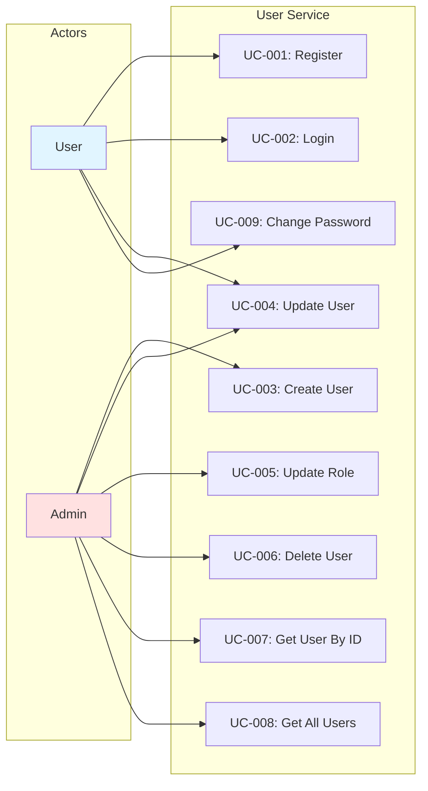

### 4.4 Product Service Use Case Diagram

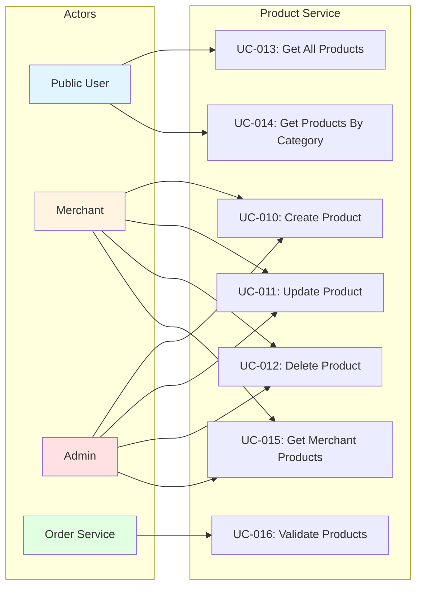

### 4.5 Order Service Use Case Diagram

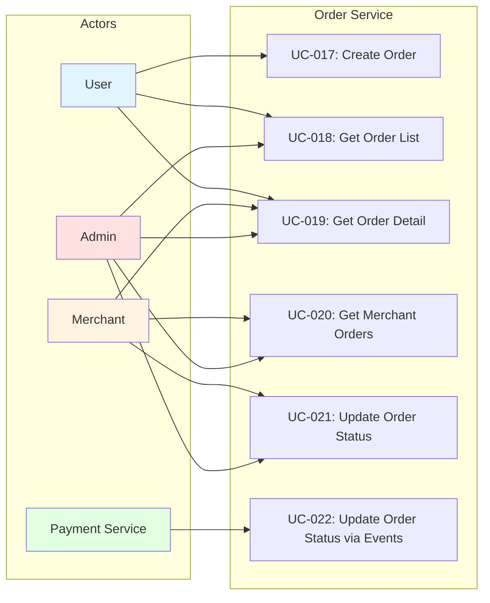

### 4.6 Payment Service Use Case Diagram

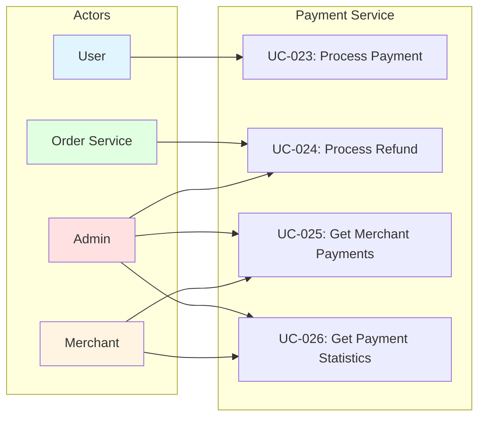

### 4.7 Use Case Diagram by Actor

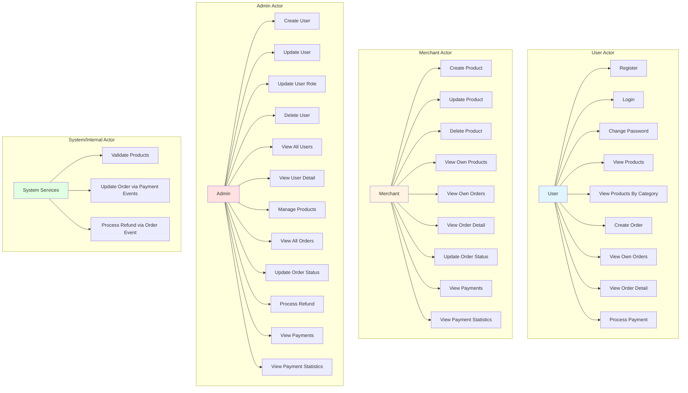

---

## Sequence Diagrams

### 5.1 Order Creation Sequence Diagram

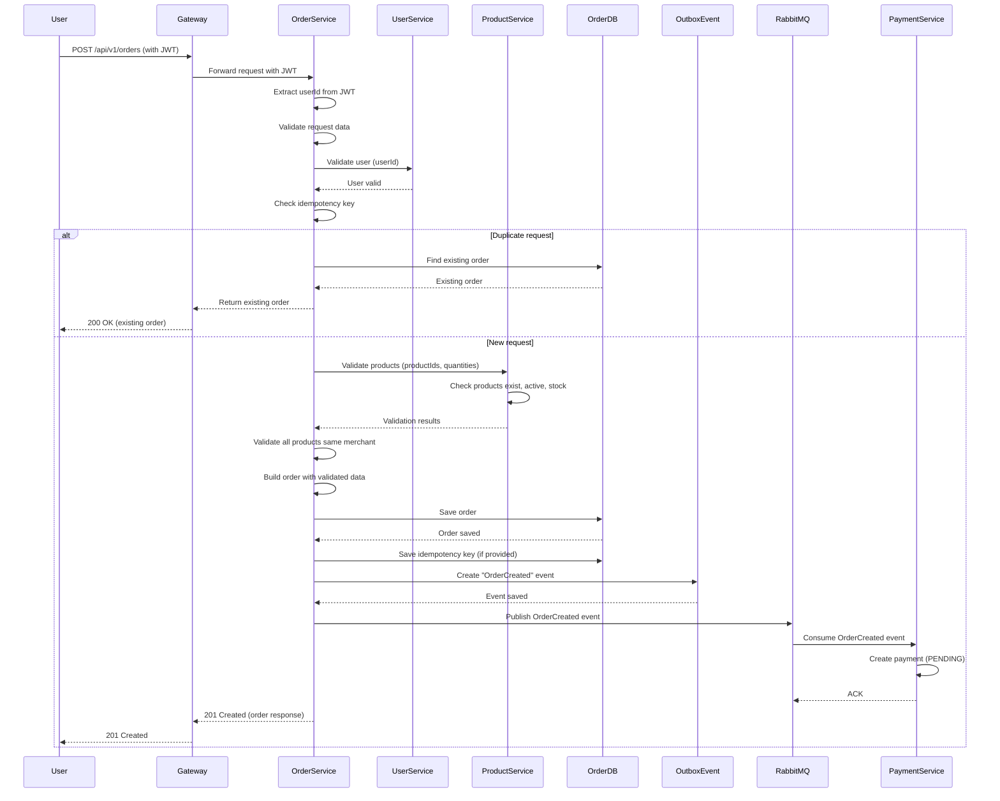

### 5.2 Payment Processing Sequence Diagram

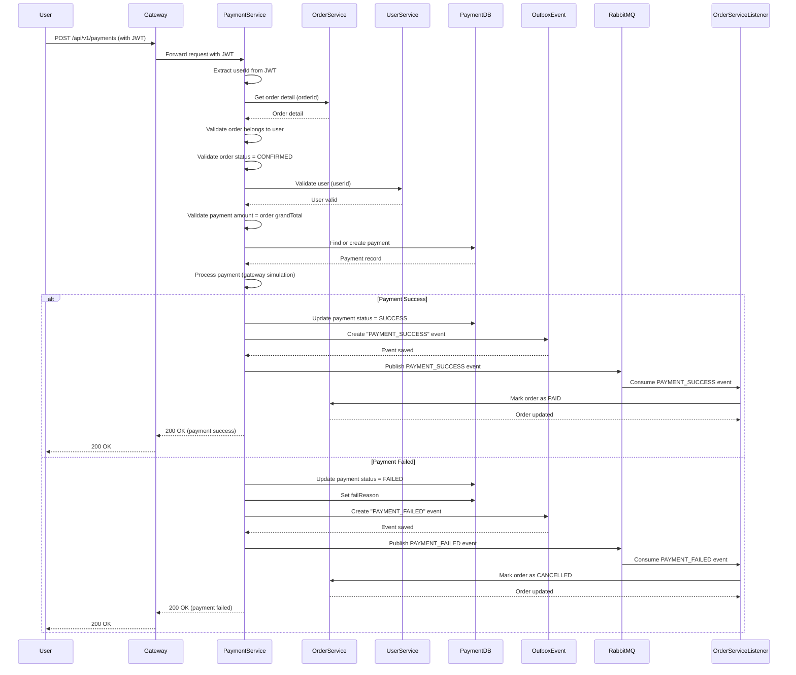

### 5.3 Order Status Update (Manual) Sequence Diagram

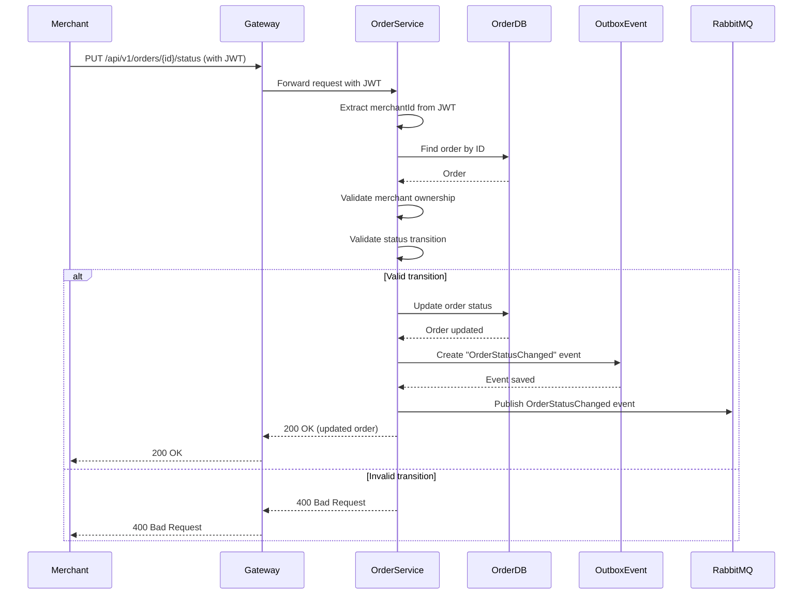

### 5.4 Order Status Update (via Payment Events) Sequence Diagram

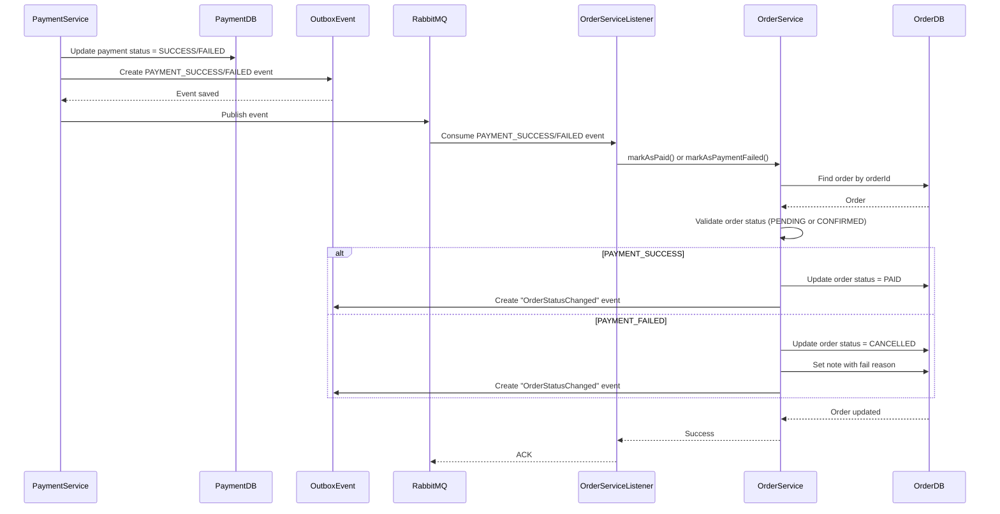

### 5.5 Product Creation Sequence Diagram

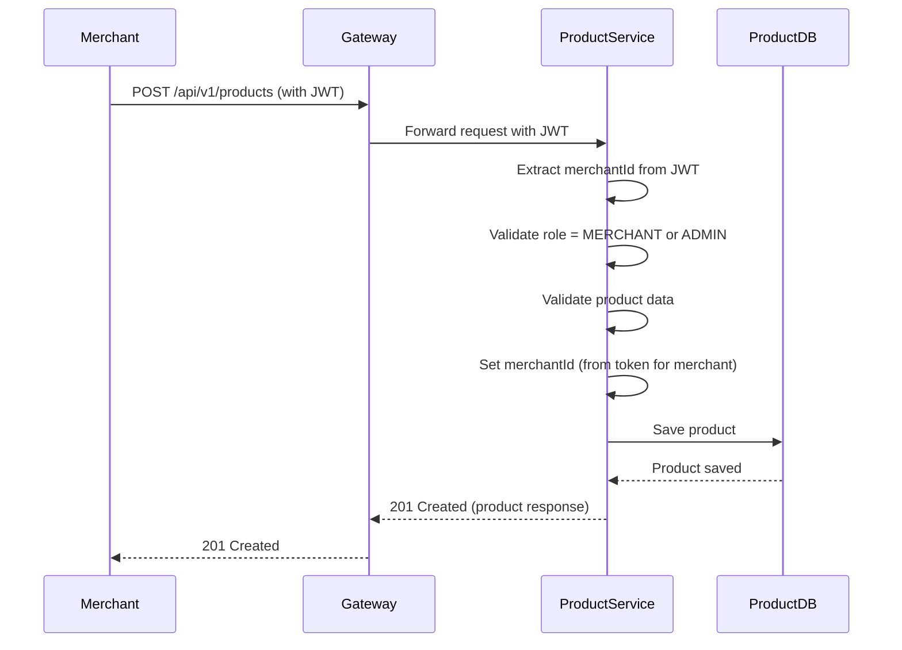

### 5.6 Product Update Sequence Diagram

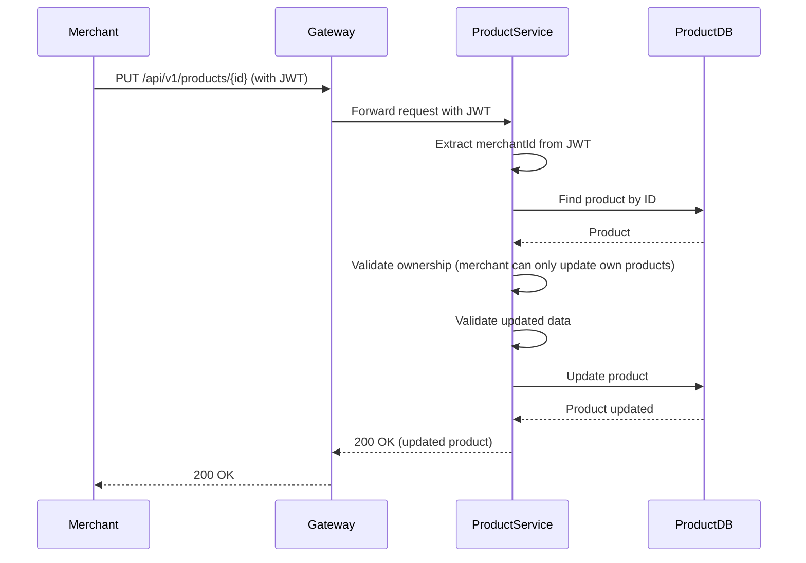

### 5.7 Refund Request Sequence Diagram

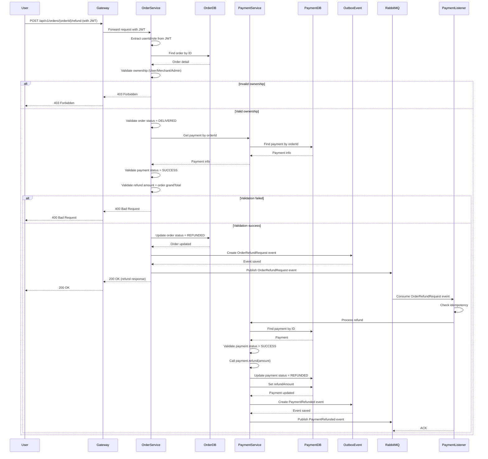

### 5.8 Stock Deduction After Payment Sequence Diagram

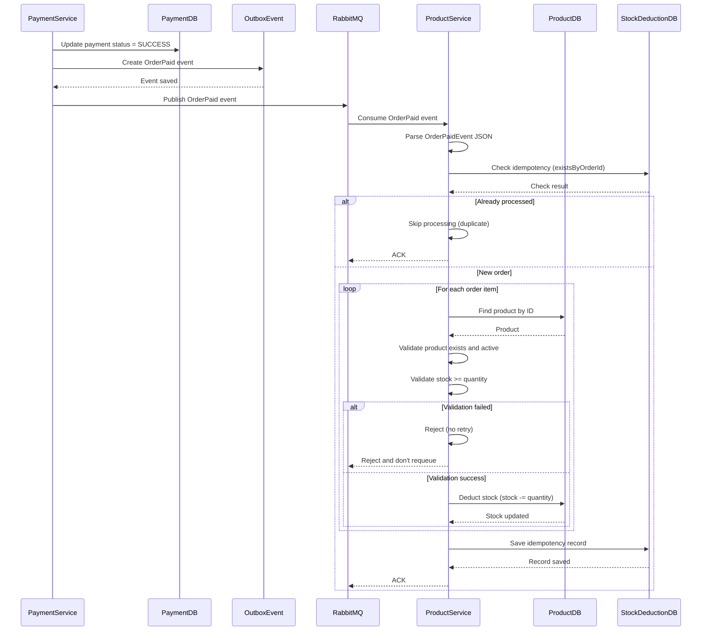

---

## Entity Relationship Diagram (ERD)

### 6.1 Overall ERD

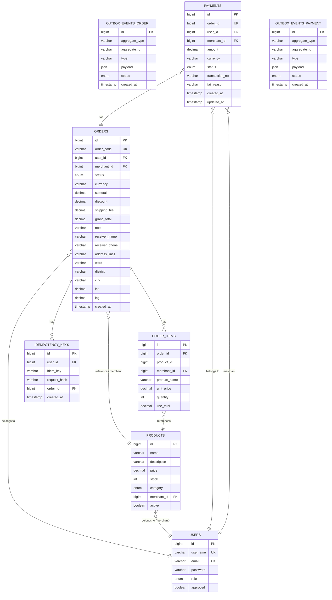

### 6.2 Database Schema Details

#### User Service Database (userservice)

**Table: users**
- `id` (BIGINT, PK, AUTO_INCREMENT)
- `username` (VARCHAR, UNIQUE, NOT NULL)
- `email` (VARCHAR, UNIQUE, NOT NULL)
- `password` (VARCHAR, NOT NULL)
- `role` (ENUM: ADMIN, USER, MERCHANT, NOT NULL)
- `approved` (BOOLEAN, NOT NULL, DEFAULT true)

#### Product Service Database (productmicroservice)

**Table: products**
- `id` (BIGINT, PK, AUTO_INCREMENT)
- `name` (VARCHAR, NOT NULL)
- `description` (VARCHAR, NOT NULL)
- `price` (DECIMAL(12,2), NOT NULL)
- `stock` (INT, NOT NULL, DEFAULT 0)
- `category` (ENUM: DRINK, FOOD, NOT NULL)
- `merchant_id` (BIGINT, NOT NULL, INDEX)
- `active` (BOOLEAN, NOT NULL, DEFAULT true)

#### Order Service Database (orderservice)

**Table: orders**
- `id` (BIGINT, PK, AUTO_INCREMENT)
- `order_code` (VARCHAR(32), UNIQUE, NOT NULL)
- `user_id` (BIGINT, NOT NULL, INDEX)
- `merchant_id` (BIGINT, NOT NULL, INDEX)
- `status` (VARCHAR(20), NOT NULL, INDEX)
- `currency` (VARCHAR(8), NOT NULL, DEFAULT 'VND')
- `subtotal` (BIGINT, NOT NULL)
- `discount` (BIGINT, NOT NULL, DEFAULT 0)
- `shipping_fee` (BIGINT, NOT NULL, DEFAULT 0)
- `grand_total` (BIGINT, NOT NULL)
- `note` (VARCHAR(255))
- `receiver_name` (VARCHAR(100), NOT NULL)
- `receiver_phone` (VARCHAR(20), NOT NULL)
- `address_line1` (VARCHAR(255), NOT NULL)
- `ward` (VARCHAR(100), NOT NULL)
- `district` (VARCHAR(100), NOT NULL)
- `city` (VARCHAR(100), NOT NULL)
- `lat` (DECIMAL(10,8))
- `lng` (DECIMAL(11,8))
- `created_at` (TIMESTAMP, NOT NULL, DEFAULT CURRENT_TIMESTAMP)

**Table: order_items**
- `id` (BIGINT, PK, AUTO_INCREMENT)
- `order_id` (BIGINT, NOT NULL, FK -> orders.id, INDEX)
- `product_id` (BIGINT, NOT NULL, INDEX)
- `merchant_id` (BIGINT, NOT NULL, INDEX)
- `product_name` (VARCHAR(255), NOT NULL)
- `unit_price` (BIGINT, NOT NULL)
- `quantity` (INT, NOT NULL)
- `line_total` (BIGINT, NOT NULL)

**Table: idempotency_keys**
- `id` (BIGINT, PK, AUTO_INCREMENT)
- `user_id` (BIGINT, NOT NULL, INDEX)
- `idem_key` (VARCHAR, NOT NULL)
- `request_hash` (VARCHAR)
- `order_id` (BIGINT, NOT NULL, FK -> orders.id)
- `created_at` (TIMESTAMP, NOT NULL)
- UNIQUE KEY (user_id, idem_key)

**Table: outbox_events**
- `id` (BIGINT, PK, AUTO_INCREMENT)
- `aggregate_type` (VARCHAR(50), NOT NULL, INDEX)
- `aggregate_id` (VARCHAR(64), NOT NULL, INDEX)
- `type` (VARCHAR(100), NOT NULL)
- `payload` (JSON, NOT NULL)
- `status` (VARCHAR(20), NOT NULL, INDEX)
- `created_at` (TIMESTAMP, NOT NULL)

#### Payment Service Database (paymentservice)

**Table: payments**
- `id` (BIGINT, PK, AUTO_INCREMENT)
- `order_id` (BIGINT, UNIQUE, NOT NULL)
- `user_id` (BIGINT, NOT NULL)
- `merchant_id` (BIGINT, NOT NULL, INDEX)
- `amount` (DECIMAL(12,2), NOT NULL)
- `currency` (VARCHAR(8), NOT NULL, DEFAULT 'VND')
- `status` (VARCHAR(16), NOT NULL, INDEX)
- `transaction_no` (VARCHAR(100))
- `fail_reason` (VARCHAR(255))
- `created_at` (TIMESTAMP, NOT NULL)
- `updated_at` (TIMESTAMP, NOT NULL)

**Table: outbox_events**
- `id` (BIGINT, PK, AUTO_INCREMENT)
- `aggregate_type` (VARCHAR(50), NOT NULL, INDEX)
- `aggregate_id` (VARCHAR(64), NOT NULL, INDEX)
- `type` (VARCHAR(100), NOT NULL)
- `payload` (JSON, NOT NULL)
- `status` (VARCHAR(20), NOT NULL, INDEX)
- `created_at` (TIMESTAMP, NOT NULL)

### 6.3 Relationships Summary

1. **Users → Products**: One-to-Many (merchant owns products)
2. **Users → Orders**: One-to-Many (user creates orders)
3. **Users → Payments**: One-to-Many (user makes payments)
4. **Orders → Order Items**: One-to-Many (order contains items)
5. **Orders → Payments**: One-to-One (each order has one payment)
6. **Products → Order Items**: Reference (order items reference products)
7. **Orders → Idempotency Keys**: One-to-Many (order can have idempotency key)

---

## Kiến trúc Hệ thống (Tổng quan)

### 7.1 Kiến trúc Tổng thể

Hệ thống được xây dựng theo mô hình **kiến trúc phân tán (Microservices)**, cho phép:

- **Mở rộng linh hoạt**: Mỗi chức năng có thể mở rộng độc lập
- **Độ tin cậy cao**: Lỗi ở một phần không ảnh hưởng toàn hệ thống
- **Bảo trì dễ dàng**: Cập nhật từng phần mà không ảnh hưởng phần khác

Hệ thống bao gồm các module chính:
- **Module Quản lý Người dùng**: Xử lý đăng ký, đăng nhập, quản lý tài khoản
- **Module Quản lý Sản phẩm**: Quản lý menu món ăn/đồ uống của nhà hàng
- **Module Quản lý Đơn hàng**: Xử lý đặt hàng và theo dõi trạng thái
- **Module Thanh toán**: Xử lý thanh toán và hoàn tiền

### 7.2 Tích hợp và Đồng bộ Dữ liệu

Hệ thống đảm bảo dữ liệu được đồng bộ giữa các module thông qua:
- **Giao tiếp Real-time**: Các module trao đổi thông tin ngay lập tức
- **Xử lý Sự kiện**: Khi có thay đổi (ví dụ: đơn hàng mới, thanh toán thành công), các module liên quan tự động được thông báo
- **Đảm bảo Tính nhất quán**: Dữ liệu luôn đồng nhất giữa các module

### 7.3 Bảo mật

**Xác thực Người dùng:**
- Đăng nhập bằng username/password
- Token bảo mật để truy cập các chức năng
- Mỗi người dùng chỉ truy cập được dữ liệu của mình

**Phân quyền:**
- Khách hàng: Chỉ xem và quản lý đơn hàng của mình
- Nhà hàng: Chỉ quản lý sản phẩm và đơn hàng của mình
- Admin: Quản lý toàn bộ hệ thống

**Bảo vệ Dữ liệu:**
- Mật khẩu được mã hóa an toàn
- Thông tin thanh toán được bảo vệ
- Dữ liệu cá nhân chỉ người dùng có quyền mới truy cập được

### 7.4 Công nghệ Sử dụng

Hệ thống sử dụng các công nghệ hiện đại, phổ biến:
- **Backend**: Java, Spring Framework
- **Database**: MySQL
- **Message Queue**: RabbitMQ (để đồng bộ dữ liệu giữa các module)
- **Container**: Docker (để triển khai dễ dàng)

---

## API Endpoints Documentation

*Lưu ý: Phần này mô tả các API endpoints để tham khảo kỹ thuật. Đối với khách hàng, các chức năng này được thể hiện qua giao diện ứng dụng/web.*

### 8.1 Chức năng Quản lý Tài khoản

**Đăng ký Tài khoản**
- Khách hàng hoặc nhà hàng có thể đăng ký tài khoản mới
- Cần cung cấp: username, email, password
- Nhà hàng cần được Admin duyệt trước khi sử dụng

**Đăng nhập**
- Đăng nhập bằng username và password
- Hệ thống cấp token để truy cập các chức năng

**Quản lý Thông tin Cá nhân**
- Cập nhật thông tin (username, email)
- Đổi mật khẩu
- Admin có thể quản lý tất cả tài khoản

---

### 8.2 Chức năng Quản lý Sản phẩm

**Thêm Sản phẩm**
- Nhà hàng thêm món ăn/đồ uống vào menu
- Cần cung cấp: tên món, mô tả, giá, số lượng, danh mục (Món ăn/Đồ uống)
- Sản phẩm mới sẽ hiển thị ngay cho khách hàng

**Cập nhật Sản phẩm**
- Nhà hàng có thể cập nhật thông tin: tên, mô tả, giá, số lượng
- Có thể tạm ngừng bán (ẩn khỏi menu)

**Xóa Sản phẩm**
- Nhà hàng có thể xóa sản phẩm khỏi menu

**Xem Menu**
- Khách hàng xem danh sách tất cả món đang bán (không cần đăng nhập)
- Có thể lọc theo danh mục (Món ăn hoặc Đồ uống)
- Nhà hàng xem danh sách sản phẩm của mình (bao gồm cả món đã ngừng bán)

---

### 8.3 Chức năng Quản lý Đơn hàng

**Đặt Hàng**
- Khách hàng chọn món từ menu, nhập số lượng
- Nhập địa chỉ giao hàng (tên người nhận, số điện thoại, địa chỉ chi tiết)
- Hệ thống tự động tính tổng tiền (tiền món + phí ship - giảm giá)
- Tạo đơn hàng với mã đơn hàng duy nhất
- Hệ thống tự động kiểm tra: món còn hàng không, giá có đúng không

**Xem Danh sách Đơn hàng**
- Khách hàng xem tất cả đơn hàng của mình
- Có thể lọc theo trạng thái (Chờ xác nhận, Đã xác nhận, Đang giao, Đã giao, Đã hủy)
- Có thể tìm kiếm theo mã đơn hàng
- Nhà hàng xem tất cả đơn hàng của mình
- Admin xem tất cả đơn hàng trong hệ thống

**Xem Chi tiết Đơn hàng**
- Xem đầy đủ thông tin: danh sách món, số lượng, giá, địa chỉ giao hàng, trạng thái

**Cập nhật Trạng thái Đơn hàng**
- Nhà hàng: Xác nhận đơn → Đang giao → Đã giao
- Nhà hàng/Admin: Có thể hủy đơn (nếu chưa giao)
- Admin: Có thể xử lý hoàn tiền cho đơn đã giao

---

### 8.4 Chức năng Thanh toán

**Thanh toán Đơn hàng**
- Khách hàng thanh toán cho đơn hàng đã được nhà hàng xác nhận
- Hệ thống kiểm tra: đơn hàng có thuộc về khách hàng không, trạng thái có phải "Đã xác nhận" không
- Sau khi thanh toán thành công, trạng thái đơn tự động chuyển sang "Đã thanh toán"
- Nếu thanh toán thất bại, đơn hàng có thể bị hủy

**Xem Lịch sử Thanh toán**
- Nhà hàng xem tất cả giao dịch thanh toán của mình
- Có thể lọc theo trạng thái (Thành công, Thất bại, Đã hoàn tiền)
- Có thể xem theo khoảng thời gian

**Thống kê Doanh thu**
- Nhà hàng xem thống kê:
  - Tổng số đơn đã thanh toán
  - Tổng doanh thu
  - Số đơn thành công/thất bại
  - Số tiền đã hoàn
  - Có thể xem theo khoảng thời gian (ngày, tuần, tháng)
- Admin xem thống kê tổng hợp cho tất cả nhà hàng

**Hoàn tiền**
- Admin có thể xử lý hoàn tiền cho đơn hàng đã giao (theo yêu cầu khách hàng)

---

### 8.5 Lưu ý Kỹ thuật

**Bảo mật:**
- Tất cả chức năng (trừ xem menu) yêu cầu đăng nhập
- Mỗi người dùng chỉ truy cập được dữ liệu của mình
- Hệ thống tự động kiểm tra quyền truy cập

**Xử lý Lỗi:**
- Hệ thống hiển thị thông báo lỗi rõ ràng khi có vấn đề
- Ví dụ: "Món này đã hết hàng", "Đơn hàng không tồn tại", "Bạn không có quyền thực hiện thao tác này"

**Hiệu năng:**
- Hệ thống hỗ trợ phân trang khi danh sách quá dài
- Tìm kiếm và lọc nhanh chóng

---

## Appendix

### A. Trạng thái Đơn hàng

Đơn hàng có các trạng thái sau:

1. **Chờ xác nhận (PENDING)**: Đơn hàng mới được tạo, đang chờ nhà hàng xác nhận
2. **Đã xác nhận (CONFIRMED)**: Nhà hàng đã xác nhận đơn, khách hàng có thể thanh toán
3. **Đã thanh toán (PAID)**: Khách hàng đã thanh toán thành công (tự động sau khi thanh toán)
4. **Đang giao (SHIPPED)**: Nhà hàng đã giao hàng
5. **Đã giao (DELIVERED)**: Khách hàng đã nhận được hàng
6. **Đã hủy (CANCELLED)**: Đơn hàng bị hủy (có thể hủy khi ở trạng thái Chờ xác nhận hoặc Đã xác nhận)
7. **Đã hoàn tiền (REFUNDED)**: Đơn hàng đã được hoàn tiền (chỉ áp dụng cho đơn đã giao)

**Quy trình chuyển trạng thái:**
- Chờ xác nhận → Đã xác nhận (Nhà hàng xác nhận)
- Chờ xác nhận → Đã hủy (Khách hàng/Nhà hàng/Admin hủy)
- Đã xác nhận → Đã thanh toán (Tự động sau khi thanh toán thành công)
- Đã xác nhận → Đang giao (Nhà hàng bắt đầu giao)
- Đã xác nhận → Đã hủy (Nhà hàng/Admin hủy)
- Đang giao → Đã giao (Nhà hàng xác nhận đã giao)
- Đã giao → Đã hoàn tiền (Admin xử lý hoàn tiền)

### B. Trạng thái Thanh toán

Thanh toán có các trạng thái:

1. **Chờ thanh toán (PENDING)**: Thanh toán được tạo tự động khi đơn hàng được tạo
2. **Thành công (SUCCESS)**: Thanh toán đã được xử lý thành công
3. **Thất bại (FAILED)**: Thanh toán không thành công
4. **Đã hoàn tiền (REFUNDED)**: Đã được hoàn tiền

### C. Vai trò và Quyền hạn

| Vai trò | Quyền hạn chính |
|---------|----------------|
| **Khách hàng (USER)** | Đặt hàng, Xem đơn hàng của mình, Thanh toán |
| **Nhà hàng (MERCHANT)** | Quản lý menu của mình, Xem đơn hàng của mình, Cập nhật trạng thái đơn hàng, Xem thống kê doanh thu |
| **Quản trị viên (ADMIN)** | Quản lý toàn bộ hệ thống, Duyệt tài khoản nhà hàng, Xem tất cả đơn hàng, Xử lý hoàn tiền, Xem thống kê tổng hợp |

### D. Tóm tắt Chức năng theo Người dùng

**Khách hàng có thể:**
- Đăng ký, đăng nhập tài khoản
- Xem menu món ăn/đồ uống
- Đặt hàng
- Thanh toán
- Xem lịch sử đơn hàng
- Theo dõi trạng thái đơn hàng
- Cập nhật thông tin cá nhân
- Đổi mật khẩu

**Nhà hàng có thể:**
- Đăng ký tài khoản (cần Admin duyệt)
- Quản lý menu (thêm, sửa, xóa món)
- Xem danh sách đơn hàng của mình
- Xác nhận đơn hàng
- Cập nhật trạng thái giao hàng
- Xem lịch sử thanh toán
- Xem thống kê doanh thu

**Admin có thể:**
- Quản lý tất cả tài khoản (tạo, xem, sửa, xóa)
- Duyệt tài khoản nhà hàng
- Quản lý sản phẩm của bất kỳ nhà hàng nào
- Xem tất cả đơn hàng
- Cập nhật trạng thái đơn hàng
- Xử lý hoàn tiền
- Xem thống kê tổng hợp toàn hệ thống

---

**End of Document**

