# Product Requirements Document (PRD)
## Fast Food Delivery Microservices System

**Version:** 1.0  
**Date:** 2024  
**Author:** System Documentation

---

## Table of Contents

1. [Executive Summary](#executive-summary)
2. [Business Flows](#business-flows)
3. [Use Cases](#use-cases)
4. [Use Case Diagrams](#use-case-diagrams)
5. [Sequence Diagrams](#sequence-diagrams)
6. [Entity Relationship Diagram (ERD)](#entity-relationship-diagram-erd)
7. [Technical Architecture Overview](#technical-architecture-overview)
8. [API Endpoints Documentation](#api-endpoints-documentation)
9. [Appendix](#appendix)

---

## Executive Summary

### 1.1 Tổng quan Hệ thống

**Fast Food Delivery** là nền tảng đặt món ăn trực tuyến, kết nối khách hàng với các nhà hàng (merchants) để đặt món và thanh toán trực tuyến một cách thuận tiện và an toàn.

Hệ thống hỗ trợ 3 nhóm người dùng chính:
- **Khách hàng (Users)**: Đặt món ăn, thanh toán, theo dõi đơn hàng
- **Nhà hàng (Merchants)**: Quản lý menu, nhận đơn hàng, cập nhật trạng thái giao hàng
- **Quản trị viên (Admin)**: Quản lý toàn bộ hệ thống, hỗ trợ users và merchants

### 1.2 Mục tiêu Kinh doanh

**Đối với Khách hàng:**
- Đặt món ăn nhanh chóng, dễ dàng qua ứng dụng/web
- Thanh toán an toàn, tiện lợi
- Theo dõi trạng thái đơn hàng real-time
- Xem menu đa dạng từ nhiều nhà hàng

**Đối với Nhà hàng:**
- Quản lý menu sản phẩm linh hoạt
- Nhận đơn hàng tự động, giảm sai sót
- Theo dõi doanh thu và thống kê bán hàng
- Quản lý trạng thái đơn hàng hiệu quả

**Đối với Hệ thống:**
- Tự động hóa quy trình từ đặt hàng đến thanh toán
- Đảm bảo tính chính xác và nhất quán dữ liệu
- Hỗ trợ mở rộng quy mô khi cần

### 1.3 Phạm vi Tài liệu

Tài liệu này mô tả các chức năng chính của hệ thống:
- **Quản lý Tài khoản**: Đăng ký, đăng nhập, quản lý thông tin cá nhân
- **Quản lý Sản phẩm**: Nhà hàng quản lý menu món ăn/đồ uống
- **Quản lý Đơn hàng**: Khách hàng đặt hàng, nhà hàng xử lý đơn hàng
- **Thanh toán**: Xử lý thanh toán và hoàn tiền

### 1.4 Personas (Nhóm người dùng mục tiêu)

| Persona | Nhu cầu chính | Quyền hạn & Công cụ |
|---------|---------------|----------------------|
| **Customer (USER)** | Dễ dàng khám phá menu, đặt/ thanh toán đơn và theo dõi trạng thái. | Ứng dụng web/app → Gateway → Order/Payment Service. Chỉ truy cập dữ liệu của mình. |
| **Merchant (MERCHANT)** | Quản lý catalog, fulfil đơn, theo dõi doanh thu. | Merchant Portal (frontend) → Product/Order/Payment Service. Chỉ thao tác trên dữ liệu của nhà hàng mình. |
| **Admin (ADMIN)** | Giám sát toàn hệ thống, duyệt merchant, xử lý tranh chấp & hoàn tiền. | Admin Portal + công cụ vận hành → User/Product/Order/Payment Service với quyền toàn cục. |

---

## Business Flows

### 2.1 Quy trình Đặt Hàng (Browse → Create Order)

- **Giá trị business:** Cho phép khách hàng duyệt menu, đặt món nhanh chóng và sinh ra đơn hàng hợp lệ để merchant xử lý.
- **Actors & Service chính:** Customer → Gateway → Order Service, Product Service, User Service.
- **UC liên quan:** UC-C02 (Discover Menu), UC-C03 (Place Order), UC-S01 (Cross-service Validation).
- **API/Event:** `GET /products`, `POST /orders`, events `OrderCreated`.
- **Sequence tham chiếu:** [5.1 Quy trình Tạo Đơn hàng](#51-quy-trinh-tao-Don-hang-order-creation).

**Các bước cốt lõi:**
1. Customer duyệt menu (theo danh mục, merchant) và chọn sản phẩm.
2. Gửi `POST /orders` với danh sách item + địa chỉ giao hàng.
3. Order Service xác thực user (User Service), validate sản phẩm & tồn kho (Product Service), kiểm tra idempotency.
4. Order Service tính phí, tạo đơn ở trạng thái `PENDING` + bản ghi thanh toán `PENDING`, phát event `OrderCreated`.
5. Payment Service nhận event và tạo payment record tương ứng; merchant nhận thông báo order mới.

**Kết quả:** Đơn hàng và payment ở trạng thái chờ xử lý, dữ liệu giỏ hàng được khóa, customer có mã đơn để theo dõi.

### 2.2 Quy trình Thanh toán (Payment & Status Sync)

- **Giá trị business:** Khách hàng thanh toán đơn đã xác nhận và theo dõi kết quả; hệ thống tự động cập nhật trạng thái đơn và tồn kho.
- **Actors & Service chính:** Customer → Gateway → Payment Service ↔ Order Service ↔ Product Service.
- **UC liên quan:** UC-C04 (Pay & Track), UC-S02 (Event-driven Order Lifecycle), UC-S03 (Inventory & Refund Sync).
- **API/Event:** `POST /payments`, events `PAYMENT_SUCCESS`, `PAYMENT_FAILED`, `OrderPaid`, `OrderStatusChanged`.
- **Sequence tham chiếu:** [5.2 Quy trình Thanh toán](#52-quy-trinh-thanh-toan-don-hang-payment-processing) và [5.4 Cập nhật trạng thái qua sự kiện](#54-cap-nhat-trang-thai-don-hang-qua-Su-kien-thanh-toan).

**Các bước cốt lõi:**
1. Customer chọn đơn `CONFIRMED` và gọi `POST /payments` với thông tin thanh toán.
2. Payment Service xác minh order (Order Service) + user (User Service) + số tiền.
3. Giao dịch được xử lý (mô phỏng gateway). Kết quả SUCCESS/FAILED được ghi vào `payments`.
4. Payment Service phát sự kiện `PAYMENT_SUCCESS/FAILED` + `OrderPaid` (khi success).
5. Order Service listener nhận sự kiện → cập nhật order `PAID/CANCELLED`, phát `OrderStatusChanged`.
6. Product Service nhận `OrderPaid` để trừ stock, log idempotent; notification service gửi thông báo cho customer & merchant.

**Kết quả:** Khách hàng nhận kết quả thanh toán, order phản ánh trạng thái mới, tồn kho cập nhật chính xác.

### 2.3 Quy trình Quản lý Trạng thái Đơn hàng (Fulfilment & Exceptions)

- **Giá trị business:** Merchant/Admin cập nhật tiến trình giao hàng đúng SLA và xử lý ngoại lệ thủ công.
- **Actors & Service chính:** Merchant/Admin → Gateway → Order Service.
- **UC liên quan:** UC-M02 (Fulfil Orders), UC-A02 (Override Catalog & Orders), UC-C05 (Manage Orders & Issues).
- **API/Event:** `GET /orders/merchant`, `PUT /orders/{id}/status`, event `OrderStatusChanged`.
- **Sequence tham chiếu:** [5.3 Cập nhật trạng thái thủ công](#53-cap-nhat-trang-thai-don-hang-thu-cong-manual-status-update).

**Các bước cốt lõi:**
1. Merchant/Admin truy vấn danh sách order theo trạng thái/ thời gian để ưu tiên xử lý.
2. Merchant xác nhận order (`PENDING` → `CONFIRMED`), chuẩn bị giao (`CONFIRMED` → `SHIPPED`), hoàn tất (`SHIPPED` → `DELIVERED`), hoặc hủy (trước `SHIPPED`).
3. Admin có thể can thiệp các bước hoặc đặt order về `REFUNDED` trong trường hợp đặc biệt.
4. Order Service kiểm tra quyền sở hữu và rule chuyển trạng thái trước khi lưu.
5. Sau mỗi cập nhật, sự kiện `OrderStatusChanged` phát ra để notification service, analytics dashboard và Payment Service (nếu cần) nắm bắt.

**Kết quả:** Trạng thái đơn phản ánh tiến trình thực tế, khách hàng cập nhật real-time, SLA được theo dõi.

### 2.4 Quy trình Quản lý Menu (Catalog Operations)

- **Giá trị business:** Giúp merchant cập nhật catalog nhanh chóng để đảm bảo menu luôn chính xác cho khách hàng.
- **Actors & Service chính:** Merchant/Admin → Gateway → Product Service.
- **UC liên quan:** UC-M01 (Maintain Catalog), UC-A02 (Override Catalog & Orders).
- **API/Event:** `POST/PUT/DELETE /products`, `GET /products/merchants/me`, events `OrderPaid` / `PaymentRefunded` ảnh hưởng stock.
- **Sequence tham chiếu:** [5.5 Tạo sản phẩm](#55-tao-san-pham-product-creation) và [5.6 Cập nhật sản phẩm](#56-cap-nhat-san-pham-product-update).

**Các bước cốt lõi:**
1. Merchant nhập thông tin sản phẩm (tên, mô tả, giá, tồn kho, category) hoặc chỉnh sửa/hủy bán.
2. Product Service xác định merchant từ JWT, kiểm tra quyền và dữ liệu hợp lệ.
3. Hệ thống lưu sản phẩm, cập nhật trạng thái `active`, đồng bộ ra catalog public.
4. Khi Order Paid/Refunded, Product Service nhận event để điều chỉnh stock, đảm bảo con số hiển thị chính xác.

**Kết quả:** Menu phản ánh trạng thái bán hàng thực tế, giảm rủi ro sai tồn kho hoặc giá.

### 2.5 Quy trình Hoàn tiền & Hoàn kho (Refund Lifecycle)

- **Giá trị business:** Cho phép khách hàng/merchant/admin giải quyết đơn hàng phát sinh vấn đề sau khi giao, đảm bảo dữ liệu tài chính và tồn kho nhất quán.
- **Actors & Service chính:** Customer/Merchant/Admin → Gateway → Order Service ↔ Payment Service ↔ Product Service.
- **UC liên quan:** UC-C05 (Manage Orders & Issues), UC-A03 (Financial Controls), UC-S03 (Inventory & Refund Sync).
- **API/Event:** `POST /orders/{id}/refund`, `GET /payments/order/{orderId}`, events `OrderRefundRequest`, `PaymentRefunded`.
- **Sequence tham chiếu:** [5.7 Quy trình Yêu cầu Hoàn tiền](#57-quy-trinh-yeu-cau-hoan-tien-refund-request) và [5.8 Trừ Tồn kho Sau Thanh toán](#58-tru-ton-kho-sau-thanh-toan-stock-deduction-after-payment) (hoàn tồn ngược).

**Các bước cốt lõi:**
1. Customer/Merchant/Admin gửi yêu cầu hoàn tiền, nêu lý do và (nếu là admin) số tiền hoàn.
2. Order Service xác minh quyền sở hữu, trạng thái order (`DELIVERED`), trạng thái payment (`SUCCESS`) và kiểm tra đã hoàn trước đó hay chưa.
3. Order Service cập nhật order → `REFUNDED`, phát event `OrderRefundRequest` cho Payment Service.
4. Payment Service xử lý hoàn tiền, cập nhật payment → `REFUNDED`, phát event `PaymentRefunded`.
5. Product Service nhận `PaymentRefunded`, hoàn stock và lưu record idempotency.

**Kết quả:** Tiền hoàn lại cho khách, order và payment phản ánh trạng thái mới, tồn kho được hoàn trả để tiếp tục bán.

---

## Use Cases

Các use case cũ được gom nhóm lại thành 14 hành trình cốt lõi nhằm giúp đội sản phẩm bám sát mục tiêu kinh doanh mà không bị trùng lặp. Chi tiết nghiệp vụ trước đây vẫn có thể tra cứu trong lịch sử tài liệu nếu cần đào sâu.

### 3.1 Customer Journeys (User-facing)

#### UC-C01: Onboard & Access

| Mục | Nội dung |
|-----|----------|
| **Mã Use Case** | UC-C01 |
| **Actor chính** | Khách hàng / Nhà hàng |
| **Giá trị** | Người dùng tạo tài khoản, đăng nhập và được định danh đúng vai trò. |
| **Tiền điều kiện** | Chưa có phiên đăng nhập hợp lệ. |
| **Hậu điều kiện** | JWT hợp lệ được cấp, merchant cần trạng thái approved trước khi truy cập. |
| **Luồng chính** | 1. Điền form đăng ký/đăng nhập. 2. Hệ thống kiểm tra trùng lặp thông tin & chính sách mật khẩu. 3. Merchant mới → chờ Admin duyệt; User thường được kích hoạt ngay. 4. Cấp token và thiết lập session. |
| **API/Event chính** | `POST /auth/register`, `POST /auth/login`, `GET/PUT /users/me`, event duyệt merchant qua Admin UI |

#### UC-C02: Discover Menu

| Mục | Nội dung |
|-----|----------|
| **Mã Use Case** | UC-C02 |
| **Actor chính** | Khách hàng (không cần đăng nhập) |
| **Giá trị** | Khách hàng xem menu, lọc theo danh mục và nhà hàng. |
| **Tiền điều kiện** | Sản phẩm đang active. |
| **Hậu điều kiện** | Danh sách sản phẩm hiển thị theo bộ lọc; dữ liệu luôn mới nhất. |
| **Luồng chính** | 1. Khách hàng chọn bộ lọc (category, merchant, từ khóa). 2. Product Service trả về danh sách đã phân trang. 3. Người dùng thêm sản phẩm vào giỏ. |
| **API/Event chính** | `GET /products`, `GET /products/{category}`, `GET /products/merchants/me` (đối với merchant), cache layer (nếu có) |

#### UC-C03: Place Order

| Mục | Nội dung |
|-----|----------|
| **Mã Use Case** | UC-C03 |
| **Actor chính** | Khách hàng |
| **Giá trị** | Đặt đơn nhanh, kiểm soát được phí và tính hợp lệ giỏ hàng. |
| **Tiền điều kiện** | Đăng nhập hợp lệ, giỏ hàng chỉ chứa sản phẩm từ 1 merchant. |
| **Hậu điều kiện** | Đơn ở trạng thái `PENDING`, thanh toán ở trạng thái `PENDING`. |
| **Luồng chính** | 1. Gửi thông tin giao hàng + danh sách sản phẩm. 2. Order Service xác thực user, idempotency và tồn kho qua Product Service. 3. Tính tổng tiền, tạo order + order items. 4. Phát sự kiện `OrderCreated` để Payment Service chuẩn bị bản ghi thanh toán. |
| **API/Event chính** | `POST /orders`, internal `/api/internal/users/{id}`, `/api/internal/products/validate`, event `OrderCreated` |

#### UC-C04: Pay & Track

| Mục | Nội dung |
|-----|----------|
| **Mã Use Case** | UC-C04 |
| **Actor chính** | Khách hàng |
| **Giá trị** | Thanh toán an toàn và theo dõi trạng thái đơn thời gian thực. |
| **Tiền điều kiện** | Đơn `CONFIRMED`, thanh toán `PENDING`. |
| **Hậu điều kiện** | Đơn chuyển `PAID/FAILED`, khách hàng nhận thông báo push/email. |
| **Luồng chính** | 1. Gửi yêu cầu thanh toán. 2. Payment Service xác minh order thuộc khách hàng & số tiền khớp. 3. Xử lý cổng thanh toán, cập nhật trạng thái & phát sự kiện `PAYMENT_SUCCESS/FAILED`. 4. Order Service cập nhật trạng thái đơn + gửi notification. |
| **API/Event chính** | `POST /payments`, `GET /payments/order/{orderId}`, events `PAYMENT_SUCCESS`, `PAYMENT_FAILED`, `OrderPaid` |

#### UC-C05: Manage Orders & Issues

| Mục | Nội dung |
|-----|----------|
| **Mã Use Case** | UC-C05 |
| **Actor chính** | Khách hàng |
| **Giá trị** | Xem lịch sử, chi tiết đơn, yêu cầu hủy/hoàn tiền khi cần. |
| **Tiền điều kiện** | Người dùng đã đăng nhập. |
| **Hậu điều kiện** | Trạng thái đơn cập nhật đúng quy trình; yêu cầu hoàn tiền chuyển sang Payment Service. |
| **Luồng chính** | 1. Lọc và xem danh sách/chi tiết đơn. 2. Gửi yêu cầu hủy (khi chưa giao) hoặc hoàn tiền (khi đã giao). 3. Order Service kiểm tra quyền, trạng thái và phát sự kiện refund nếu hợp lệ. |
| **API/Event chính** | `GET /orders`, `GET /orders/{id}`, `POST /orders/{id}/refund`, events `OrderStatusChanged`, `OrderRefundRequest` |

### 3.2 Merchant Journeys

#### UC-M01: Maintain Catalog

| Mục | Nội dung |
|-----|----------|
| **Mã Use Case** | UC-M01 |
| **Actor chính** | Merchant, Admin |
| **Giá trị** | Quản lý menu (CRUD) kèm validation dữ liệu. |
| **Tiền điều kiện** | Merchant đã được approve và đăng nhập; Admin có quyền toàn cục. |
| **Hậu điều kiện** | Sản phẩm được lưu/ẩn, cache và danh sách public được cập nhật. |
| **Luồng chính** | Tạo/cập nhật/xóa sản phẩm, kiểm tra quyền sở hữu, kích hoạt/ẩn sản phẩm. |
| **API/Event chính** | `POST/PUT/DELETE /products`, `GET /products/merchants/me`, event `OrderPaid`/`PaymentRefunded` ảnh hưởng stock |

#### UC-M02: Fulfil Orders

| Mục | Nội dung |
|-----|----------|
| **Mã Use Case** | UC-M02 |
| **Actor chính** | Merchant |
| **Giá trị** | Nắm toàn bộ đơn thuộc nhà hàng, cập nhật trạng thái giao hàng chuẩn SLA. |
| **Tiền điều kiện** | Merchant đăng nhập; chỉ thao tác trên đơn thuộc nhà hàng mình. |
| **Hậu điều kiện** | Đơn cập nhật trạng thái hợp lệ, customer nhận notification, hệ thống phát event `OrderStatusChanged`. |
| **Luồng chính** | 1. Xem danh sách đơn theo thời gian/trạng thái. 2. Xác nhận → Đang giao → Đã giao, hoặc hủy khi cần. 3. Đẩy notification tới khách hàng. |
| **API/Event chính** | `GET /orders/merchant`, `PUT /orders/{id}/status`, event `OrderStatusChanged` |

#### UC-M03: Monitor Revenue & Payout

| Mục | Nội dung |
|-----|----------|
| **Mã Use Case** | UC-M03 |
| **Actor chính** | Merchant |
| **Giá trị** | Theo dõi thanh toán, doanh thu, số tiền hoàn để quyết định vận hành. |
| **Tiền điều kiện** | Merchant đăng nhập; thanh toán liên kết với merchant_id tương ứng. |
| **Hậu điều kiện** | Merchant nắm KPI (tổng đơn, doanh thu, tỷ lệ refund) để lập kế hoạch. |
| **Luồng chính** | Truy vấn danh sách giao dịch, thống kê theo thời gian, export báo cáo. |
| **API/Event chính** | `GET /payments/merchant`, `GET /payments/merchant/statistics`, dữ liệu từ events `OrderPaid`, `PaymentRefunded` |

### 3.3 Admin Guardrails

#### UC-A01: Govern Accounts & Roles

| **Mã** | UC-A01 |
|--------|--------|
| **Giá trị** | Admin tạo, duyệt merchant, khóa/mở tài khoản, phân quyền. |
| **Tiền điều kiện** | Admin đăng nhập bằng tài khoản có role ADMIN. |
| **Hậu điều kiện** | Merchant/Users có trạng thái và vai trò phù hợp, được đồng bộ sang các service khác. |
| **Trọng tâm** | Đảm bảo chỉ merchant đã kiểm duyệt mới được bật chức năng thương mại. |
| **API/Event chính** | `POST /users`, `PUT /users/{id}` (bao gồm trường `approved`), `DELETE /users/{id}`, event đồng bộ user cache |

#### UC-A02: Override Catalog & Orders

| **Mã** | UC-A02 |
|--------|--------|
| **Giá trị** | Admin xem/điều chỉnh mọi sản phẩm và đơn hàng khi có tranh chấp. |
| **Tiền điều kiện** | Admin đăng nhập; yêu cầu điều tra tranh chấp hoặc sự cố vận hành. |
| **Hậu điều kiện** | Dữ liệu sản phẩm/đơn hàng được chỉnh sửa, log audit ghi nhận người thao tác. |
| **Trọng tâm** | Có thể cập nhật trạng thái đơn hoặc menu thay merchant để giữ trải nghiệm khách hàng. |
| **API/Event chính** | `PUT /products/{id}`, `PUT /orders/{id}/status`, dashboard quản trị |

#### UC-A03: Financial Controls & Compliance

| **Mã** | UC-A03 |
|--------|--------|
| **Giá trị** | Quản trị dòng tiền: phê duyệt hoàn tiền, xem báo cáo tổng hợp, đảm bảo audit trail. |
| **Tiền điều kiện** | Đơn đã giao, thanh toán `SUCCESS`, có yêu cầu hoàn tiền hợp lệ. |
| **Hậu điều kiện** | Thanh toán chuyển `REFUNDED`, tồn kho được hoàn trả, báo cáo tài chính ghi nhận. |
| **Trọng tâm** | Mọi giao dịch hoàn/hủy phải ghi nhận lý do và người phê duyệt. |
| **API/Event chính** | `POST /orders/{id}/refund`, `GET /payments/order/{orderId}`, events `OrderRefundRequest`, `PaymentRefunded` |

### 3.4 System / Internal Automations

#### UC-S01: Cross-service Validation

| **Mã** | UC-S01 |
|--------|--------|
| **Actor chính** | Order/Payment Service (internal) |
| **Giá trị** | Đảm bảo dữ liệu người dùng và sản phẩm hợp lệ trước khi tạo giao dịch. |
| **Tiền điều kiện** | Service caller có token nội bộ và id cần validate. |
| **Hậu điều kiện** | Nhận kết quả hợp lệ/không hợp lệ để quyết định tiếp tục hoặc từ chối request. |
| **API/Event chính** | Internal API: `/api/internal/users/{id}/validate`, `/api/internal/products/validate`, `/api/internal/orders/{id}` |

#### UC-S02: Event-driven Order Lifecycle

| **Mã** | UC-S02 |
|--------|--------|
| **Actor chính** | Payment Service ↔ Order Service |
| **Giá trị** | Đồng bộ trạng thái đơn tự động theo kết quả thanh toán, giảm thao tác tay. |
| **Tiền điều kiện** | Payment Service xử lý một giao dịch và có kết quả SUCCESS/FAILED. |
| **Hậu điều kiện** | Order cập nhật trạng thái (PAID/CANCELLED), phát event `OrderStatusChanged` cho các subscriber. |
| **API/Event chính** | Events: `PAYMENT_SUCCESS`, `PAYMENT_FAILED`, `OrderStatusChanged`; listener nội bộ của Order Service. |

#### UC-S03: Inventory & Refund Sync

| **Mã** | UC-S03 |
|--------|--------|
| **Actor chính** | Product Service (asynchronous consumer) |
| **Giá trị** | Giữ tồn kho chính xác sau thanh toán hoặc hoàn tiền với cơ chế idempotent. |
| **Tiền điều kiện** | Payment Service phát `OrderPaid` / `PaymentRefunded`. |
| **Hậu điều kiện** | Stock được trừ hoặc hoàn, ghi record `stock_deduction_records` để tránh xử lý trùng. |
| **API/Event chính** | Events `OrderPaid`, `PaymentRefunded`; bảng `stock_deduction_records`. |

### 3.5 Core Use Case Matrix

| ID | Tên Use Case | Persona/Service | Giá trị chính | Thành phần liên quan |
|----|--------------|-----------------|---------------|----------------------|
| UC-C01 | Onboard & Access | User Service | Đăng ký, đăng nhập, approve merchant | User Service, Admin Portal |
| UC-C02 | Discover Menu | Product Service | Khách hàng xem & lọc sản phẩm | Product Service, Cache |
| UC-C03 | Place Order | Order Service | Tạo đơn hợp lệ, chuẩn bị thanh toán | Order, Product, Payment |
| UC-C04 | Pay & Track | Payment Service | Thanh toán và cập nhật trạng thái | Payment, Order, Notification |
| UC-C05 | Manage Orders & Issues | Order Service | Theo dõi/hủy/hoàn tiền đơn | Order, Payment |
| UC-M01 | Maintain Catalog | Product Service | CRUD menu theo merchant | Product, Admin override |
| UC-M02 | Fulfil Orders | Order Service | Merchant xử lý & cập nhật đơn | Order, Notification |
| UC-M03 | Monitor Revenue | Payment Service | Báo cáo thanh toán/hoàn tiền | Payment, Reporting |
| UC-A01 | Govern Accounts & Roles | User Service | Duyệt merchant, quản lý vai trò | User Service |
| UC-A02 | Override Catalog & Orders | Product + Order | Can thiệp khi có tranh chấp | Admin Portal |
| UC-A03 | Financial Controls | Payment Service | Phê duyệt hoàn tiền, audit | Payment, Compliance DB |
| UC-S01 | Cross-service Validation | Internal API | Đảm bảo dữ liệu hợp lệ | User/Product services |
| UC-S02 | Event-driven Lifecycle | Messaging Layer | Đồng bộ trạng thái đơn | Order, Payment, MQ |
| UC-S03 | Inventory & Refund Sync | Product Service | Trừ/hoàn tồn kho tự động | Product, Payment |

> **Legacy chi tiết:** Các bước UC-001…UC-031 trước đây được giữ làm tham chiếu trong Appendix để đội kỹ thuật có thể truy cứu khi cần độ chi tiết mức API.

---

## Use Case Diagrams

### 4.1 High-level Use Case Diagram (Sau tinh gọn)

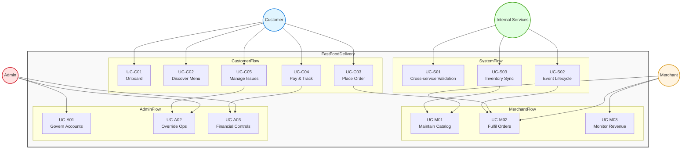

### 4.2 Persona-focused Swimlane

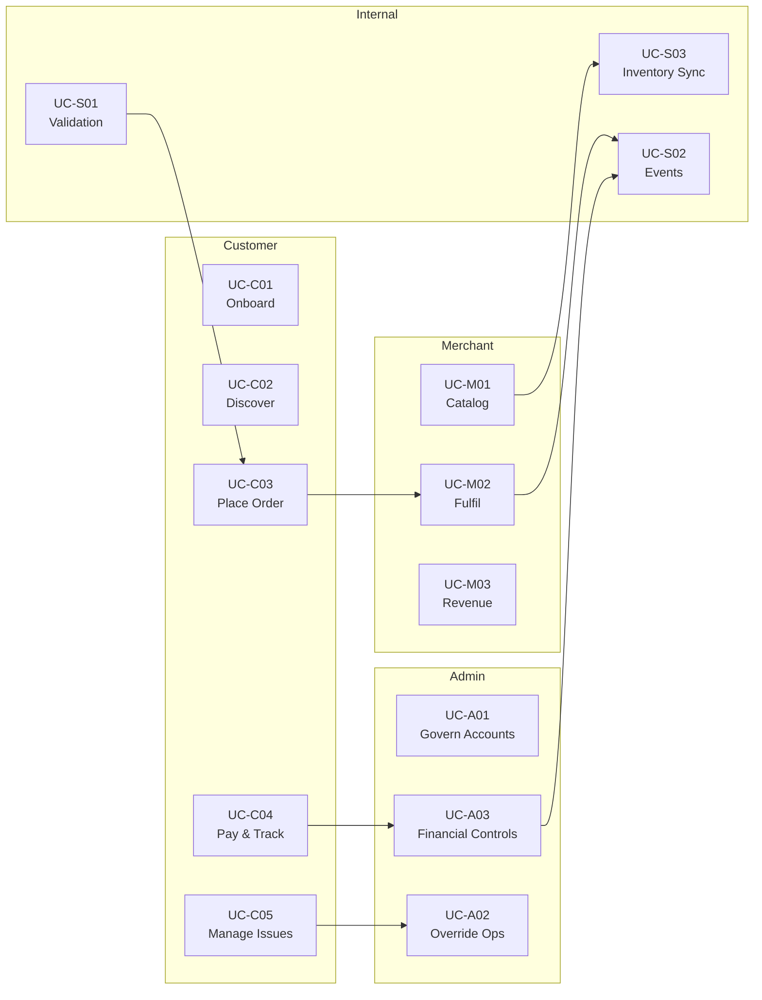

---

## Sequence Diagrams

*Phần này minh họa chi tiết các quy trình nghiệp vụ cốt lõi đã mô tả ở **Business Flows** và **Use Cases**, dưới dạng sequence diagram. Mỗi quy trình đều có mô tả ngắn, phạm vi và các service tham gia.*

### 5.1 Quy trình Tạo Đơn hàng (Order Creation)

**Mô tả ngắn:** Minh họa luồng UC-C03 (Place Order) và UC-S01 (Cross-service Validation): khách hàng tạo đơn qua Gateway, Order Service xác thực user, sản phẩm, idempotency, lưu đơn và phát sự kiện `OrderCreated` cho Payment Service.

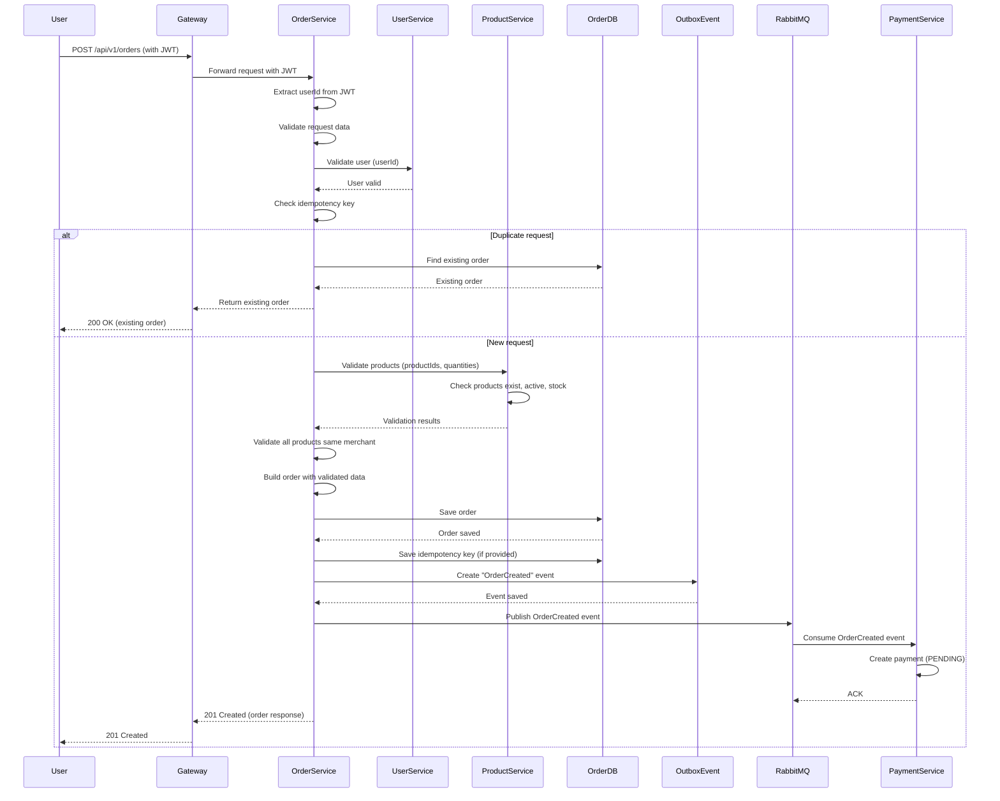

### 5.2 Quy trình Thanh toán Đơn hàng (Payment Processing)

**Mô tả ngắn:** Minh họa luồng UC-C04 (Pay & Track) và UC-S02 (Event-driven Order Lifecycle): khách hàng gọi `POST /payments`, Payment Service xác thực order + user + số tiền, xử lý thanh toán, phát `PAYMENT_SUCCESS/FAILED` để Order Service cập nhật trạng thái đơn.

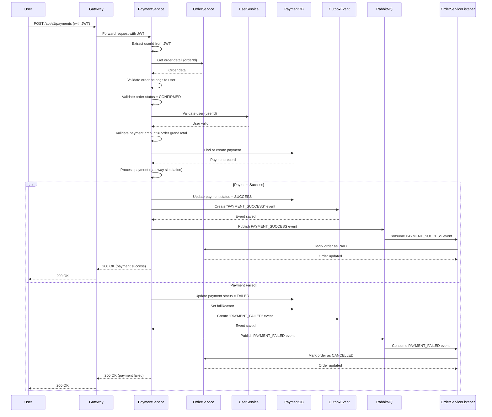

### 5.3 Cập nhật Trạng thái Đơn hàng Thủ công (Manual Status Update)

**Mô tả ngắn:** Minh họa luồng UC-M02 và UC-A02 khi Merchant/Admin cập nhật trạng thái đơn (CONFIRMED/SHIPPED/DELIVERED/CANCELLED) qua API; Order Service kiểm tra quyền, rule chuyển trạng thái và phát `OrderStatusChanged`.

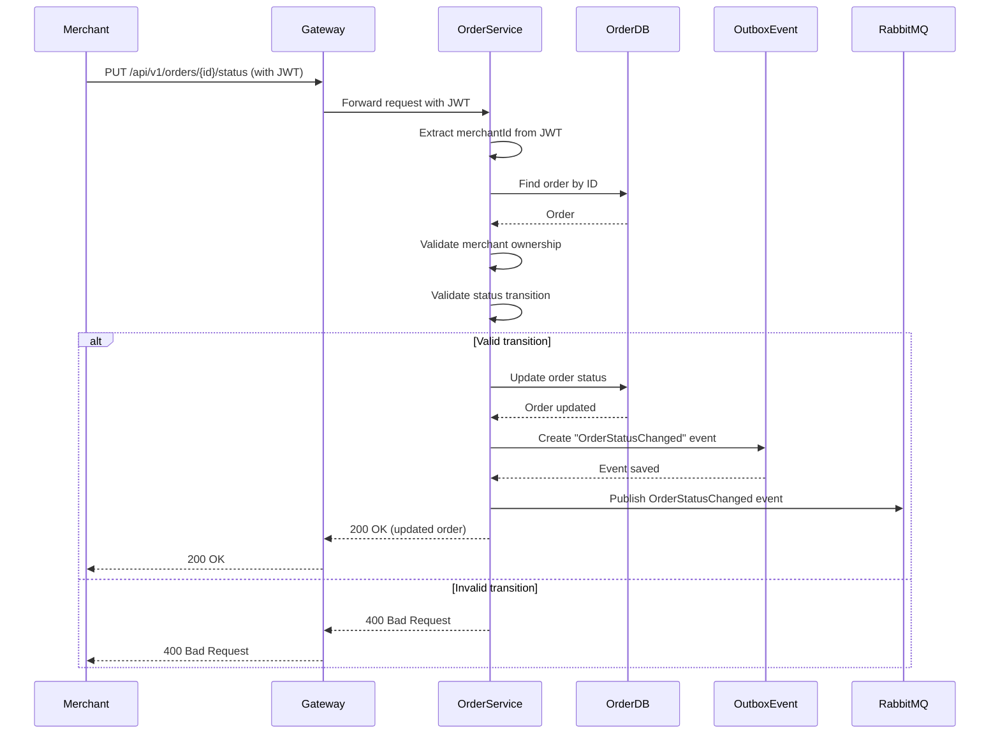

### 5.4 Cập nhật Trạng thái Đơn hàng qua Sự kiện Thanh toán

**Mô tả ngắn:** Tiếp nối 5.2, thể hiện UC-S02 khi Payment Service phát sự kiện kết quả thanh toán; Order Service listener nhận và tự động cập nhật đơn sang `PAID` hoặc `CANCELLED`, ghi chú lý do và phát `OrderStatusChanged`.

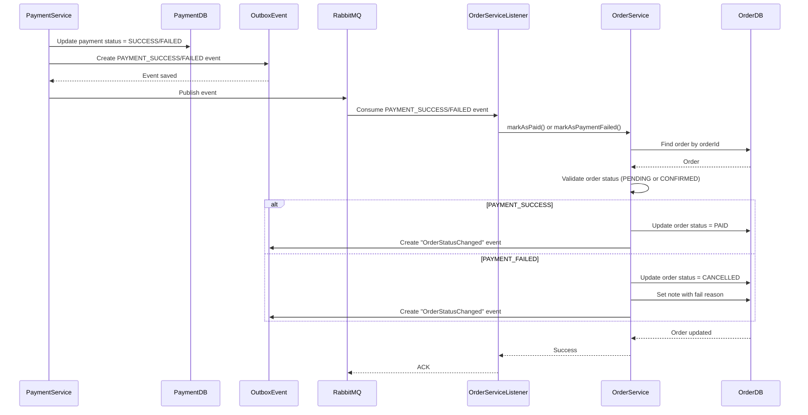

### 5.5 Tạo Sản phẩm (Product Creation)

**Mô tả ngắn:** Minh họa một phần UC-M01 (Maintain Catalog): Merchant/Admin gọi `POST /products` qua Gateway, Product Service validate quyền và dữ liệu, gán `merchantId` và lưu sản phẩm mới.

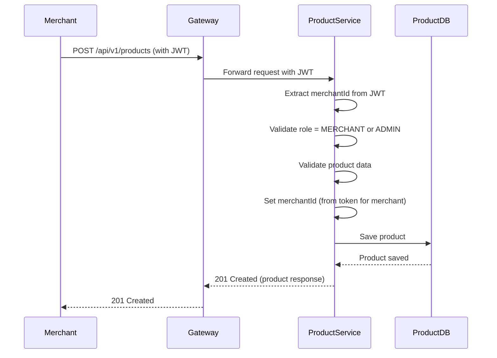

### 5.6 Cập nhật Sản phẩm (Product Update)

**Mô tả ngắn:** Tiếp tục UC-M01: Merchant/Admin cập nhật sản phẩm qua `PUT /products/{id}`, Product Service kiểm tra quyền sở hữu (merchant chỉ sửa sản phẩm của mình), validate dữ liệu rồi cập nhật DB.

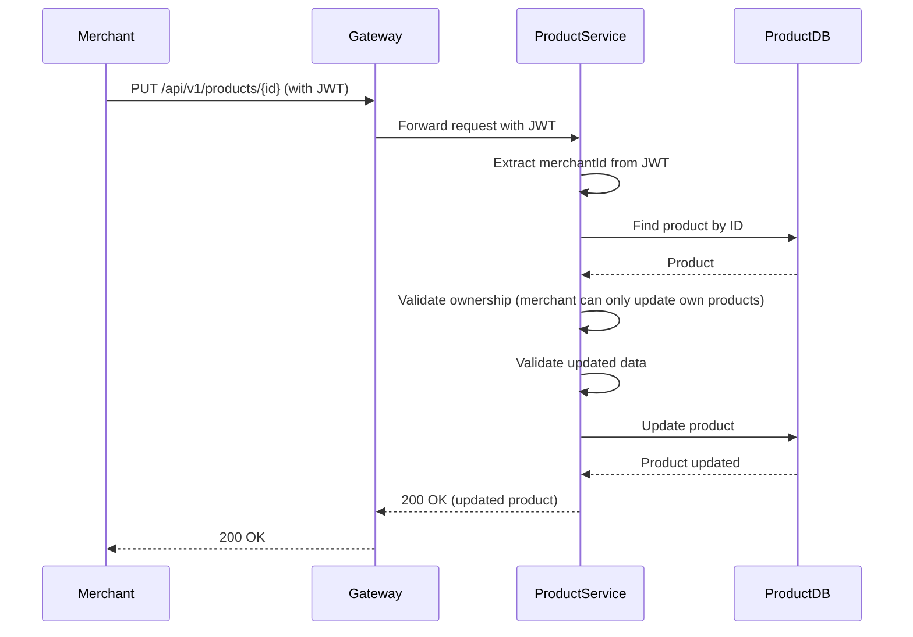

### 5.7 Quy trình Yêu cầu Hoàn tiền (Refund Request)

**Mô tả ngắn:** Minh họa UC-C05 (Manage Orders & Issues) và UC-A03 (Financial Controls): khách hàng/merchant/admin gửi yêu cầu hoàn tiền, Order Service validate quyền + trạng thái đơn + payment, cập nhật đơn sang `REFUNDED` và phát `OrderRefundRequest` để Payment Service xử lý hoàn tiền.

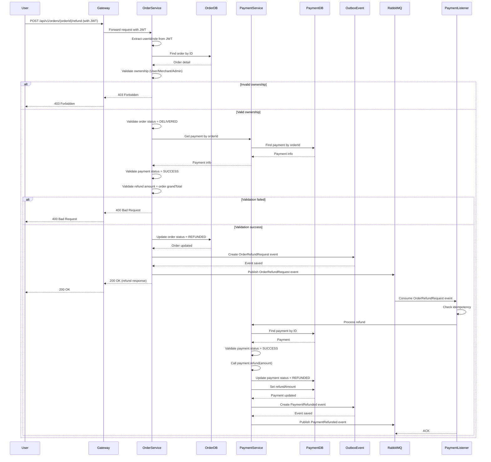

### 5.8 Trừ Tồn kho Sau Thanh toán (Stock Deduction After Payment)

**Mô tả ngắn:** Minh họa UC-S03 (Inventory & Refund Sync): sau khi thanh toán thành công, Payment Service phát `OrderPaid`, Product Service nhận, kiểm tra idempotency, validate từng sản phẩm và trừ stock, ghi lại bản ghi idempotent.

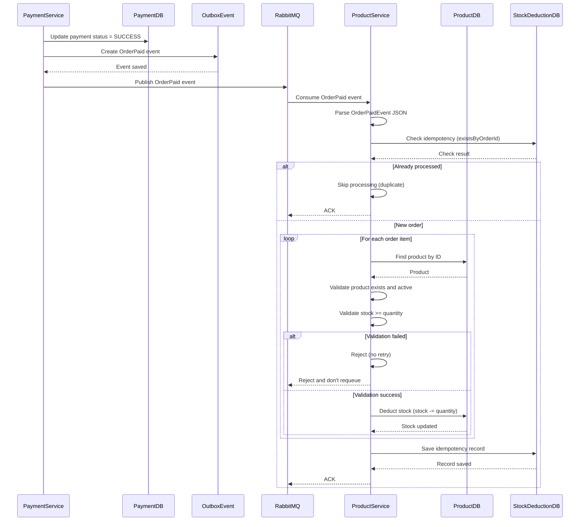

---

## Entity Relationship Diagram (ERD)

### 6.1 Conceptual ERD

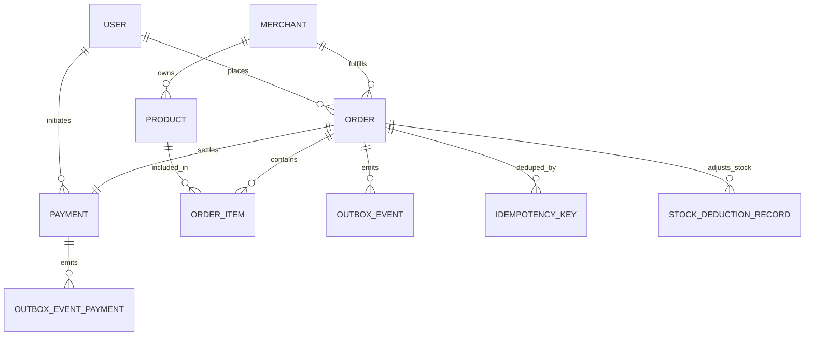

*Ý nghĩa:* sơ đồ khái niệm nhấn mạnh các thực thể chính và quan hệ nghiệp vụ: người dùng đặt đơn, merchant quản lý sản phẩm & fulfil đơn, mọi thay đổi đều sinh event/outbox và ghi nhận điều chỉnh tồn kho.

### 6.2 Physical ERD (Per-service Data Model)

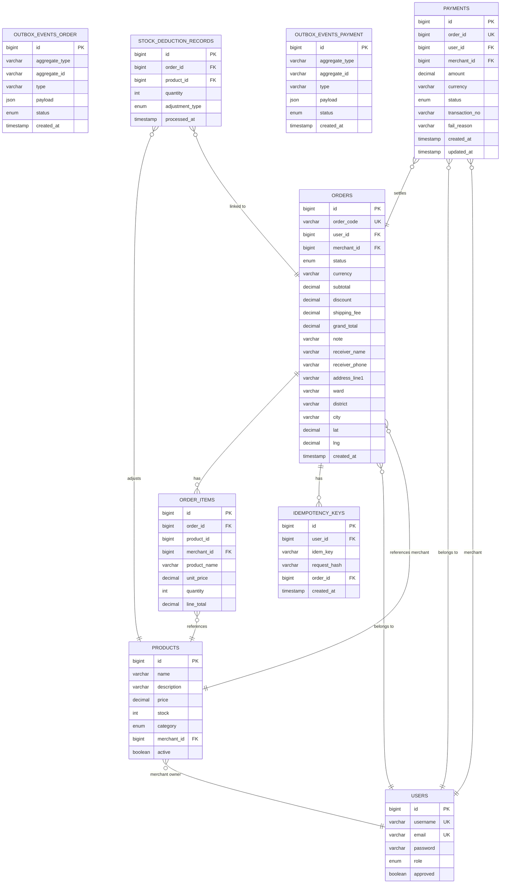

### 6.3 Database Schema Details

#### User Service Database (userservice)

**Table: users**
- `id` (BIGINT, PK, AUTO_INCREMENT)
- `username` (VARCHAR, UNIQUE, NOT NULL)
- `email` (VARCHAR, UNIQUE, NOT NULL)
- `password` (VARCHAR, NOT NULL)
- `role` (ENUM: ADMIN, USER, MERCHANT, NOT NULL)
- `approved` (BOOLEAN, NOT NULL, DEFAULT true)

#### Product Service Database (productmicroservice)

**Table: products**
- `id` (BIGINT, PK, AUTO_INCREMENT)
- `name` (VARCHAR, NOT NULL)
- `description` (VARCHAR, NOT NULL)
- `price` (DECIMAL(12,2), NOT NULL)
- `stock` (INT, NOT NULL, DEFAULT 0)
- `category` (ENUM: DRINK, FOOD, NOT NULL)
- `merchant_id` (BIGINT, NOT NULL, INDEX)
- `active` (BOOLEAN, NOT NULL, DEFAULT true)
- `created_at` / `updated_at`

**Table: stock_deduction_records**
- `id` (BIGINT, PK, AUTO_INCREMENT)
- `order_id` (BIGINT, NOT NULL, FK -> orders.id)
- `product_id` (BIGINT, NOT NULL, FK -> products.id)
- `quantity` (INT, NOT NULL)
- `adjustment_type` (ENUM: DEDUCT, RESTORE, NOT NULL)
- `processed_at` (TIMESTAMP, NOT NULL)
- UNIQUE KEY (`order_id`, `product_id`, `adjustment_type`) để đảm bảo idempotency

#### Order Service Database (orderservice)

**Table: orders**
- `id` (BIGINT, PK, AUTO_INCREMENT)
- `order_code` (VARCHAR(32), UNIQUE, NOT NULL)
- `user_id` (BIGINT, NOT NULL, INDEX)
- `merchant_id` (BIGINT, NOT NULL, INDEX)
- `status` (VARCHAR(20), NOT NULL, INDEX)
- `currency` (VARCHAR(8), NOT NULL, DEFAULT 'VND')
- `subtotal` (BIGINT, NOT NULL)
- `discount` (BIGINT, NOT NULL, DEFAULT 0)
- `shipping_fee` (BIGINT, NOT NULL, DEFAULT 0)
- `grand_total` (BIGINT, NOT NULL)
- `note` (VARCHAR(255))
- `receiver_name` (VARCHAR(100), NOT NULL)
- `receiver_phone` (VARCHAR(20), NOT NULL)
- `address_line1` (VARCHAR(255), NOT NULL)
- `ward` (VARCHAR(100), NOT NULL)
- `district` (VARCHAR(100), NOT NULL)
- `city` (VARCHAR(100), NOT NULL)
- `lat` (DECIMAL(10,8))
- `lng` (DECIMAL(11,8))
- `created_at` (TIMESTAMP, NOT NULL, DEFAULT CURRENT_TIMESTAMP)

**Table: order_items**
- `id` (BIGINT, PK, AUTO_INCREMENT)
- `order_id` (BIGINT, NOT NULL, FK -> orders.id, INDEX)
- `product_id` (BIGINT, NOT NULL, INDEX)
- `merchant_id` (BIGINT, NOT NULL, INDEX)
- `product_name` (VARCHAR(255), NOT NULL)
- `unit_price` (BIGINT, NOT NULL)
- `quantity` (INT, NOT NULL)
- `line_total` (BIGINT, NOT NULL)

**Table: idempotency_keys**
- `id` (BIGINT, PK, AUTO_INCREMENT)
- `user_id` (BIGINT, NOT NULL, INDEX)
- `idem_key` (VARCHAR, NOT NULL)
- `request_hash` (VARCHAR)
- `order_id` (BIGINT, NOT NULL, FK -> orders.id)
- `created_at` (TIMESTAMP, NOT NULL)
- UNIQUE KEY (user_id, idem_key)

**Table: outbox_events**
- `id` (BIGINT, PK, AUTO_INCREMENT)
- `aggregate_type` (VARCHAR(50), NOT NULL, INDEX)
- `aggregate_id` (VARCHAR(64), NOT NULL, INDEX)
- `type` (VARCHAR(100), NOT NULL)
- `payload` (JSON, NOT NULL)
- `status` (VARCHAR(20), NOT NULL, INDEX)
- `created_at` (TIMESTAMP, NOT NULL)

#### Payment Service Database (paymentservice)

**Table: payments**
- `id` (BIGINT, PK, AUTO_INCREMENT)
- `order_id` (BIGINT, UNIQUE, NOT NULL)
- `user_id` (BIGINT, NOT NULL)
- `merchant_id` (BIGINT, NOT NULL, INDEX)
- `amount` (DECIMAL(12,2), NOT NULL)
- `currency` (VARCHAR(8), NOT NULL, DEFAULT 'VND')
- `status` (VARCHAR(16), NOT NULL, INDEX)
- `transaction_no` (VARCHAR(100))
- `fail_reason` (VARCHAR(255))
- `created_at` (TIMESTAMP, NOT NULL)
- `updated_at` (TIMESTAMP, NOT NULL)

**Table: outbox_events**
- `id` (BIGINT, PK, AUTO_INCREMENT)
- `aggregate_type` (VARCHAR(50), NOT NULL, INDEX)
- `aggregate_id` (VARCHAR(64), NOT NULL, INDEX)
- `type` (VARCHAR(100), NOT NULL)
- `payload` (JSON, NOT NULL)
- `status` (VARCHAR(20), NOT NULL, INDEX)
- `created_at` (TIMESTAMP, NOT NULL)

### 6.4 Relationships Summary

1. **Users → Products**: One-to-Many (merchant owns products)
2. **Users → Orders**: One-to-Many (user creates orders)
3. **Users → Payments**: One-to-Many (user makes payments)
4. **Orders → Order Items**: One-to-Many (order contains items)
5. **Orders → Payments**: One-to-One (each order has one payment)
6. **Products → Order Items**: Reference (order items snapshot product data)
7. **Orders → Idempotency Keys**: One-to-Many (order can có nhiều request idempotency)
8. **Orders → Outbox Events**: One-to-Many (mỗi thay đổi sinh event để đồng bộ)
9. **Payments → Outbox Events**: One-to-Many (event payment status)
10. **Orders/Products → Stock Deduction Records**: One-to-Many (ghi lại mỗi lần trừ/hoàn tồn kho dựa trên order)

---

## Kiến trúc Hệ thống (Tổng quan)

### 7.1 Kiến trúc Tổng thể

Hệ thống được xây dựng theo mô hình **kiến trúc phân tán (Microservices)**, cho phép:

- **Mở rộng linh hoạt**: Mỗi chức năng có thể mở rộng độc lập
- **Độ tin cậy cao**: Lỗi ở một phần không ảnh hưởng toàn hệ thống
- **Bảo trì dễ dàng**: Cập nhật từng phần mà không ảnh hưởng phần khác

Hệ thống bao gồm các module chính:
- **Module Quản lý Người dùng**: Xử lý đăng ký, đăng nhập, quản lý tài khoản
- **Module Quản lý Sản phẩm**: Quản lý menu món ăn/đồ uống của nhà hàng
- **Module Quản lý Đơn hàng**: Xử lý đặt hàng và theo dõi trạng thái
- **Module Thanh toán**: Xử lý thanh toán và hoàn tiền

| Thành phần | Vai trò chính | Công nghệ | Port/Dịch vụ |
|------------|---------------|-----------|---------------|
| API Gateway | Entry point, auth, routing | Spring Cloud Gateway | `8080` |
| Service Registry | Service discovery | Netflix Eureka | `8761` |
| User Service | Auth/authorization, merchant approval | Spring Boot + MySQL (`userservice`) | `8081` |
| Product Service | Catalog & stock | Spring Boot + MySQL (`productmicroservice`) | `8082` |
| Order Service | Order lifecycle, idempotency, outbox | Spring Boot + MySQL (`orderservice`) | `8083` |
| Payment Service | Payments, refunds, events | Spring Boot + MySQL (`paymentservice`) | `8084` |
| RabbitMQ | Event bus (OrderCreated, OrderPaid, ...) | RabbitMQ 3.13 | `5672/15672` |
| MySQL | Shared DB engine (multi schema) | MySQL 8.0 | `3306` |
| Frontend | React SPA (Admin/Merchant/Customer Portal) | React + Vite | `3000` |

### 7.2 Tích hợp và Đồng bộ Dữ liệu

Hệ thống đảm bảo dữ liệu được đồng bộ giữa các module thông qua:
- **Giao tiếp Real-time**: Các module trao đổi thông tin ngay lập tức
- **Xử lý Sự kiện**: Khi có thay đổi (ví dụ: đơn hàng mới, thanh toán thành công), các module liên quan tự động được thông báo
- **Đảm bảo Tính nhất quán**: Dữ liệu luôn đồng nhất giữa các module

### 7.3 Bảo mật

**Xác thực Người dùng:**
- Đăng nhập bằng username/password
- Token bảo mật để truy cập các chức năng
- Mỗi người dùng chỉ truy cập được dữ liệu của mình

**Phân quyền:**
- Khách hàng: Chỉ xem và quản lý đơn hàng của mình
- Nhà hàng: Chỉ quản lý sản phẩm và đơn hàng của mình
- Admin: Quản lý toàn bộ hệ thống

**Bảo vệ Dữ liệu:**
- Mật khẩu được mã hóa an toàn
- Thông tin thanh toán được bảo vệ
- Dữ liệu cá nhân chỉ người dùng có quyền mới truy cập được

### 7.4 Công nghệ Sử dụng

Hệ thống sử dụng các công nghệ hiện đại, phổ biến:
- **Backend**: Java, Spring Framework
- **Database**: MySQL
- **Message Queue**: RabbitMQ (để đồng bộ dữ liệu giữa các module)
- **Container**: Docker (để triển khai dễ dàng)

### 7.5 Observability & Reliability

- **Spring Boot Actuator** bật trên mọi service (`/actuator/health`, `/actuator/info`, `/actuator/metrics`) để phục vụ monitoring và cảnh báo.
- **Resilience4j** bảo vệ các call giữa services (Order ↔ Payment) với circuit breaker (failure threshold 50%, window 10 request, auto half-open sau 5–10s).
- **Structured logging & correlation ID**: Gateway gán traceId cho từng request, chuyển xuống các service để dễ truy vết.
- **Metrics & Alerts**: Đếm số order/payment theo trạng thái (PAID, FAILED, REFUNDED) từ bảng outbox + actuator metrics để feed dashboards.
- **Retry & Idempotency**: Outbox pattern (Order/Payment) + `stock_deduction_records` đảm bảo sự kiện được xử lý ít nhất một lần nhưng không nhân đôi.

### 7.6 Component Diagram

Component diagram mô tả các component, ports, provided interfaces (⭕) và required interfaces (🔌) của hệ thống.

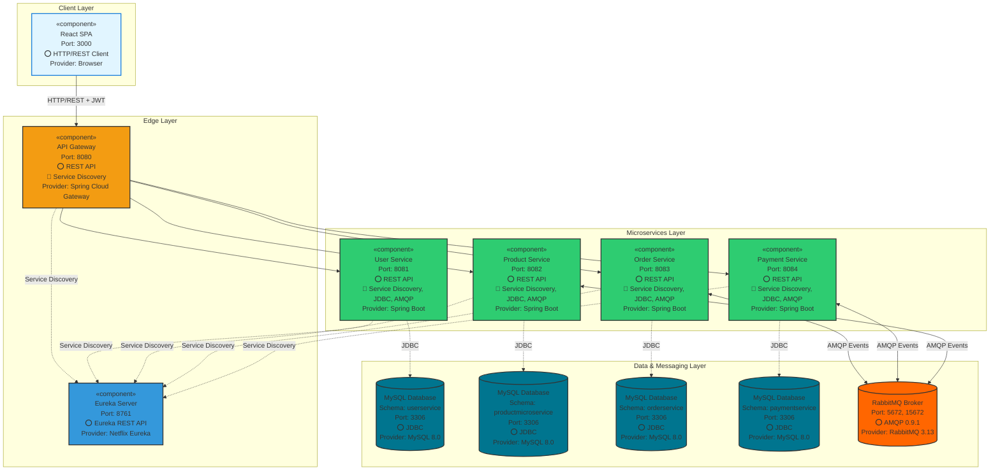

**Chú thích:**
- **Port**: Cổng mạng mà component lắng nghe/kết nối
- **⭕ Provided Interface**: Interface mà component cung cấp
- **🔌 Required Interface**: Interface mà component cần từ component khác
- **Provider**: Công nghệ/thư viện cung cấp implementation

**Bảng tóm tắt:**

| Component | Port | Provided | Required | Provider |
|-----------|------|----------|----------|----------|
| React SPA | 3000 | HTTP/REST Client | - | Browser |
| API Gateway | 8080 | REST API | Service Discovery | Spring Cloud Gateway |
| Eureka Server | 8761 | Eureka REST API | - | Netflix Eureka |
| User/Product/Order/Payment Service | 8081-8084 | REST API | Service Discovery, JDBC, AMQP | Spring Boot |
| MySQL (4 schemas) | 3306 | JDBC | - | MySQL 8.0 |
| RabbitMQ | 5672, 15672 | AMQP 0.9.1 | - | RabbitMQ 3.13 |

*Diễn giải:* Frontend gọi Gateway qua HTTP/REST. Gateway định tuyến tới các microservice thông qua Eureka (Service Discovery). Mỗi service kết nối tới MySQL riêng qua JDBC và trao đổi sự kiện qua RabbitMQ bằng AMQP.

#### 7.6.1 Phiên bản PlantUML (Tham khảo)

PlantUML hỗ trợ tốt hơn cho UML Component Diagram với ports và interfaces theo chuẩn. Để sử dụng, cần cài đặt PlantUML hoặc sử dụng online editor tại [plantuml.com](http://www.plantuml.com/plantuml/uml/).

```plantuml
@startuml Component Diagram
!theme plain
skinparam componentStyle rectangle
skinparam linetype ortho

package "Client Layer" {
    component [React SPA\nProvider: Browser] as Frontend
    portin "Port: 3000" as FrontendPort
    interface "HTTP/REST Client" as FrontendAPI
    Frontend -- FrontendPort
    FrontendPort -- FrontendAPI
}

package "Edge Layer" {
    component [API Gateway\nProvider: Spring Cloud Gateway] as Gateway
    portin "Port: 8080" as GatewayPort
    portin "Port: 8761" as GatewaySDPort
    interface "REST API" as GatewayAPI
    interface "Service Discovery" as GatewaySD
    Gateway -- GatewayPort
    Gateway -- GatewaySDPort
    GatewayPort -- GatewayAPI
    GatewaySDPort -- GatewaySD

    component [Eureka Server\nProvider: Netflix Eureka] as Registry
    portin "Port: 8761" as RegistryPort
    interface "Eureka REST API" as RegistryAPI
    Registry -- RegistryPort
    RegistryPort -- RegistryAPI
}

package "Microservices Layer" {
    component [User Service\nProvider: Spring Boot] as UserSvc
    portin "Port: 8081" as UserSvcPort
    portin "Port: 8761" as UserSvcSDPort
    portin "Port: 3306" as UserSvcDBPort
    portin "Port: 5672" as UserSvcMQPort
    interface "REST API" as UserSvcAPI
    interface "Service Discovery" as UserSvcSD
    interface "JDBC" as UserSvcJDBC
    interface "AMQP" as UserSvcAMQP
    UserSvc -- UserSvcPort
    UserSvc -- UserSvcSDPort
    UserSvc -- UserSvcDBPort
    UserSvc -- UserSvcMQPort
    UserSvcPort -- UserSvcAPI
    UserSvcSDPort -- UserSvcSD
    UserSvcDBPort -- UserSvcJDBC
    UserSvcMQPort -- UserSvcAMQP

    component [Product Service\nProvider: Spring Boot] as ProductSvc
    portin "Port: 8082" as ProductSvcPort
    portin "Port: 8761" as ProductSvcSDPort
    portin "Port: 3306" as ProductSvcDBPort
    portin "Port: 5672" as ProductSvcMQPort
    interface "REST API" as ProductSvcAPI
    interface "Service Discovery" as ProductSvcSD
    interface "JDBC" as ProductSvcJDBC
    interface "AMQP" as ProductSvcAMQP
    ProductSvc -- ProductSvcPort
    ProductSvc -- ProductSvcSDPort
    ProductSvc -- ProductSvcDBPort
    ProductSvc -- ProductSvcMQPort
    ProductSvcPort -- ProductSvcAPI
    ProductSvcSDPort -- ProductSvcSD
    ProductSvcDBPort -- ProductSvcJDBC
    ProductSvcMQPort -- ProductSvcAMQP

    component [Order Service\nProvider: Spring Boot] as OrderSvc
    portin "Port: 8083" as OrderSvcPort
    portin "Port: 8761" as OrderSvcSDPort
    portin "Port: 3306" as OrderSvcDBPort
    portin "Port: 5672" as OrderSvcMQPort
    interface "REST API" as OrderSvcAPI
    interface "Service Discovery" as OrderSvcSD
    interface "JDBC" as OrderSvcJDBC
    interface "AMQP" as OrderSvcAMQP
    OrderSvc -- OrderSvcPort
    OrderSvc -- OrderSvcSDPort
    OrderSvc -- OrderSvcDBPort
    OrderSvc -- OrderSvcMQPort
    OrderSvcPort -- OrderSvcAPI
    OrderSvcSDPort -- OrderSvcSD
    OrderSvcDBPort -- OrderSvcJDBC
    OrderSvcMQPort -- OrderSvcAMQP

    component [Payment Service\nProvider: Spring Boot] as PaymentSvc
    portin "Port: 8084" as PaymentSvcPort
    portin "Port: 8761" as PaymentSvcSDPort
    portin "Port: 3306" as PaymentSvcDBPort
    portin "Port: 5672" as PaymentSvcMQPort
    interface "REST API" as PaymentSvcAPI
    interface "Service Discovery" as PaymentSvcSD
    interface "JDBC" as PaymentSvcJDBC
    interface "AMQP" as PaymentSvcAMQP
    PaymentSvc -- PaymentSvcPort
    PaymentSvc -- PaymentSvcSDPort
    PaymentSvc -- PaymentSvcDBPort
    PaymentSvc -- PaymentSvcMQPort
    PaymentSvcPort -- PaymentSvcAPI
    PaymentSvcSDPort -- PaymentSvcSD
    PaymentSvcDBPort -- PaymentSvcJDBC
    PaymentSvcMQPort -- PaymentSvcAMQP
}

package "Data & Messaging Layer" {
    database "MySQL\nuserservice\nProvider: MySQL 8.0" as MySQLUser
    portin "Port: 3306" as MySQLUserPort
    interface "JDBC" as MySQLUserJDBC
    MySQLUser -- MySQLUserPort
    MySQLUserPort -- MySQLUserJDBC

    database "MySQL\nproductmicroservice\nProvider: MySQL 8.0" as MySQLProduct
    portin "Port: 3306" as MySQLProductPort
    interface "JDBC" as MySQLProductJDBC
    MySQLProduct -- MySQLProductPort
    MySQLProductPort -- MySQLProductJDBC

    database "MySQL\norderservice\nProvider: MySQL 8.0" as MySQLOrder
    portin "Port: 3306" as MySQLOrderPort
    interface "JDBC" as MySQLOrderJDBC
    MySQLOrder -- MySQLOrderPort
    MySQLOrderPort -- MySQLOrderJDBC

    database "MySQL\npaymentservice\nProvider: MySQL 8.0" as MySQLPayment
    portin "Port: 3306" as MySQLPaymentPort
    interface "JDBC" as MySQLPaymentJDBC
    MySQLPayment -- MySQLPaymentPort
    MySQLPaymentPort -- MySQLPaymentJDBC

    queue "RabbitMQ Broker\nProvider: RabbitMQ 3.13" as RabbitMQ
    portin "Port: 5672" as RabbitMQPort
    interface "AMQP 0.9.1" as RabbitMQAMQP
    RabbitMQ -- RabbitMQPort
    RabbitMQPort -- RabbitMQAMQP
}

' Interface Connections
FrontendAPI --> GatewayAPI : HTTP/REST + JWT
GatewayAPI --> UserSvcAPI
GatewayAPI --> ProductSvcAPI
GatewayAPI --> OrderSvcAPI
GatewayAPI --> PaymentSvcAPI

GatewaySD --> RegistryAPI
UserSvcSD --> RegistryAPI
ProductSvcSD --> RegistryAPI
OrderSvcSD --> RegistryAPI
PaymentSvcSD --> RegistryAPI

UserSvcJDBC --> MySQLUserJDBC
ProductSvcJDBC --> MySQLProductJDBC
OrderSvcJDBC --> MySQLOrderJDBC
PaymentSvcJDBC --> MySQLPaymentJDBC

OrderSvcAMQP <--> RabbitMQAMQP : Events
PaymentSvcAMQP <--> RabbitMQAMQP : Events
ProductSvcAMQP <--> RabbitMQAMQP : Events

@enduml
```

**Cách sử dụng PlantUML:**
1. **Online**: Truy cập [plantuml.com/plantuml/uml/](http://www.plantuml.com/plantuml/uml/) và paste code trên
2. **VS Code**: Cài extension "PlantUML" và preview
3. **CLI**: Cài PlantUML Java và chạy `plantuml component.puml`
4. **GitHub/GitLab**: Tự động render PlantUML trong markdown

---

## API Endpoints Documentation

*Lưu ý: Tất cả endpoint bên dưới đều được client gọi qua API Gateway tại base URL `http://<gateway>/api/v1/...`. Bảng chỉ liệt kê các endpoint cốt lõi, map với các hành trình UC-C/M/A/S ở trên.*

### 8.1 User & Auth APIs (UC-C01, UC-A01)

| Endpoint | Method | Mô tả | Auth | Use Case |
|---------|--------|-------|------|----------|
| `/auth/register` | POST | Đăng ký tài khoản Customer hoặc Merchant. | Public | UC-C01 |
| `/auth/login` | POST | Đăng nhập, trả về JWT (access + refresh token). | Public | UC-C01 |
| `/users/me` | GET | Lấy thông tin tài khoản hiện tại. | JWT | UC-C01, UC-C05 |
| `/users/me` | PUT | Cập nhật thông tin cá nhân (email, username, profile). | JWT | UC-C01 |
| `/users/me/password` | PUT | Đổi mật khẩu. | JWT | UC-C01 |
| `/users` | POST | Admin tạo tài khoản (Customer/Merchant/Admin). | ADMIN | UC-A01 |
| `/users/{id}` | GET/PUT/DELETE | Admin xem/sửa/xóa tài khoản. | ADMIN | UC-A01 |
| `/users` | GET | Admin xem danh sách tất cả tài khoản (phân trang, lọc theo role). | ADMIN | UC-A01 |

### 8.2 Product APIs (UC-C02, UC-M01, UC-S01, UC-S03)

| Endpoint | Method | Mô tả | Auth | Use Case |
|---------|--------|-------|------|----------|
| `/products` | GET | Danh sách sản phẩm public, chỉ trả về `active = true`. | Public | UC-C02 |
| `/products/{category}` | GET | Danh sách sản phẩm theo danh mục. | Public | UC-C02 |
| `/products` | POST | Merchant/Admin tạo sản phẩm mới (merchantId từ JWT với merchant). | MERCHANT/ADMIN | UC-M01 |
| `/products/{id}` | PUT | Cập nhật thông tin sản phẩm, chỉ chủ sở hữu hoặc Admin. | MERCHANT/ADMIN | UC-M01 |
| `/products/{id}` | DELETE | Xóa/ẩn sản phẩm khỏi menu. | MERCHANT/ADMIN | UC-M01 |
| `/products/merchants/me` | GET | Merchant xem tất cả sản phẩm của mình. | MERCHANT | UC-M01, UC-M03 |
| `/internal/products/validate` | POST | Order Service xác thực danh sách sản phẩm (tồn tại, active, đủ stock). | Internal | UC-S01 |
| `/internal/stock/deduction` | POST (event-consumer) | Trừ/hoàn tồn kho dựa trên `OrderPaid`/`PaymentRefunded`. | Event | UC-S03 |

### 8.3 Order APIs (UC-C03, UC-C05, UC-M02, UC-A02, UC-S01, UC-S02)

| Endpoint | Method | Mô tả | Auth | Use Case |
|---------|--------|-------|------|----------|
| `/orders` | POST | Customer tạo đơn hàng từ giỏ hiện tại, kiểm tra user + sản phẩm + idempotency. | CUSTOMER | UC-C03, UC-S01 |
| `/orders` | GET | Customer xem danh sách đơn của mình (lọc trạng thái, thời gian, mã đơn). | CUSTOMER | UC-C05 |
| `/orders/{orderId}` | GET | Xem chi tiết đơn hàng (Customer/Merchant/Admin theo quyền). | JWT | UC-C05, UC-M02, UC-A02 |
| `/orders/merchant` | GET | Merchant xem đơn hàng của nhà hàng mình. | MERCHANT | UC-M02 |
| `/orders/{orderId}/status` | PUT | Merchant/Admin cập nhật trạng thái đơn (CONFIRMED, SHIPPED, DELIVERED, CANCELLED). | MERCHANT/ADMIN | UC-M02, UC-A02 |
| `/orders/{orderId}/refund` | POST | Customer/Merchant/Admin gửi yêu cầu hoàn tiền. | JWT | UC-C05, UC-A03 |
| `/internal/orders/{orderId}` | GET | Payment/Product Service lấy chi tiết đơn nội bộ. | Internal | UC-S01 |
| *(Event)* `OrderCreated` | - | Phát sau khi tạo đơn, Payment Service tạo thanh toán `PENDING`. | Event | UC-S02 |
| *(Event)* `OrderStatusChanged` | - | Phát khi trạng thái đơn đổi (manual hoặc qua payment). | Event | UC-S02 |

### 8.4 Payment APIs (UC-C04, UC-M03, UC-A03, UC-S02, UC-S03)

| Endpoint | Method | Mô tả | Auth | Use Case |
|---------|--------|-------|------|----------|
| `/payments` | POST | Customer thanh toán cho đơn đã `CONFIRMED`. | CUSTOMER | UC-C04 |
| `/payments/order/{orderId}` | GET | Lấy thông tin thanh toán theo orderId (Admin/Order Service). | ADMIN/Internal | UC-A03, UC-S02 |
| `/payments/merchant` | GET | Merchant xem lịch sử thanh toán theo thời gian, trạng thái. | MERCHANT | UC-M03 |
| `/payments/merchant/statistics` | GET | Thống kê doanh thu, số lần thanh toán, số tiền hoàn theo khoảng thời gian. | MERCHANT/ADMIN | UC-M03, UC-A03 |
| *(Event)* `PAYMENT_SUCCESS` / `PAYMENT_FAILED` | - | Cập nhật trạng thái đơn (PAID/CANCELLED) trong Order Service. | Event | UC-S02 |
| *(Event)* `OrderPaid` | - | Product Service trừ tồn kho sau thanh toán. | Event | UC-S03 |
| *(Event)* `PaymentRefunded` | - | Product Service hoàn tồn kho sau hoàn tiền. | Event | UC-S03 |

### 8.5 Mapping Endpoint ↔ Luồng Nghiệp vụ

- **Quy trình Đặt Hàng (UC-C02 → UC-C03 → UC-S01 → UC-S02):**
  - `GET /products` / `/products/{category}` → khách chọn món.  
  - `POST /orders` → tạo đơn, validate user + product + stock, phát `OrderCreated`.  
  - Payment Service nhận `OrderCreated` → chuẩn bị payment record.

- **Quy trình Thanh toán & Cập nhật Đơn (UC-C04, UC-S02, UC-S03):**
  - `POST /payments` → xử lý thanh toán, phát `PAYMENT_SUCCESS/FAILED` + `OrderPaid`.  
  - Order Service nhận sự kiện → cập nhật trạng thái đơn (`PAID` hoặc `CANCELLED`).  
  - Product Service nhận `OrderPaid` → trừ tồn kho; dashboard Merchant/Admin đọc từ `orders` + `payments`.

- **Quy trình Quản lý Đơn & Hoàn tiền (UC-C05, UC-M02, UC-A02, UC-A03):**
  - `GET /orders`, `/orders/merchant`, `/orders/{id}` → xem lịch sử và chi tiết.  
  - `PUT /orders/{id}/status` → Merchant/Admin cập nhật trạng thái vận hành.  
  - `POST /orders/{id}/refund` → Order Service phát `OrderRefundRequest` → Payment Service hoàn tiền, phát `PaymentRefunded` để hoàn tồn kho.

Các luồng trên chính là hiện thực kỹ thuật của các hành trình UC-C/M/A/S đã gom nhóm ở phần Use Cases, đảm bảo không bỏ sót nghiệp vụ cũ nhưng trình bày gọn hơn cho cả business và dev.

---

## Appendix

### A. Trạng thái Đơn hàng

Đơn hàng có các trạng thái sau:

1. **Chờ xác nhận (PENDING)**: Đơn hàng mới được tạo, đang chờ nhà hàng xác nhận
2. **Đã xác nhận (CONFIRMED)**: Nhà hàng đã xác nhận đơn, khách hàng có thể thanh toán
3. **Đã thanh toán (PAID)**: Khách hàng đã thanh toán thành công (tự động sau khi thanh toán)
4. **Đang giao (SHIPPED)**: Nhà hàng đã giao hàng
5. **Đã giao (DELIVERED)**: Khách hàng đã nhận được hàng
6. **Đã hủy (CANCELLED)**: Đơn hàng bị hủy (có thể hủy khi ở trạng thái Chờ xác nhận hoặc Đã xác nhận)
7. **Đã hoàn tiền (REFUNDED)**: Đơn hàng đã được hoàn tiền (chỉ áp dụng cho đơn đã giao)

**Quy trình chuyển trạng thái:**
- Chờ xác nhận → Đã xác nhận (Nhà hàng xác nhận)
- Chờ xác nhận → Đã hủy (Khách hàng/Nhà hàng/Admin hủy)
- Đã xác nhận → Đã thanh toán (Tự động sau khi thanh toán thành công)
- Đã xác nhận → Đang giao (Nhà hàng bắt đầu giao)
- Đã xác nhận → Đã hủy (Nhà hàng/Admin hủy)
- Đang giao → Đã giao (Nhà hàng xác nhận đã giao)
- Đã giao → Đã hoàn tiền (Admin xử lý hoàn tiền)

### B. Trạng thái Thanh toán

Thanh toán có các trạng thái:

1. **Chờ thanh toán (PENDING)**: Thanh toán được tạo tự động khi đơn hàng được tạo
2. **Thành công (SUCCESS)**: Thanh toán đã được xử lý thành công
3. **Thất bại (FAILED)**: Thanh toán không thành công
4. **Đã hoàn tiền (REFUNDED)**: Đã được hoàn tiền

### C. Vai trò và Quyền hạn

| Vai trò | Quyền hạn chính |
|---------|----------------|
| **Khách hàng (USER)** | Đặt hàng, Xem đơn hàng của mình, Thanh toán |
| **Nhà hàng (MERCHANT)** | Quản lý menu của mình, Xem đơn hàng của mình, Cập nhật trạng thái đơn hàng, Xem thống kê doanh thu |
| **Quản trị viên (ADMIN)** | Quản lý toàn bộ hệ thống, Duyệt tài khoản nhà hàng, Xem tất cả đơn hàng, Xử lý hoàn tiền, Xem thống kê tổng hợp |

### D. Tóm tắt Chức năng theo Người dùng

**Khách hàng có thể:**
- Đăng ký, đăng nhập tài khoản
- Xem menu món ăn/đồ uống
- Đặt hàng
- Thanh toán
- Xem lịch sử đơn hàng
- Theo dõi trạng thái đơn hàng
- Cập nhật thông tin cá nhân
- Đổi mật khẩu

**Nhà hàng có thể:**
- Đăng ký tài khoản (cần Admin duyệt)
- Quản lý menu (thêm, sửa, xóa món)
- Xem danh sách đơn hàng của mình
- Xác nhận đơn hàng
- Cập nhật trạng thái giao hàng
- Xem lịch sử thanh toán
- Xem thống kê doanh thu

**Admin có thể:**
- Quản lý tất cả tài khoản (tạo, xem, sửa, xóa)
- Duyệt tài khoản nhà hàng
- Quản lý sản phẩm của bất kỳ nhà hàng nào
- Xem tất cả đơn hàng
- Cập nhật trạng thái đơn hàng
- Xử lý hoàn tiền
- Xem thống kê tổng hợp toàn hệ thống

### E. Mapping Legacy Use Cases (UC-00x → UC-C/M/A/S)

| Legacy UC (cũ) | Phạm vi chức năng | Hành trình mới |
|----------------|-------------------|----------------|
| UC-001 – UC-005 | Đăng ký, đăng nhập, quản lý hồ sơ / mật khẩu | UC-C01 (Onboard & Access) |
| UC-003 – UC-008 | Admin tạo/sửa/xóa/danh sách users, duyệt merchant | UC-A01 (Govern Accounts & Roles) |
| UC-009 | Đổi mật khẩu người dùng | UC-C01 |
| UC-010 – UC-015 | CRUD sản phẩm, xem catalog theo merchant/public | UC-M01 (Maintain Catalog), UC-C02 (Discover Menu) |
| UC-016 | Validate sản phẩm trước khi đặt hàng | UC-S01 (Cross-service Validation) |
| UC-017 – UC-021 | Tạo đơn, xem danh sách, cập nhật trạng thái | UC-C03/UC-C05 (Customer), UC-M02 (Merchant Fulfilment), UC-A02 (Admin Override) |
| UC-022 | Cập nhật đơn qua sự kiện thanh toán | UC-S02 (Event-driven Lifecycle) |
| UC-023 – UC-026 | Thanh toán, hoàn tiền, thống kê payment | UC-C04 (Pay & Track), UC-M03 (Monitor Revenue), UC-A03 (Financial Controls) |
| UC-027 | Yêu cầu hoàn tiền | UC-C05, UC-A03 |
| UC-028 | Internal API lấy chi tiết đơn | UC-S01 |
| UC-029 | Internal API xác thực người dùng | UC-S01 |
| UC-030 | Lấy thanh toán theo order | UC-A03, UC-S02 |
| UC-031 | Trừ tồn kho sau thanh toán | UC-S03 (Inventory & Refund Sync) |

---

**End of Document**

